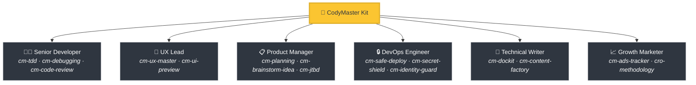
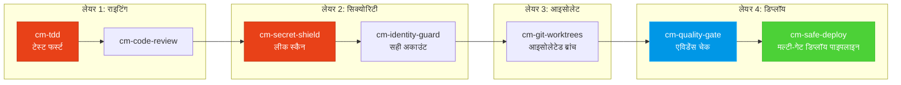

<div align="center">

[English](README.md) | [Tiếng Việt](README-vi.md) | [中文](README-zh.md) | [Русский](README-ru.md) | [한국어](README-ko.md) | [हिन्दी](README-hi.md)

# 🧠 CodyMaster

### आपका AI एजेंट स्मार्ट है। CodyMaster इसे *बुद्धिमान* बनाता है।

**33 स्किल्स · 11 कमांड्स · 1 प्लगइन · 7+ प्लेटफॉर्म्स · 6 भाषाएं**

<p align="center">
  
  
  
  
  <a href="https://github.com/tody-agent/codymaster#readme" target="_blank">
    
  </a>
</p>


### 🌟 अगर CodyMaster आपका समय बचाता है, तो इसे [Star](https://github.com/tody-agent/codymaster) दें! 🌟

</div>

---

## 🛑 वह समस्या जिसके बारे में कोई बात नहीं करता

आपने एक AI कोडिंग एजेंट इंस्टॉल किया। यह *शानदार* है। यह किसी भी इंसान से तेज कोड लिखता है।

लेकिन फिर हकीकत सामने आती है:

| 😤 असल में क्या होता है | 💀 असली कीमत जो आप चुकाते हैं |
|--------------------------|-----------------|
| AI हर बार **अलग तरह से डिज़ाइन** करता है — एक ही ब्रांड, 3 अलग स्टाइल | ग्राहकों को लगता है कि आप 3 अलग-अलग कम्पनियाँ हैं |
| AI एक बग ठीक करता है, लेकिन **चुपचाप 5 अन्य चीजों को तोड़ देता है** | आपको एक ही काम 3-4 बार करना पड़ता है |
| सेशंस के बीच AI **सब कुछ भूल** जाता है | आपको हर सुबह एक ही कोडबेस दोबारा समझाना पड़ता है |
| AI शून्य टेस्ट, शून्य डॉक्स लिखता है | आपका कोडबेस ताश के पत्तों का घर बन जाता है |
| आप 15 अलग-अलग स्किल्स इंस्टॉल करते हैं — **उनमें से कोई भी आपस में बात नहीं करता** | शून्य तालमेल के साथ फ्रेंकस्टीन टूलकिट |
| प्रोडक्शन में डिप्लॉय करें = **बस डिप्लॉय करें और प्रार्थना करें** 🙏 | रात 2 बजे टूटे हुए डिप्लॉय, कोई रोलबैक नहीं |

> *"AI ने मुझे 100 हाथ दिए। लेकिन बिना अनुशासन के, उन हाथों ने केवल अराजकता पैदा की।"*
> — **Tody Le**, हेड ऑफ़ प्रोडक्ट · 10+ साल का अनुभव · CodyMaster के रचयिता

---

## 🟢 समाधान: एक किट में पूरी सीनियर टीम

CodyMaster सिर्फ "एक और AI स्किल्स पैक" नहीं है। यह **10+ वर्षों का प्रोडक्ट मैनेजमेंट का अनुभव और 6 महीने की वाइब कोडिंग की कड़ी मेहनत** है, जिसे 33 परस्पर जुड़ी हुई स्किल्स में ढाला गया है, जो एक **सिंगल इंटीग्रेटेड सिस्टम** के रूप में काम करते हैं।

जब आप CodyMaster इंस्टॉल करते हैं, तो आप केवल स्किल्स नहीं जोड़ते हैं।
**आप एक पूरी सीनियर टीम को काम पर रख रहे हैं:**



---

## ⚡ क्या बात CodyMaster को अलग बनाती है

अन्य स्किल पैक आपको बिखरे हुए टूल्स देते हैं। CodyMaster आपके AI के लिए एक **इंटर-कनेक्टेड ऑपरेटिंग सिस्टम** देता है।

### 🔄 पूरा लाइफसाइकिल कवरेज (आइडिया → प्रोडक्शन)

कोई गैप नहीं। कोई मैन्युअल हैंडऑफ़ नहीं। हर फेज़ को कवर किया गया है:


### 🧠 वह दिमाग जो गलतियों से सीखता है

आपका AI सिर्फ काम ही नहीं करता — वह **याद रखता है और सुधार करता है**:

- **`cm-continuity`** — सेशंस के बीच वर्किंग मेमोरी। क्या गलत हुआ, AI याद रखता है और कभी भी वही गलती नहीं दोहराता।
- **`cm-skill-mastery`** — नहीं पता कि कुछ कैसे करना है? यह **अपने आप सही स्किल ढूंढ़ता है** और खुद को अपग्रेड करता है।
- **`cm-deep-search`** — 200+ फाइल्स के बेस में खो गए? सेकंड्स में हर चीज के लिए सिमेंटिक सर्च।

### 🛡️ मल्टी-लेयर प्रोटेक्शन (आपका कोडबेस कभी बर्बाद नहीं होगा)

कोड की हर लाइन प्रोडक्शन तक पहुँचने से पहले मल्टीपल सेफ्टी गेट्स से होकर गुजरती है:



> **नतीजा:** शून्य रहस्य लीक। शून्य गलत-अकाउंट डिप्लॉय। शून्य "मेरे कंप्यूटर में तो काम कर रहा था" वाली विफलताएं।

### 🎨 डिज़ाइन सिस्टम एक्सट्रेक्शन — पुराने प्रोडक्ट्स से भी

एक पुराना प्रोडक्ट है जिसमें कोई डिज़ाइन सिस्टम नहीं है? **`cm-ux-master`** आपकी वेबसाइट को स्कैन करता है, रंग, टाइपोग्राफी, स्पेसिंग और टोकन निकालता है, फिर एक उचित डिज़ाइन सिस्टम को फिर से बनाता है। कोड की एक भी लाइन लिखे बिना **Pencil.dev** या **Google Stitch** के साथ डिज़ाइन का विज्युअली प्रिव्यू करें।

### 📝 कोई डॉक्युमेंटेशन नहीं है? कोई परेशानी नहीं।

पता नहीं पुराना कोड क्या काम करता है? **`cm-dockit`** आपका पूरा कोडबेस पढ़ता है और जेनेरेट करता है:
- 📚 टेक्निकल आर्किटेक्चर डॉक्स
- 📖 यूज़र गाइड्स & SOPs
- 🔌 API रिफरेन्सेस
- 🎯 पर्सोना एनालिसिस & JTBD मैपिंग
- 🌐 मल्टी-लैंग्वेज सपोर्ट। SEO-ऑप्टिमाइज़्ड।

**एक स्कैन = पूरा नॉलेज बेस तैयार।**

### 📊 विज़ुअल डैशबोर्ड — सबकुछ एक नज़र में देखें

अब कोई अंदाज़ा नहीं। रियल-टाइम कानबान बोर्ड पर हर टास्क, हर एजेंट, हर डिप्लॉयमेंट को ट्रैक करें। पाइपलाइन प्रोग्रेस, टोकन ट्रैकर, इवेंट लॉग — सब कुछ एक स्क्रीन पर।

---

## 🆚 बिखरी हुई स्किल्स बनाम CodyMaster

| | 😵 15 रैंडम स्किल्स | 🧠 CodyMaster |
|---|---|---|
| **इंटीग्रेशन** | हर स्किल अलग है, कोई शेयर्ड कांटेक्स्ट नहीं है | 33 स्किल्स जो जुड़ते हैं, मेमोरी शेयर करते हैं, और बात करते हैं |
| **लाइफसाइकिल** | सिर्फ कोडिंग कवर करता है | आइडिया → डिज़ाइन → कोड → टेस्ट → डिप्लॉय → डॉक्स → लर्न - सब कवर करता है |
| **मेमोरी** | सेशन खत्म होते ही सब भूल जाता है | 4-टियर मेमोरी सिस्टम: वर्किंग → एपिसोडिक → सिमेंटिक → डीप सर्च |
| **सुरक्षा** | YOLO डिप्लॉय | 4-लेयर प्रोटेक्शन: TDD → सिक्योरिटी → आइसोलेशन → मल्टी-गेट डिप्लॉय |
| **डिज़ाइन** | हर बार रैंडम UI | डिज़ाइन सिस्टम निकालता है और लागू करता है + विज़ुअल प्रिव्यू |
| **डॉक्युमेंटेशन** | "शायद बाद में README लिख दूँ" | ऑटो-जेनेरेट्स कम्पलीट डॉक्स, SOPs, API रिफरेन्सेस कोड से |
| **खुद में सुधार (Self-improvement)** | स्थिर - जो इंस्टॉल किया वही मिलेगा | गलतियों से सीखता है, नए स्किल्स अपने आप ढूंढता है, रोज़ाना स्मार्ट होता है |
| **रखरखाव (Maintenance)** | 15 रेपो को अलग-अलग अपडेट करें | एक `git pull` सब कुछ अपडेट करता है |

---

## 🦥 आलसी लोगों के लिए बनाया गया (गंभीरता से)

हम ईमानदारी से कह रहे हैं: **CodyMaster आलसी लोगों के लिए ही बनाया गया है।**

अगर आप चाहते हैं:
- ✅ एक चैट मैसेज टाइप करें और बदले में एक **काम करता हुआ प्रोडक्ट** पाएं
- ✅ आपका AI अपनी **गलतियों से सीखें** और हर दिन बेहतर बनें
- ✅ कभी भी एक ही बॉयलरप्लेट को दो बार सेटअप न करें
- ✅ प्रार्थना करने के बजाय **पूरे कॉन्फिडेंस** के साथ डिप्लॉय करें

**→ CodyMaster आपके लिए है।**

अगर आप पसंद करते हैं:
- ❌ मैन्युअल रूप से AI आउटपुट की हर लाइन को रिव्यु करना
- ❌ हर प्रोजेक्ट के लिए वही सेटअप रीचुअल करना
- ❌ धीमे, मैन्युअल डिप्लॉय, वो भी बिना सेफ्टी नेट के

**→ CodyMaster आपके लिए नहीं है।**

---

## 🚀 1-मिनट का इनस्टॉल

### Claude Code (सुझाया गया)
```bash
bash <(curl -fsSL https://raw.githubusercontent.com/tody-agent/codymaster/main/install.sh) --claude
```
*या फिर: `claude plugin marketplace add tody-agent/codymaster` → `claude plugin install cm@codymaster`*

### Cursor IDE
```
/add-plugin cody-master
```

### Gemini CLI / Antigravity
```bash
gemini extensions install https://github.com/tody-agent/codymaster
```

<details>
<summary><b>अन्य प्लेटफॉर्म्स: Codex, OpenCode, Kiro, Copilot, Windsurf, Cline</b></summary>

```bash
# यूनिवर्सल: एक बार क्लोन करें, किसी भी प्लेटफॉर्म पर कॉपी करें
git clone https://github.com/tody-agent/codymaster.git ~/.cody-master

# फिर स्किल्स को अपनी प्लेटफॉर्म डायरेक्टरी में डालें:
cp -r ~/.cody-master/skills/* .cursor/skills/
cp -r ~/.cody-master/skills/* .codex/skills/
cp -r ~/.cody-master/skills/* .kiro/steering/
cp -r ~/.cody-master/skills/* .opencode/skills/
cp -r ~/.cody-master/skills/* ~/.gemini/antigravity/skills/
```
</details>

---

## 🧰 33-स्किल्स का शस्त्रागार

| डोमेन | स्किल्स |
|--------|--------|
| 🔧 **इंजीनियरिंग** | `cm-tdd` `cm-debugging` `cm-quality-gate` `cm-test-gate` `cm-code-review` |
| ⚙️ **ऑपरेशन्स** | `cm-safe-deploy` `cm-identity-guard` `cm-secret-shield` `cm-git-worktrees` `cm-terminal` `cm-safe-i18n` |
| 🎨 **प्रोडक्ट & UX** | `cm-planning` `cm-ux-master` `cm-ui-preview` `cm-project-bootstrap` `cm-jtbd` `cm-brainstorm-idea` `cm-dockit` `cm-readit` |
| 📈 **ग्रोथ/CRO** | `cm-content-factory` `cm-ads-tracker` `cro-methodology` |
| 🎯 **ऑर्केस्ट्रेशन** | `cm-execution` `cm-continuity` `cm-skill-chain` `cm-skill-mastery` `cm-skill-index` `cm-deep-search` `cm-how-it-work` |
| 🖥️ **वर्कफ़्लो** | `cm-start` `cm-dashboard` `cm-status` |

---

## 🎮 कमांड्स

```
/cm:demo         → इंटरैक्टिव ऑनबोर्डिंग टूर
/cm:bootstrap    → स्क्रैच से नया प्रोजेक्ट बनाएं
/cm:plan         → एनालिसिस के साथ फ़ीचर की योजना बनाएं
/cm:build        → मजबूत TDD के साथ बिल्ड करें
/cm:debug        → व्यवस्थित डिबगिंग
/cm:ux           → डिज़ाइन सिस्टम निकालें और UI प्रीव्यू
/cm:track        → मार्केटिंग पिक्सेल और ट्रैकिंग सेटअप
```

---

## 👤 इसे किसने बनाया

**Tody Le** — 10+ वर्षों के अनुभव के साथ हेड ऑफ़ प्रोडक्ट। वो कोड नहीं लिख सकते। उन्होंने लगातार 6 महीने तक वास्तविक प्रोडक्ट्स बनाने के लिए AI का उपयोग किया। इस किट का हर कौशल वास्तविक विफलता से पैदा हुआ था जिसमें वास्तविक समय और वास्तविक दर्द की कीमत चुकानी पड़ी।

> *"33 स्किल्स। हर 1 स्किल एक सबक है। हर सबक एक नींद न आने वाली रात है। और अब, आपको उन रातों से नहीं गुजरना पड़ेगा।"*

📖 [पूरी कहानी पढ़ें →](https://cody-master.pages.dev/story)

---

## 📚 रिसोर्सेज

- 🌍 [वेबसाइट](https://cody-master.pages.dev) — ओवरव्यू और डेमोस
- 📖 [डॉक्युमेंटेशन](https://cody-master.pages.dev/docs) — पूरी गहराई से
- 🛠️ [स्किल्स रिफरेन्स](skills/) — सभी 33 SKILL.md फाइल्स ब्राउज़ करें
- 📖 [हमारी कहानी](https://cody-master.pages.dev/story) — यह क्यों मौजूद है

---

## 🤝 योगदान

1. ⭐ **रेपो को Star दें** — इससे और बिल्डर्स को इसे ढूंढने में मदद मिलती है
2. Fork करें → `skills/cm-your-skill/SKILL.md` बनाएं
3. पुल रिक्वेस्ट (Pull Request) सबमिट करें

---

<div align="center">

*MIT लाइसेंस — इस्तेमाल करने, संसोधित करने और वितरित करने के लिए मुफ़्त।* <br/>
**vibe coding कम्युनिटी के लिए दिल ❤️ से बनाया गया।**

*"Cody" = "Code Đi" (वियतनामी: "जाओ कोड करो!") — बस बनाना शुरू करो।*

</div>
