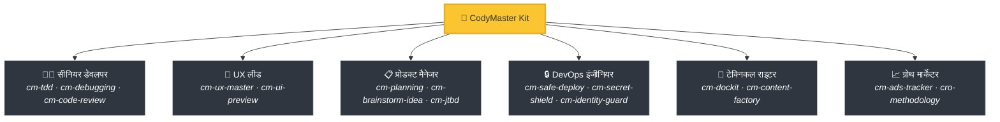
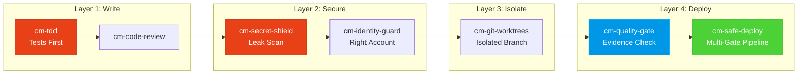

<div align="center">

[English](README.md) | [Tiếng Việt](README-vi.md) | [中文](README-zh.md) | [Русский](README-ru.md) | [한국어](README-ko.md) | [हिन्दी](README-hi.md)

# 🧠 CodyMaster

### आपका AI Agent स्मार्ट है। CodyMaster इसे *बुद्धिमान* बनाता है।

**33 Skills · 11 Commands · 1 Plugin · 7+ Platforms · 6 भाषाएं**

<p align="center">
  
  
  
  
  <a href="https://github.com/tody-agent/codymaster#readme" target="_blank">
    
  </a>
</p>


### 🌟 अगर CodyMaster आपका समय बचाता है, तो इसे एक [Star](https://github.com/tody-agent/codymaster) दें! 🌟

</div>

---

## 🛑 वह समस्या जिसके बारे में कोई बात नहीं करता

आपने एक AI coding agent इंस्टॉल किया है। यह *शानदार* है। यह किसी भी इंसान की तुलना में तेज़ी से कोड लिखता है।

लेकिन फिर असलियत सामने आती है:

| 😤 वास्तव में क्या होता है | 💀 असली कीमत |
|--------------------------|-----------------|
| AI **हर बार अलग तरीके से** डिज़ाइन करता है — एक ही ब्रांड, 3 अलग स्टाइल | क्लाइंट्स को लगता है कि आप 3 अलग कंपनियां हैं |
| AI एक बग ठीक करता है, **चुपचाप 5 अन्य चीज़ें तोड़ देता है** | आप एक ही काम को 3-4 बार दोबारा करते हैं |
| AI सत्रों (sessions) के बीच **सब कुछ भूल जाता है** | आप हर सुबह एक ही कोडबेस को दोबारा समझाते हैं |
| AI शून्य टेस्ट, शून्य डॉक्स लिखता है | आपका कोडबेस ताश के पत्तों का घर बन जाता है |
| आप 15 अलग-अलग स्किल्स इंस्टॉल करते हैं — **उनमें से कोई भी एक-दूसरे से बात नहीं करती** | बिना किसी तालमेल के Frankenstein टूलकिट |
| प्रोडक्शन में डिप्लॉय करना = **डिप्लॉय करें और प्रार्थना करें** 🙏 | रात 2 बजे टूटे हुए डिप्लॉय, कोई रोलबैक नहीं |

> *"AI ने मुझे 100 हाथ दिए। लेकिन अनुशासन के बिना, उन हाथों ने अराजकता पैदा की।"*
> — **Tody Le**, Head of Product · 10+ साल · CodyMaster के निर्माता

---

## 🟢 समाधान: एक ही किट में पूरी सीनियर टीम

CodyMaster सिर्फ "एक और AI skills pack" नहीं है। यह **10+ साल का प्रोडक्ट मैनेजमेंट अनुभव + 6 महीने की बैटल-टेस्टेड vibe coding** है, जिसे 33 परस्पर जुड़ी स्किल्स में पिरोया गया है जो एक **एकल एकीकृत सिस्टम** के रूप में काम करती हैं।

जब आप CodyMaster इंस्टॉल करते हैं, तो आप केवल स्किल्स नहीं जोड़ रहे होते हैं।
**आप एक पूरी सीनियर टीम को काम पर रख रहे हैं:**



---

## ⚡ क्या चीज़ CodyMaster को अलग बनाती है

अन्य स्किल पैक आपको खुले टूल्स देते हैं। CodyMaster आपके AI के लिए एक **परस्पर जुड़ा हुआ ऑपरेटिंग सिस्टम** देता है।

### 🔄 पूर्ण जीवनचक्र कवरेज (Idea → Production)

कोई अंतराल नहीं। कोई मैन्युअल हैंडऑफ़ नहीं। हर चरण कवर किया गया है:


### 🧠 एक दिमाग जो गलतियों से सीखता है

आपका AI सिर्फ निष्पादन (execute) नहीं करता है — यह **याद रखता है और सुधार करता है**:

- **`cm-continuity`** — सत्रों के दौरान वर्किंग मेमोरी। AI याद रखता है कि क्या गलत हुआ था और वही गलती कभी नहीं दोहराता
- **`cm-skill-mastery`** — नहीं जानते कि कुछ कैसे करना है? यह **स्वचालित रूप से सही स्किल ढूंढता है** और खुद को अपग्रेड करता है
- **`cm-deep-search`** — 200+ फाइलों वाले कोडबेस में खो गए हैं? सेकंडों में सब कुछ के पार सिमेंटिक सर्च

### 🛡️ मल्टी-लेयर प्रोटेक्शन (आपका कोडबेस नष्ट नहीं होगा)

कोड की हर लाइन प्रोडक्शन तक पहुँचने से पहले कई सुरक्षा द्वारों (safety gates) से गुजरती है:



> **परिणाम:** शून्य लीक हुए सीक्रेट्स। शून्य गलत अकाउंट पर डिप्लॉय। शून्य "मेरे मशीन पर काम किया" वाली विफलताएं।

### 🎨 डिजाइन सिस्टम एक्सट्रैक्शन — पुराने प्रोडक्ट्स से भी

क्या आपके पास बिना किसी डिजाइन सिस्टम वाला कोई लेगेसी प्रोडक्ट है? **`cm-ux-master`** आपकी वेबसाइट को स्कैन करता है, कलर्स, टाइपोग्राफी, स्पेसिंग और टोकन एक्सट्रैक्ट करता है, फिर एक उचित डिजाइन सिस्टम बनाता है। कोड की एक भी लाइन लिखने से पहले **Pencil.dev** या **Google Stitch** के साथ डिजाइन का विजुअल प्रीव्यू देखें।

### 📝 जीरो डॉक्यूमेंटेशन? कोई बात नहीं।

नहीं जानते कि पुराना कोड क्या करता है? **`cm-dockit`** आपके पूरे कोडबेस को पढ़ता है और जनरेट करता है:
- 📚 टेक्निकल आर्किटेक्चर डॉक्यूमेंट्स
- 📖 यूजर गाइड्स और SOPs
- 🔌 API रेफरेंस
- 🎯 पर्सोना एनालिसिस और JTBD मैपिंग
- 🌐 मल्टी-लैंग्वेज। SEO-ऑप्टिमाइज्ड।

**एक स्कैन = पूर्ण नॉलेज बेस।**

### 📊 विजुअल डैशबोर्ड — सब कुछ एक नज़र में देखें

अब कोई अटकलें नहीं। रियल-टाइम Kanban बोर्ड पर हर टास्क, हर एजेंट, हर डिप्लॉयमेंट को ट्रैक करें। पाइपलाइन प्रोग्रेस, टोकन ट्रैकर, इवेंट लॉग — सब कुछ एक ही स्क्रीन पर।

---

## 🆚 बिखरे हुए स्किल्स बनाम CodyMaster

| | 😵 15 रैंडम स्किल्स | 🧠 CodyMaster |
|---|---|---|
| **एकीकरण** | प्रत्येक स्किल स्टैंडअलोन है, कोई साझा संदर्भ नहीं | 33 स्किल्स जो चेन बनाती हैं, मेमोरी साझा करती हैं और संवाद करती हैं |
| **लाइफसाइकिल** | केवल कोडिंग को कवर करता है | आइडिया → डिजाइन → कोड → टेस्ट → डिप्लॉय → डॉक्यूमेंट्स → लर्न को कवर करता है |
| **मेमोरी** | सत्रों के बीच सब कुछ भूल जाता है | 4-टियर मेमोरी सिस्टम: वर्किंग → एपिसोडिक → सिमेंटिक → डीप सर्च |
| **सुरक्षा** | YOLO डिप्लॉय | 4-लेयर प्रोटेक्शन: TDD → सिक्योरिटी → आइसोलेशन → मल्टी-गेट डिप्लॉय |
| **डिजाइन** | हर बार रैंडम UI | डिजाइन सिस्टम को एक्सट्रैक्ट और लागू करता है + विजुअल प्रीव्यू |
| **डॉक्यूमेंटेशन** | "शायद बाद में README लिखेंगे" | कोड से पूर्ण डॉक्यूमेंट्स, SOPs, API रेफरेंस ऑटो-जनरेट करता है |
| **स्व-सुधार** | स्टैटिक — जो आप इंस्टॉल करते हैं वही आपको मिलता है | गलतियों से सीखता है, स्वचालित रूप से नई स्किल्स खोजता है, रोजाना स्मार्ट बनता है |
| **मेंटेनेंस** | 15 रिपॉजिटरी को अलग से अपडेट करें | एक `git pull` सब कुछ अपडेट कर देता है |

---

## 🦥 आलसी लोगों के लिए निर्मित (गंभीरता से)

हम ईमानदार रहेंगे: **CodyMaster आलसी लोगों के लिए बनाया गया था।**

यदि आप चाहते हैं:
- ✅ एक चैट मैसेज टाइप करें और बदले में एक **वर्किंग प्रोडक्ट** प्राप्त करें
- ✅ आपका AI **अपनी गलतियों से सीखे** और हर दिन बेहतर बने
- ✅ एक ही बॉयलरप्लेट को दोबारा कभी सेटअप न करें
- ✅ प्रार्थना करने के बजाय **आत्मविश्वास** के साथ डिप्लॉय करें

**→ CodyMaster आपके लिए है।**

यदि आप पसंद करते हैं:
- ❌ AI आउटपुट की हर लाइन की मैन्युअल रूप से समीक्षा करना
- ❌ हर प्रोजेक्ट के लिए वही सेटअप रस्म करना
- ❌ बिना किसी सुरक्षा जाल के धीमा, मैन्युअल डिप्लॉयमेंट

**→ CodyMaster आपके लिए नहीं है।**

---

## 🚀 1-मिनट इंस्टालेशन

### Claude Code (अनुशंसित)
```bash
bash <(curl -fsSL https://raw.githubusercontent.com/tody-agent/codymaster/main/install.sh) --claude
```
*या: `claude plugin marketplace add tody-agent/codymaster` → `claude plugin install cm@codymaster`*

### Cursor IDE
```
/add-plugin cody-master

### Gemini CLI / Antigravity
```bash
gemini extensions install https://github.com/tody-agent/codymaster
```

<details>
<summary><b>अन्य प्लेटफॉर्म: Codex, OpenCode, Kiro, Copilot, Windsurf, Cline</b></summary>

```bash
# Universal: clone once, copy to any platform
git clone https://github.com/tody-agent/codymaster.git ~/.cody-master

# Then drop skills into your platform's directory:
cp -r ~/.cody-master/skills/* .cursor/skills/
cp -r ~/.cody-master/skills/* .codex/skills/
cp -r ~/.cody-master/skills/* .kiro/steering/
cp -r ~/.cody-master/skills/* .opencode/skills/
cp -r ~/.cody-master/skills/* ~/.gemini/antigravity/skills/
```
</details>

---

## 🧰 33-कौशलों का शस्त्रागार

| डोमेन | कौशल |
|--------|--------|
| 🔧 **इंजीनियरिंग** | `cm-tdd` `cm-debugging` `cm-quality-gate` `cm-test-gate` `cm-code-review` |
| ⚙️ **ऑपरेशन्स** | `cm-safe-deploy` `cm-identity-guard` `cm-secret-shield` `cm-git-worktrees` `cm-terminal` `cm-safe-i18n` |
| 🎨 **प्रोडक्ट और UX** | `cm-planning` `cm-ux-master` `cm-ui-preview` `cm-project-bootstrap` `cm-jtbd` `cm-brainstorm-idea` `cm-dockit` `cm-readit` |
| 📈 **ग्रोथ/CRO** | `cm-content-factory` `cm-ads-tracker` `cro-methodology` |
| 🎯 **ऑर्केस्ट्रेशन** | `cm-execution` `cm-continuity` `cm-skill-chain` `cm-skill-mastery` `cm-skill-index` `cm-deep-search` `cm-how-it-work` |
| 🖥️ **वर्कफ़्लो** | `cm-start` `cm-dashboard` `cm-status` |

---

## 🎮 कमांड्स

```
/cm:demo         → इंटरएक्टिव ऑनबोर्डिंग टूर
/cm:bootstrap    → शुरुआत से एक नया प्रोजेक्ट तैयार करें
/cm:plan         → विश्लेषण के साथ एक फीचर की योजना बनाएं
/cm:build        → सख्त TDD के साथ निर्माण करें
/cm:debug        → व्यवस्थित डिबगिंग
/cm:ux           → डिजाइन सिस्टम एक्सट्रैक्शन और UI प्रीव्यू
/cm:track        → मार्केटिंग पिक्सेल और ट्रैकिंग सेटअप
```

---

## 👤 इसे किसने बनाया

**Tody Le** — 10+ वर्षों के अनुभव के साथ हेड ऑफ प्रोडक्ट। कोड नहीं लिख सकते। लगातार 6 महीनों तक वास्तविक प्रोडक्ट बनाने के लिए AI का उपयोग किया। इस किट का हर कौशल एक वास्तविक विफलता से पैदा हुआ है जिसमें वास्तविक समय और वास्तविक आंसू खर्च हुए।

> *"33 कौशल। प्रत्येक कौशल एक सबक है। प्रत्येक सबक एक बिना नींद वाली रात है। और अब, आपको उन रातों से गुजरने की ज़रूरत नहीं है।"*

📖 [पूरी कहानी पढ़ें →](https://cody-master.pages.dev/story)

---

## 📚 संसाधन

- 🌍 [वेबसाइट](https://cody-master.pages.dev) — अवलोकन और डेमो
- 📖 [दस्तावेज़ीकरण](https://cody-master.pages.dev/docs) — पूरी गहराई से जानकारी
- 🛠️ [कौशल संदर्भ](skills/) — सभी 33 SKILL.md फाइलें ब्राउज़ करें
- 📖 [हमारी कहानी](https://cody-master.pages.dev/story) — यह क्यों मौजूद है

---

## 🤝 योगदान देना

1. ⭐ **रेपो को स्टार करें** — यह अधिक बिल्डरों को इसे खोजने में मदद करता है
2. Fork → `skills/cm-your-skill/SKILL.md` बनाएं
3. एक Pull Request सबमिट करें

---

<div align="center">

*MIT लाइसेंस — उपयोग करने, संशोधित करने और वितरित करने के लिए स्वतंत्र।* <br/>
**vibe coding समुदाय के लिए ❤️ के साथ बनाया गया।**

*"Cody" = "Code Đi" (वियतनामी: "कोड करो!") — बस निर्माण शुरू करें।*

</div>