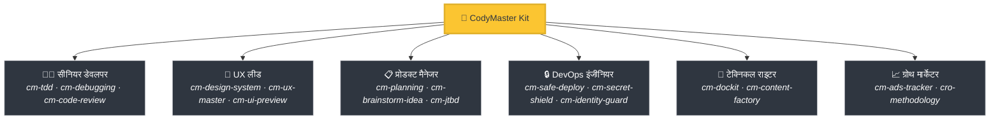
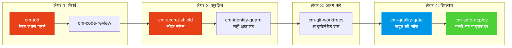

<div align="center">

[English](README.md) | [Tiếng Việt](README-vi.md) | [中文](README-zh.md) | [Русский](README-ru.md) | [한국어](README-ko.md) | [हिन्दी](README-hi.md)

# 🧠 CodyMaster

### आपका AI एजेंट स्मार्ट है। CodyMaster इसे *बुद्धिमान* बनाता है।

**68+ स्किल्स · 11 कमांड्स · 1 प्लगइन · 7+ प्लेटफॉर्म्स · 6 भाषाएं**

<p align="center">
  
  
  
  
  <a href="https://github.com/tody-agent/codymaster#readme" target="_blank">
    
  </a>
</p>


### 🌟 अगर CodyMaster आपका समय बचाता है, तो इसे एक [Star](https://github.com/tody-agent/codymaster) दें! 🌟

</div>

---

## 🛑 वह समस्या जिसके बारे में कोई बात नहीं करता

आपने एक AI कोडिंग एजेंट इंस्टॉल किया है। यह *शानदार* है। यह किसी भी इंसान की तुलना में तेज़ी से कोड लिखता है।

लेकिन फिर हकीकत सामने आती है:

| 😤 वास्तव में क्या होता है | 💀 असली लागत |
|--------------------------|-----------------|
| AI हर बार **अलग तरह से डिजाइन करता है** — एक ही ब्रांड, 3 अलग स्टाइल | क्लाइंट्स को लगता है कि आप 3 अलग कंपनियां हैं |
| AI एक बग ठीक करता है, **चुपचाप 5 अन्य चीजों को तोड़ देता है** | आप एक ही काम को 3-4 बार दोबारा करते हैं |
| AI सत्रों (sessions) के बीच **सब कुछ भूल जाता है** | आप हर सुबह एक ही कोडबेस को दोबारा समझाते हैं |
| AI शून्य टेस्ट, शून्य डॉक्स लिखता है | आपका कोडबेस ताश के पत्तों का घर बन जाता है |
| आप 15 अलग-अलग स्किल्स इंस्टॉल करते हैं — **उनमें से कोई भी एक-दूसरे से बात नहीं करता** | शून्य तालमेल वाला फ्रेंकस्टीन टूलकिट |
| प्रोडक्शन में डिप्लॉय करना = **डिप्लॉय करें और प्रार्थना करें** 🙏 | रात 2 बजे टूटे हुए डिप्लॉय, कोई रोलबैक नहीं |

> *"AI ने मुझे 100 हाथ दिए। लेकिन बिना अनुशासन के, उन हाथों ने अराजकता पैदा कर दी।"*
> — **Tody Le**, प्रोडक्ट हेड · 10+ वर्ष · CodyMaster के निर्माता

---

## 🟢 समाधान: एक ही किट में पूरी सीनियर टीम

CodyMaster सिर्फ "एक और AI स्किल्स पैक" नहीं है। यह **10+ साल का प्रोडक्ट मैनेजमेंट अनुभव + 6 महीने की बैटल-टेस्टेड वाइब कोडिंग** है, जिसे 68+ आपस में जुड़ी स्किल्स में पिरोया गया है जो एक **एकल एकीकृत प्रणाली** के रूप में काम करती हैं।

जब आप CodyMaster इंस्टॉल करते हैं, तो आप सिर्फ स्किल्स नहीं जोड़ रहे होते हैं।
**आप एक पूरी सीनियर टीम को काम पर रख रहे होते हैं:**



---

## ⚡ CodyMaster को क्या अलग बनाता है

अन्य स्किल पैक आपको अलग-अलग टूल देते हैं। CodyMaster आपको आपके AI के लिए एक **इंटरकनेक्टेड ऑपरेटिंग सिस्टम** देता है।

### 🔄 पूर्ण जीवनचक्र कवरेज (विचार → प्रोडक्शन)

कोई कमी नहीं। कोई मैन्युअल हैंडऑफ़ नहीं। हर चरण कवर किया गया है:


### 🧠 एकीकृत मस्तिष्क: 5-स्तरीय मेमोरी आर्किटेक्चर

आपका AI सिर्फ निष्पादन (execute) नहीं करता — यह एक 5-स्तरीय एकीकृत मस्तिष्क (Unified Brain) प्रणाली का उपयोग करके **समझता है और याद रखता है** जो सत्रों (sessions) और मशीनों के बीच सुरक्षित रहता है:

1. **Sensory Memory (सत्र)** — सक्रिय फाइलों और टर्मिनलों का तात्कालिक संदर्भ।
2. **Working Memory (`cm-continuity`)** — क्रॉस-सेशन स्क्रैचपैड। AI कभी भी वही गलती नहीं दोहराता।
3. **Long-Term Memory (`learnings.json`)** — स्मार्ट एबिंगहॉस TTL क्षय (decay) के साथ मजबूत किए गए सबक।
4. **Semantic Memory (`cm-deep-search`)** — `qmd` का उपयोग करके डॉक्स में स्थानीय वेक्टर खोज।
5. **Structural Memory (`cm-codeintell`)** — AST-आधारित CodeGraph। पूर्ण कोडबेस संदर्भ के लिए 95% तक टोकन संपीड़न (compression)।

☁️ **The Cloud Brain (`cm-notebooklm`)**
उच्च-मूल्य वाले ज्ञान और डिज़ाइन पैटर्न को NotebookLM के साथ सिंक किया जाता है, जो आपके प्रोजेक्ट के लिए एक सार्वभौमिक, क्रॉस-मशीन "आत्मा (Soul)" प्रदान करता है। AI के साथ मानव डेवलपर्स को प्रशिक्षित करने के लिए पॉडकास्ट और फ्लैशकार्ड को स्वचालित रूप से उत्पन्न करें।

📖 [संपूर्ण ज्ञान आर्किटेक्चर पढ़ें (EN) →](docs/knowledge-architecture.md)

### 🛡️ मल्टी-लेयर सुरक्षा (आपका कोडबेस नष्ट नहीं होगा)

कोड की हर लाइन प्रोडक्शन तक पहुँचने से पहले कई सुरक्षा द्वारों (gates) से होकर गुजरती है:



> **परिणाम:** शून्य लीक हुए सीक्रेट्स। शून्य गलत-अकाउंट डिप्लॉयमेंट। शून्य "मेरे मशीन पर चला था" वाली विफलताएँ।

### 🎨 डिजाइन सिस्टम एक्सट्रैक्शन — पुराने उत्पादों से भी

क्या आपके पास कोई पुराना उत्पाद है जिसका कोई डिजाइन सिस्टम नहीं है? **cm-design-system** आपकी वेबसाइट को स्कैन करता है, रंग, टाइपोग्राफी, स्पेसिंग और टोकन निकालता है, और फिर एक उचित डिजाइन सिस्टम बनाता है। कोड की एक भी लाइन लिखने से पहले **Pencil.dev** या **Google Stitch** के साथ डिजाइन का विजुअल प्रीव्यू देखें।

### 📝 शून्य डॉक्यूमेंटेशन? कोई बात नहीं।

नहीं जानते कि पुराना कोड क्या करता है? **`cm-dockit`** आपके पूरे कोडबेस को पढ़ता है और जनरेट करता है:
- 📚 तकनीकी आर्किटेक्चर डॉक्यूमेंट्स
- 📖 यूजर गाइड्स और SOPs
- 🔌 API संदर्भ (references)
- 🎯 पर्सोना विश्लेषण और JTBD मैपिंग
- 🌐 बहु-भाषी। SEO-ऑप्टिमाइज्ड।

**एक स्कैन = पूर्ण ज्ञान का आधार (knowledge base)।**

### 💡 रणनीतिक विचार-मंथन (Design Thinking + 9 Windows)

जटिल कार्यों के लिए कोड लिखने से पहले, **`cm-brainstorm-idea`** बहुआयामी विश्लेषण (तकनीक, उत्पाद, डिज़ाइन, व्यवसाय) का उपयोग करके आपके उत्पाद का मूल्यांकन करता है। यह 9 Windows (TRIZ) फ्रेमवर्क का उपयोग करके 2-3 योग्य विकल्प उत्पन्न करता है और विस्तृत योजना बनाने से पहले दिशा मान्य करने के लिए **Pencil.dev** या **Google Stitch** के माध्यम से UI प्रीव्यू प्रदान करता है।

📖 [यूआई पूर्वावलोकन चरण के बारे में और पढ़ें →](docs/Brainstorm-UI-Preview.md)

### 🏭 AI Content Factory v2.0 & विजुअल डैशबोर्ड

सामग्री को स्केल करने की आवश्यकता है? **`cm-content-factory`** एक स्व-शिक्षण, मल्टी-एजेंट सामग्री इंजन है। यह स्वचालित रूप से शोध करता है, लिखता है, ऑडिट (एसईओ और अनुनय) करता है, और रूपांतरण (conversion) की गारंटी देने के लिए कंटेंट मास्टरी (StoryBrand + Cialdini) फ्रेमवर्क के साथ उच्च-रूपांतरण (high-converting) लेखों को तैनात करता है।

**विजुअल डैशबोर्ड** (`cm-dashboard`) पर सब कुछ ट्रैक करें: अब और अनुमान नहीं। रीयल-टाइम कानबान बोर्ड (Kanban board) पर हर टास्क, हर एजेंट, हर डिप्लॉयमेंट को ट्रैक करें। पाइपलाइन की प्रगति, टोकन ट्रैकर, इवेंट लॉग — सब कुछ एक स्क्रीन पर।

---

## 🆚 Scattered Skills vs CodyMaster

| | 😵 15 रैंडम स्किल्स | 🧠 CodyMaster |
|---|---|---|
| **इंटीग्रेशन** | प्रत्येक स्किल स्टैंडअलोन है, कोई साझा संदर्भ नहीं है | 68+ स्किल्स जो चेन बनाते हैं, मेमोरी साझा करते हैं और संवाद करते हैं |
| **लाइफसाइकिल** | केवल कोडिंग को कवर करता है | आइडिया → डिजाइन → कोड → टेस्ट → डिप्लॉय → डॉक्स → सीखने तक को कवर करता है |
| **मेमोरी** | सत्रों (sessions) के बीच सब कुछ भूल जाता है | 5-स्तरीय एकीकृत मस्तिष्क प्रणाली: Sensory → Working → Long-term → Semantic → Structural + Cloud Brain |
| **सुरक्षा** | YOLO डिप्लॉयमेंट | 4-लेयर सुरक्षा: TDD → सिक्योरिटी → आइसोलेशन → मल्टी-गेट डिप्लॉय |
| **डिजाइन** | हर बार रैंडम UI | डिजाइन सिस्टम को एक्सट्रैक्ट और लागू करता है + विजुअल प्रीव्यू |
| **डॉक्यूमेंटेशन** | "शायद बाद में README लिखेंगे" | कोड से पूर्ण डॉक्स, SOPs, API संदर्भ स्वचालित रूप से जनरेट करता है |
| **स्व-सुधार** | स्टेटिक — जो आपने इंस्टॉल किया है वही मिलता है | गलतियों से सीखता है, नई स्किल्स को स्वचालित रूप से खोजता है, रोजाना स्मार्ट बनता है |
| **रखरखाव** | 15 रिपॉजिटरी को अलग-अलग अपडेट करें | एक `git pull` सब कुछ अपडेट कर देता है |

---

## 🦥 आलसी लोगों के लिए निर्मित (सच में)

हम ईमानदार होने जा रहे हैं: **CodyMaster आलसी लोगों के लिए बनाया गया था।**

यदि आप चाहते हैं:
- ✅ एक चैट संदेश टाइप करें और बदले में एक **वर्किंग उत्पाद** प्राप्त करें
- ✅ आपका AI **अपनी गलतियों से सीखे** और हर दिन बेहतर हो
- ✅ कभी भी एक ही बॉयलरप्लेट (boilerplate) को दोबारा सेटअप न करें
- ✅ प्रार्थना करने के बजाय **आत्मविश्वास** के साथ डिप्लॉय करें

**→ CodyMaster आपके लिए है।**

यदि आप पसंद करते हैं:
- ❌ AI आउटपुट की हर लाइन की मैन्युअल समीक्षा करना
- ❌ हर प्रोजेक्ट के लिए वही सेटअप अनुष्ठान करना
- ❌ बिना किसी सुरक्षा जाल के धीमे, मैन्युअल डिप्लॉयमेंट

**→ CodyMaster आपके लिए नहीं है।**

---

## 🚀 1-मिनट इंस्टालेशन

### 1. एआई कौशल इंस्टॉल करें (सभी प्लेटफॉर्म)

एक कमांड आपके वातावरण में सभी 68+ कौशल स्थापित करता है। यह Claude Code, Gemini CLI, Cursor, Aider, Windsurf, Cline, OpenCode आदि का समर्थन करता है:

```bash
bash <(curl -fsSL https://raw.githubusercontent.com/tody-agent/codymaster/main/install.sh) --all
```

*Cursor IDE उपयोगकर्ताओं के लिए, आप सीधे अपने चैट में `/add-plugin cody-master` टाइप कर सकते हैं।*

### 2. डैशबोर्ड इंस्टॉल करें (वैकल्पिक लेकिन अनुशंसित)

अपने हैम्स्टर Cody 🐹 के साथ प्रगति को ट्रैक करें, कार्यों को प्रबंधित करें।

```bash
npm install -g codymaster
cm
```

यह CLI लंबे कोडिंग सत्रों के दौरान आपको व्यवस्थित रखेगा!

```text
    ( . \ --- / . )
     /   ^   ^   \        Hi! I'm Cody 🐹
    (      u      )        Your smart coding companion.
     |  \ ___ /  |
      '--w---w--'

│
◆  Quick menu
│  ● 📊  Dashboard (Start & open)
│  ○ 📋  My Tasks
│  ○ 📈 Status
│  ○ 🧩  Browse Skills
```

---

## 🧰 68+ Skill Arsenal

| डोमेन | कौशल (Skills) |
|--------|--------|
| 🔧 **इंजीनियरिंग** | `cm-tdd` `cm-debugging` `cm-quality-gate` `cm-test-gate` `cm-code-review` |
| ⚙️ **ऑपरेशंस** | `cm-safe-deploy` `cm-identity-guard` `cm-secret-shield` `cm-git-worktrees` `cm-terminal` `cm-safe-i18n` |
| 🎨 **प्रोडक्ट और UX** | `cm-planning` `cm-design-system` `cm-ux-master` `cm-ui-preview` `cm-project-bootstrap` `cm-jtbd` `cm-brainstorm-idea` `cm-dockit` `cm-readit` |
| 📈 **ग्रोथ/CRO** | `cm-content-factory` `cm-ads-tracker` `cro-methodology` |
| 🎯 **ऑर्केस्ट्रेशन** | `cm-execution` `cm-continuity` `cm-skill-chain` `cm-skill-mastery` `cm-skill-index` `cm-deep-search` `cm-notebooklm` `cm-how-it-work` |
| 🖥️ **वर्कफ़्लो** | `cm-start` `cm-dashboard` `cm-status` |

---

## 🎮 कमांड्स

```
/cm:demo         → इंटरएक्टिव ऑनबोर्डिंग टूर
/cm:bootstrap    → शुरुआत से एक नया प्रोजेक्ट तैयार करें
/cm:plan         → एनालिसिस के साथ एक फीचर की योजना बनाएं
/cm:build        → सख्त TDD के साथ बिल्ड करें
/cm:debug        → सिस्टमैटिक डिबगिंग
/cm:ux           → डिजाइन सिस्टम एक्सट्रैक्शन और UI प्रिव्यू
/cm:track        → मार्केटिंग पिक्सेल और ट्रैकिंग सेटअप
```

---

## 👤 इसे किसने बनाया

**Tody Le** — 10+ वर्षों के अनुभव के साथ हेड ऑफ प्रोडक्ट। कोड नहीं लिख सकते। लगातार 6 महीनों तक वास्तविक उत्पाद बनाने के लिए AI का उपयोग किया। इस किट का प्रत्येक कौशल एक वास्तविक विफलता से पैदा हुआ था जिसमें वास्तविक समय और वास्तविक आँसू लगे थे।

> *"68+ कौशल। प्रत्येक कौशल एक सबक है। प्रत्येक सबक एक बिना नींद वाली रात है। और अब, आपको उन रातों से नहीं गुजरना पड़ेगा।"*

📖 [पूरी कहानी पढ़ें →](https://cody.todyle.com/story)

---

## 📚 संसाधन

- 🌍 [वेबसाइट](https://cody.todyle.com) — ओवरव्यू और डेमो
- 📖 [डॉक्यूमेंटेशन](https://cody.todyle.com/docs) — पूर्ण डीप-डाइव
- 🛠️ [स्किल्स संदर्भ](skills/) — सभी 68+ SKILL.md फाइलें ब्राउज़ करें
- 📖 [हमारी कहानी](https://cody.todyle.com/story) — यह क्यों मौजूद है

---

## 🤝 योगदान देना

1. ⭐ **रेपो को स्टार करें** — यह अधिक बिल्डर्स को इसे खोजने में मदद करता है
2. Fork → `skills/cm-your-skill/SKILL.md` बनाएं
3. एक Pull Request सबमिट करें

---

<div align="center">

*MIT लाइसेंस — उपयोग, संशोधन और वितरण के लिए निःशुल्क।* <br/>
**वाइब कोडिंग कम्युनिटी के लिए ❤️ के साथ बनाया गया।**

*"CodyMaster" = "Code Đi" (वियतनामी: "कोड करो!") — बस निर्माण शुरू करें।*

</div>