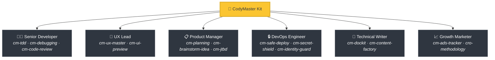
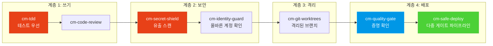

<div align="center">

[English](README.md) | [Tiếng Việt](README-vi.md) | [中文](README-zh.md) | [Русский](README-ru.md) | [한국어](README-ko.md) | [हिन्दी](README-hi.md)

# 🧠 CodyMaster

### 당신의 AI 에이전트는 똑똑합니다. CodyMaster는 그것을 *지혜롭게* 만듭니다.

**33가지 스킬 · 11개 명령어 · 플러그인 1개 · 7개 이상 플랫폼 · 6개 언어**

<p align="center">
  
  
  
  
  <a href="https://github.com/tody-agent/codymaster#readme" target="_blank">
    
  </a>
</p>


### 🌟 CodyMaster가 시간을 절약해 주었다면 [Star](https://github.com/tody-agent/codymaster)를 눌러주세요! 🌟

</div>

---

## 🛑 아무도 이야기하지 않는 문제

AI 코딩 에이전트를 설치했습니다. *훌륭합니다*. 어떤 사람보다 코드를 빨리 작성합니다.

하지만 다음엔 현실이 닥쳐옵니다:

| 😤 실제로 일어나는 일 | 💀 진정한 대가 |
|--------------------------|-----------------|
| AI는 **매번 다르게 디자인합니다** — 같은 브랜드, 3가지 다른 스타일 | 클라이언트는 당신을 3개의 다른 회사라고 생각합니다 |
| AI가 버그 하나를 잡았지만, **다른 5가지를 조용히 망가뜨립니다** | 같은 일을 3-4번 다시 해야 합니다 |
| 세션 간에 AI가 **모든 것을 잊어버립니다** | 매일 아침 같은 코드베이스를 다시 설명해야 합니다 |
| AI는 테스트도 작성하지 않고 문서도 작성하지 않습니다 | 귀하의 코드베이스는 카드로 쌓은 집처럼 됩니다 |
| 15개의 다른 스킬을 설치했습니다 — **하지만 아무 것도 서로 대화하지 않습니다** | 시너지 효과가 전혀 없는 프랑켄슈타인 툴킷 |
| 프로덕션에 배포 = **배포하고 기도하기** 🙏 | 새벽 2시에 망가진 배포, 롤백 불가능 |

> *"AI가 내게 100개의 손을 주었습니다. 하지만 규율 없는 이 손들은 그저 혼돈만 만들 뿐이었습니다."*
> — **Tody Le**, 프로덕트 총괄 · 10년 이상 경험 · CodyMaster 창립자

---

## 🟢 솔루션: 시니어 팀 전체가 하나의 키트로

CodyMaster는 단순한 "또 다른 AI 스킬 팩"이 아닙니다. **10년 이상의 프로덕트 관리 경험과 6개월의 실전 바이브 코딩**이 응축된, **단일 통합 시스템**으로 작동하는 33개의 상호 연결된 스킬입니다.

CodyMaster를 설치하면 단순 스킬을 추가하는 것이 아닙니다.
**진정한 시니어 팀을 고용하는 것입니다:**



---

## ⚡ CodyMaster가 다른 점

다른 스킬 팩은 흩어진 도구를 제공합니다. CodyMaster는 귀하의 AI를 위해 **상호 연결된 운영 체제**를 제공합니다.

### 🔄 전체 수명 주기 처리 (아이디어 → 프로덕션)

공백 없음. 수동 인계 없음. 모든 단계가 처리됩니다:


### 🧠 실수로부터 배우는 뇌

귀하의 AI는 단지 실행만 하는 것이 아닙니다. **기억하고 개선합니다**:

- **`cm-continuity`** — 세션간 작업 메모리. AI는 무엇이 잘못되었는지 기억하고 같은 실수를 반복하지 않습니다.
- **`cm-skill-mastery`** — 어떻게 해야할지 모르시나요? **올바른 스킬을 자동으로 찾고** 스스로 업그레이드합니다.
- **`cm-deep-search`** — 200개 이상의 파일을 가진 코드베이스에서 길을 잃으셨나요? 단 몇 초 만에 모든 것을 시맨틱 검색합니다.

### 🛡️ 다계층 보호 (코드베이스가 파괴되지 않습니다)

코드는 프로덕션에 도달하기 전 여러 개의 안전 게이트를 통과합니다:



> **결과:** 시크릿 유출 제로. 잘못된 계정 배포 제로. "내 컴퓨터에서는 됐는데" 식의 실패 제로.

### 🎨 디자인 시스템 추출 — 오래된 제품에서도 가능

디자인 시스템이 없는 레거시 제품이 있나요? **`cm-ux-master`**는 귀하의 웹사이트를 스캔하고 로고, 타이포그래피, 간격, 토큰을 추출한 다음 제대로 된 디자인 시스템을 재구축합니다. 코드를 한 줄 쓰기 전에 **Pencil.dev** 또는 **Google Stitch**를 통해 디자인을 시각적으로 먼저 미리볼 수 있습니다.

### 📝 문서가 없나요? 문제없습니다.

오래된 코드가 무엇을 하는지 모르시나요? **`cm-dockit`**은 모든 코드베이스를 읽고 다음을 생성합니다:
- 📚 기술 아키텍처 문서
- 📖 사용자 가이드 및 SOP
- 🔌 API 참고자료
- 🎯 페르소나 분석 & JTBD 매핑
- 🌐 다국어 지원. SEO 최적화.

**단 한 번의 스캔으로 = 완벽한 지식 기반 구축.**

### 📊 시각적 대시보드 — 한눈에 모든 것을 보세요

더이상 추측할 필요가 없습니다. 실시간 칸반 보드에서 모들 태스크, 에이전트, 배포를 모니터링합니다. 파이프라인 진행 상태, 토큰 트래커, 이벤트 로그를 전부 하나의 화면에서 볼 수 있습니다.

---

## 🆚 흩어진 스킬들 vs CodyMaster

| | 😵 15개의 분산된 스킬 | 🧠 CodyMaster |
|---|---|---|
| **통합** | 공통의 컨텍스트 없이 각 스킬이 독립적으로 작동 | 지식을 공유하고 소통하는 33개의 연동 스킬 |
| **수명 주기** | 코딩만 지원합니다 | 아이디어 → 디자인 → 코드 → 테스트 → 배포 → 문서 → 학습 단계 전체 커버 |
| **메모리 저장소** | 세션 종료 후 모두 잊습니다 | 4단계 저장 프레임워크: 단기 → 일화 → 의미 → 깊은 검색 |
| **안전 시스템** | 맹목적 배포 | 4단계 보호막: TDD → 백도어 탐지 → 독립 격리 → 다중 검증 파이프라인 |
| **디자인 일관성** | 예측 불가한 UI | 기존 디자인 시스템 도출 및 시각적 미리보기 |
| **기술 문서 생성** | "나중에 README를 쓰겠습니다" | 로직 분석 자동화 API 레퍼런스 및 가이드 생성 |
| **자체 고도화** | 딱 설치된 상태까지만 지원 | 실수로부터 얻은 교훈 기반의 판단 기준 획득 및 새 스킬 발견 |
| **버전 유지** | 15개 서로 다른 Repo들을 수동 업데이트 | 단 한 줄의 `git pull` 통합 관리 |

---

## 🦥 게으른 사람을 위해 제작되었습니다 (진짜로)

솔직히 말해: **CodyMaster는 게으른 사람을 위해 만들어졌습니다.**

다음과 같은 분들께 추천합니다:
- ✅ 채팅 메시지를 입력하고 바로 **작동하는 제품**을 받고 싶다면
- ✅ 귀하의 AI가 **자신의 실수로부터 배우고** 매일 더 나아지게 하길 원한다면
- ✅ 매 프로세스마다 똑같은 반복 셋업을 원치 않는다면
- ✅ 배포 후 걱정하는 대신 **확신**을 가지고 배포하고 싶다면

**→ CodyMaster는 당신을 위한 것입니다.**

다음과 같은 분들은 고려해주세요:
- ❌ AI가 작성한 모든 줄의 코드를 일일이 확인하는 걸 선호한다면
- ❌ 모든 프로젝트마다 똑같이 번거로운 초기 설정을 반복해야 직성이 풀린다면
- ❌ 안전 장치 없는 느리고 수동적인 배포만 의지한다면

**→ CodyMaster는 당신을 위한 것이 아닙니다.**

---

## 🚀 1분 설치

### Claude Code (권장 기능)
```bash
bash <(curl -fsSL https://raw.githubusercontent.com/tody-agent/codymaster/main/install.sh) --claude
```
*또는: `claude plugin marketplace add tody-agent/codymaster` → `claude plugin install cm@codymaster`*

### Cursor IDE
```
/add-plugin cody-master
```

### Gemini CLI / Antigravity
```bash
gemini extensions install https://github.com/tody-agent/codymaster
```

<details>
<summary><b>그 외 다른 플랫폼: Codex, OpenCode, Kiro, Copilot, Windsurf, Cline</b></summary>

```bash
# 기본 세팅: 단 한 번 클론하고 복사하세요
git clone https://github.com/tody-agent/codymaster.git ~/.cody-master

# 그리고 플랫폼 폴더로 스킬들을 붙여넣으세요:
cp -r ~/.cody-master/skills/* .cursor/skills/
cp -r ~/.cody-master/skills/* .codex/skills/
cp -r ~/.cody-master/skills/* .kiro/steering/
cp -r ~/.cody-master/skills/* .opencode/skills/
cp -r ~/.cody-master/skills/* ~/.gemini/antigravity/skills/
```
</details>

---

## 🧰 33개의 강력한 스킬

| 영역 | 스킬 |
|--------|--------|
| 🔧 **엔지니어링** | `cm-tdd` `cm-debugging` `cm-quality-gate` `cm-test-gate` `cm-code-review` |
| ⚙️ **운영 관리** | `cm-safe-deploy` `cm-identity-guard` `cm-secret-shield` `cm-git-worktrees` `cm-terminal` `cm-safe-i18n` |
| 🎨 **프로덕트 & UX** | `cm-planning` `cm-ux-master` `cm-ui-preview` `cm-project-bootstrap` `cm-jtbd` `cm-brainstorm-idea` `cm-dockit` `cm-readit` |
| 📈 **성장/CRO** | `cm-content-factory` `cm-ads-tracker` `cro-methodology` |
| 🎯 **에이전트 조율** | `cm-execution` `cm-continuity` `cm-skill-chain` `cm-skill-mastery` `cm-skill-index` `cm-deep-search` `cm-how-it-work` |
| 🖥️ **워크플로우** | `cm-start` `cm-dashboard` `cm-status` |

---

## 🎮 명령어

```
/cm:demo         → 처음 접하는 분을 위한 소개
/cm:bootstrap    → 빈 상태에서 신규 프로젝트 틀 구축
/cm:plan         → 기획안 생성 및 기술적 분석 검토
/cm:build        → 엄격한 TDD 방식 기반 기능 작성
/cm:debug        → 체계적인 방법의 결함 탐지 분석
/cm:ux           → 디자인 시스템 자동 추출 및 UI 프리뷰 검토
/cm:track        → 마케팅 픽셀 및 성과 트래킹 설정 통합
```

---

## 👤 제작자

**Tody Le** — 10년 이상의 경험을 가진 프로덕트 총괄입니다. 스스로 코드를 작성하지 못합니다. 단지 6개월 내내 AI를 활용해 실제 제품을 기획하고 빌드해 출시했습니다. 이 팩에 있는 모든 스킬은 그의 막대한 시간 비용과 흘린 눈물이 반영된 현실적인 실패 속에서 태어난 것들입니다.

> *"33개의 스킬. 각 스킬은 곧 교훈입니다. 각각의 교훈에는 잠들지 못한 밤들이 녹아있습니다. 자 이제, 당신은 그 밤들을 견딜 필요가 없습니다."*

📖 [전체 스토리 읽기 →](https://cody-master.pages.dev/story)

---

## 📚 관련 자료

- 🌍 [웹사이트](https://cody-master.pages.dev) — 개요 및 데모
- 📖 [문서 안내서](https://cody-master.pages.dev/docs) — 심층 학습
- 🛠️ [스킬 참조](skills/) — 33개 모든 SKILL.md 파일 탐색
- 📖 [우리의 스토리](https://cody-master.pages.dev/story) — 이것이 존재하는 이유

---

## 🤝 기여하기

1. ⭐ **레포지토리에 Star를 찍어주세요** — 더 많은 빌더들이 프로젝트를 찾을 수록 도움이 됩니다.
2. Fork하기 → `skills/cm-your-skill/SKILL.md` 만들기
3. 여러분의 Pull Request 제출하기

---

<div align="center">

*MIT 라이선스 — 당신의 재량에 맞게 무료로 사용하고, 뜯어 고치고, 공유하세요.* <br/>
**바이브 코딩 커뮤니티를 향한 큰 ❤️ 사랑으로 개발되었습니다.**

*"Cody" = 베트남어로 "Code Đi" ("지금 당장 코딩해라") — 고민하지 말고 시작하세요.*

</div>
