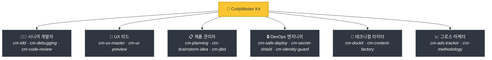
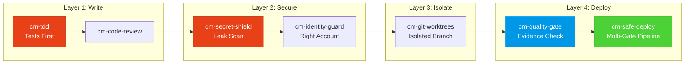

<div align="center">

[English](README.md) | [Tiếng Việt](README-vi.md) | [中文](README-zh.md) | [Русский](README-ru.md) | [한국어](README-ko.md) | [हिन्दी](README-hi.md)

# 🧠 CodyMaster

### 당신의 AI 에이전트는 똑똑합니다. CodyMaster는 그것을 *현명하게* 만듭니다.

**33가지 기술 · 11가지 명령어 · 1가지 플러그인 · 7개 이상의 플랫폼 · 6개 언어**

<p align="center">
  
  
  
  
  <a href="https://github.com/tody-agent/codymaster#readme" target="_blank">
    
  </a>
</p>


### 🌟 CodyMaster가 시간을 절약해 주었다면, [Star](https://github.com/tody-agent/codymaster)를 눌러주세요! 🌟

</div>

---

## 🛑 아무도 말하지 않는 문제

당신은 AI 코딩 에이전트를 설치했습니다. 아주 *훌륭하죠*. 어떤 인간보다 빠르게 코드를 작성합니다.

하지만 곧 현실과 마주하게 됩니다:

| 😤 실제로 일어나는 일 | 💀 진짜 대가 |
|--------------------------|-----------------|
| AI가 **매번 다르게 디자인함** — 같은 브랜드인데 3가지 다른 스타일 | 고객은 당신이 3개의 다른 회사라고 생각합니다 |
| AI가 버그 하나를 고치면, **조용히 다른 5가지를 망가뜨림** | 같은 일을 3~4번 다시 하게 됩니다 |
| AI가 세션 사이에 **모든 것을 잊어버림** | 매일 아침 같은 코드베이스를 다시 설명해야 합니다 |
| AI가 테스트와 문서를 전혀 작성하지 않음 | 당신의 코드베이스는 사상누각이 됩니다 |
| 15가지 다른 기술을 설치했지만 — **서로 연동되지 않음** | 시너지가 전혀 없는 프랑켄슈타인 툴킷 |
| 운영 환경 배포 = **배포하고 기도하기** 🙏 | 새벽 2시에 배포 실패, 롤백 불가 |

> *"AI는 저에게 100개의 손을 주었습니다. 하지만 규율이 없으니, 그 손들은 혼돈을 만들었습니다."*
> — **Tody Le**, 제품 책임자 · 10년 이상의 경력 · CodyMaster 제작자

---

## 🟢 해결책: 하나의 키트에 담긴 시니어 팀 전체

CodyMaster는 단순한 "또 다른 AI 기술 팩"이 아닙니다. 10년 이상의 제품 관리 경험과 6개월간의 실전에서 검증된 바이브 코딩(vibe coding)을 하나의 **통합 시스템**으로 작동하는 33개의 상호 연결된 기술로 응축한 결과물입니다.

CodyMaster를 설치하는 것은 단순히 기술을 추가하는 것이 아닙니다.
**시니어 팀 전체를 채용하는 것입니다:**



---

## ⚡ CodyMaster가 다른 점

다른 기술 팩은 흩어진 도구들을 제공합니다. CodyMaster는 당신의 AI를 위한 **상호 연결된 운영체제**를 제공합니다.

### 🔄 전체 라이프사이클 커버리지 (아이디어 → 운영)

공백도, 수동 전달도 없습니다. 모든 단계가 커버됩니다:


### 🧠 실수로부터 배우는 두뇌

당신의 AI는 단순히 실행만 하지 않습니다 — **기억하고 개선합니다**:

- **`cm-continuity`** — 세션 간의 작업 기억. AI가 무엇이 잘못되었는지 기억하고 동일한 실수를 절대 반복하지 않습니다.
- **`cm-skill-mastery`** — 어떻게 해야 할지 모르시나요? **자동으로 적절한 기술을 찾아** 스스로를 업그레이드합니다.
- **`cm-deep-search`** — 200개 이상의 파일로 구성된 코드베이스에서 길을 잃으셨나요? 몇 초 만에 모든 항목에 대한 시맨틱 검색을 수행합니다.

### 🛡️ 다중 레이어 보호 (코드베이스가 파괴되지 않습니다)

모든 코드 라인은 운영 환경에 배포되기 전에 여러 안전 게이트를 통과합니다:



> **결과:** 비밀 정보 유출 제로. 잘못된 계정 배포 제로. "내 컴퓨터에서는 잘 됐는데" 식의 실패 제로.

### 🎨 디자인 시스템 추출 — 오래된 제품에서도 가능

디자인 시스템이 없는 레거시 제품을 가지고 계신가요? **`cm-ux-master`**가 웹사이트를 스캔하여 색상, 타이포그래피, 간격 및 토큰을 추출한 다음 적절한 디자인 시스템을 재구축합니다. 단 한 줄의 코드를 작성하기 전에 **Pencil.dev** 또는 **Google Stitch**를 통해 디자인을 시각적으로 미리 확인하세요.

### 📝 문서가 전혀 없나요? 문제없습니다.

오래된 코드가 무엇을 하는지 모르시나요? **`cm-dockit`**이 전체 코드베이스를 읽고 다음을 생성합니다:
- 📚 기술 아키텍처 문서
- 📖 사용자 가이드 및 SOP
- 🔌 API 레퍼런스
- 🎯 페르소나 분석 및 JTBD 매핑
- 🌐 다국어 지원. SEO 최적화.

**한 번의 스캔 = 완전한 지식 베이스.**

### 📊 비주얼 대시보드 — 한눈에 모든 것을 확인하세요

더 이상 추측할 필요가 없습니다. 실시간 칸반 보드에서 모든 작업, 에이전트 및 배포를 추적하세요. 파이프라인 진행 상황, 토큰 트래커, 이벤트 로그 — 이 모든 것이 한 화면에 제공됩니다.

---

## 🆚 흩어져 있는 기술들 vs CodyMaster

| | 😵 15 무작위 기술들 | 🧠 CodyMaster |
|---|---|---|
| **통합** | 각 기술이 독립적이며 공유된 컨텍스트가 없음 | 체인으로 연결되고 메모리를 공유하며 소통하는 33개의 기술 |
| **라이프사이클** | 코딩만 지원 | 아이디어 → 디자인 → 코드 → 테스트 → 배포 → 문서화 → 학습 전 과정 지원 |
| **메모리** | 세션 간에 모든 것을 잊어버림 | 4계층 메모리 시스템: Working → Episodic → Semantic → Deep Search |
| **안전성** | YOLO 배포 | 4계층 보호: TDD → 보안 → 격리 → 다중 게이트 배포 |
| **디자인** | 매번 무작위 UI | 디자인 시스템 추출 및 강제 적용 + 시각적 미리보기 |
| **문서화** | "나중에 README나 써볼까" | 코드에서 완전한 문서, SOP, API 레퍼런스 자동 생성 |
| **자기 개선** | 정적임 — 설치한 것 그대로만 사용 | 실수로부터 배우고 새로운 기술을 자동 발견하며 매일 똑똑해짐 |
| **유지보수** | 15개의 저장소를 개별적으로 업데이트 | 한 번의 `git pull`로 모든 것을 업데이트 |

---

## 🦥 게으른 사람들을 위해 만들어졌습니다 (진심으로)

솔직히 말씀드리겠습니다: **CodyMaster는 게으른 사람들을 위해 만들어졌습니다.**

다음과 같은 것을 원하신다면:
- ✅ 채팅 메시지를 입력하고 **작동하는 제품**을 돌려받기
- ✅ AI가 **실수로부터 배우고** 매일 더 발전하기를 원함
- ✅ 동일한 보일러플레이트를 두 번 다시 설정하고 싶지 않음
- ✅ 기도하는 마음 대신 **확신**을 가지고 배포하고 싶음

**→ CodyMaster는 당신을 위한 것입니다.**

다음과 같은 방식을 선호하신다면:
- ❌ AI 출력의 모든 라인을 수동으로 검토하기
- ❌ 모든 프로젝트마다 동일한 설정 의식을 반복하기
- ❌ 안전장치 없는 느리고 수동적인 배포

**→ CodyMaster는 당신을 위한 것이 아닙니다.**

---

## 🚀 1분 설치

### Claude Code (권장)
```bash
bash <(curl -fsSL https://raw.githubusercontent.com/tody-agent/codymaster/main/install.sh) --claude
```
*또는: `claude plugin marketplace add tody-agent/codymaster` → `claude plugin install cm@codymaster`*

### Cursor IDE
```
/add-plugin cody-master

### Gemini CLI / Antigravity
```bash
gemini extensions install https://github.com/tody-agent/codymaster
```

<details>
<summary><b>기타 플랫폼: Codex, OpenCode, Kiro, Copilot, Windsurf, Cline</b></summary>

```bash
# Universal: clone once, copy to any platform
git clone https://github.com/tody-agent/codymaster.git ~/.cody-master

# Then drop skills into your platform's directory:
cp -r ~/.cody-master/skills/* .cursor/skills/
cp -r ~/.cody-master/skills/* .codex/skills/
cp -r ~/.cody-master/skills/* .kiro/steering/
cp -r ~/.cody-master/skills/* .opencode/skills/
cp -r ~/.cody-master/skills/* ~/.gemini/antigravity/skills/
```
</details>

---

## 🧰 33가지 스킬 무기고

| 분야 | 스킬 |
|--------|--------|
| 🔧 **엔지니어링** | `cm-tdd` `cm-debugging` `cm-quality-gate` `cm-test-gate` `cm-code-review` |
| ⚙️ **운영** | `cm-safe-deploy` `cm-identity-guard` `cm-secret-shield` `cm-git-worktrees` `cm-terminal` `cm-safe-i18n` |
| 🎨 **제품 및 UX** | `cm-planning` `cm-ux-master` `cm-ui-preview` `cm-project-bootstrap` `cm-jtbd` `cm-brainstorm-idea` `cm-dockit` `cm-readit` |
| 📈 **성장/CRO** | `cm-content-factory` `cm-ads-tracker` `cro-methodology` |
| 🎯 **오케스트레이션** | `cm-execution` `cm-continuity` `cm-skill-chain` `cm-skill-mastery` `cm-skill-index` `cm-deep-search` `cm-how-it-work` |
| 🖥️ **워크플로우** | `cm-start` `cm-dashboard` `cm-status` |

---

## 🎮 명령어

```
/cm:demo         → 대화형 온보딩 투어
/cm:bootstrap    → 새 프로젝트를 처음부터 스캐폴딩
/cm:plan         → 분석을 통한 기능 계획
/cm:build        → 엄격한 TDD를 통한 구축
/cm:debug        → 체계적인 디버깅
/cm:ux           → 디자인 시스템 추출 및 UI 프리뷰
/cm:track        → 마케팅 픽셀 및 트래킹 설정
```

---

## 👤 제작자

**Tody Le** — 10년 이상의 경력을 가진 제품 책임자. 코드를 작성할 줄 모름. 6개월 동안 인공지능을 사용하여 실제 제품을 개발함. 이 키트의 모든 스킬은 실제 시간과 눈물을 희생시킨 실제 실패에서 탄생함.

> *"33가지 스킬. 각 스킬은 하나의 교훈입니다. 각 레슨은 잠 못 이루는 밤이었습니다. 이제 여러분은 그런 밤을 보낼 필요가 없습니다."*

📖 [전체 이야기 읽기 →](https://cody-master.pages.dev/story)

---

## 📚 리소스

- 🌍 [웹사이트](https://cody-master.pages.dev) — 개요 및 데모
- 📖 [문서](https://cody-master.pages.dev/docs) — 심층 분석
- 🛠️ [스킬 레퍼런스](skills/) — 모든 33가지 SKILL.md 파일 찾아보기
- 📖 [우리의 이야기](https://cody-master.pages.dev/story) — 이것이 존재하는 이유

---

## 🤝 기여하기

1. ⭐ **리포지토리 스타(Star)** — 더 많은 빌더가 이를 찾을 수 있도록 돕습니다
2. 포크(Fork) → `skills/cm-your-skill/SKILL.md` 생성
3. Pull Request 제출

---

<div align="center">

*MIT 라이선스 — 자유롭게 사용, 수정 및 배포 가능.* <br/>
**바이브 코딩 커뮤니티를 위해 ❤️로 제작되었습니다.**

*"Cody" = "Code Đi" (베트남어: "코딩해!") — 바로 구축을 시작하세요.*

</div>