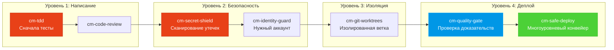

<div align="center">

[English](README.md) | [Tiếng Việt](README-vi.md) | [中文](README-zh.md) | [Русский](README-ru.md) | [한국어](README-ko.md) | [हिन्दी](README-hi.md)

# 🧠 CodyMaster

### Ваш AI-агент умен. CodyMaster делает его *мудрым*.

**33 навыка · 11 команд · 1 плагин · 7+ платформ · 6 языков**

<p align="center">
  
  
  
  
  <a href="https://github.com/tody-agent/codymaster#readme" target="_blank">
    
  </a>
</p>


### 🌟 Если CodyMaster экономит ваше время, поставьте ему [Star](https://github.com/tody-agent/codymaster)! 🌟

</div>

---

## 🛑 Проблема, о которой никто не говорит

Вы установили AI-агента для кодинга. Он *блестящий*. Он пишет код быстрее любого человека.

Но затем наступает реальность:

| 😤 Что происходит на самом деле | 💀 Реальная цена |
|--------------------------|-----------------|
| AI создает дизайн **каждый раз по-разному** — один бренд, 3 разных стиля | Клиенты думают, что вы — 3 разные компании |
| AI исправляет один баг и **тихо ломает 5 других вещей** | Вы переделываете одну и ту же работу 3-4 раза |
| AI **забывает все** между сессиями | Вы заново объясняете одну и ту же кодовую базу каждое утро |
| AI пишет ноль тестов, ноль документации | Ваша кодовая база превращается в карточный домик |
| Вы устанавливаете 15 разных навыков — **ни один из них не взаимодействует с другими** | Инструментарий Франкенштейна с нулевой синергией |
| Деплой в продакшн = **деплой и молитва** 🙏 | Сломанные деплои в 2 часа ночи, без возможности отката |

> *"AI дал мне 100 рук. Но без дисциплины эти руки создали хаос."*
> — **Tody Le**, Head of Product · 10+ лет опыта · Создатель CodyMaster

---

## 🟢 Решение: целая команда сеньоров в одном наборе

CodyMaster — это не просто "еще один набор навыков для AI". Это **10+ лет опыта управления продуктами + 6 месяцев проверенного в боях вайб-кодинга**, воплощенные в 33 взаимосвязанных навыках, которые работают как **единая интегрированная система**.

Когда вы устанавливаете CodyMaster, вы не просто добавляете навыки.
**Вы нанимаете целую команду сеньоров:**


---

## ⚡ Что отличает CodyMaster

Другие наборы навыков дают вам разрозненные инструменты. CodyMaster дает вам **взаимосвязанную операционную систему** для вашего AI.

### 🔄 Полное покрытие жизненного цикла (Идея → Продакшн)

Никаких пробелов. Никаких ручных передач дел. Каждая фаза охвачена:


### 🧠 Мозг, который учится на ошибках

Ваш AI не просто исполняет команды — он **запоминает и совершенствуется**:

- **`cm-continuity`** — Рабочая память между сессиями. ИИ помнит, что пошло не так, и никогда не повторяет ту же ошибку
- **`cm-skill-mastery`** — Не знаете, как что-то сделать? Он **автоматически находит нужный навык** и обновляет себя
- **`cm-deep-search`** — Потерялись в кодовой базе из 200+ файлов? Семантический поиск по всему коду за считанные секунды

### 🛡️ Многоуровневая защита (ваша кодовая база не будет разрушена)

Каждая строка кода проходит через несколько защитных шлюзов, прежде чем попасть в продакшн:



> **Результат:** Ноль утечек секретов. Ноль деплоев на неправильные аккаунты. Ноль сбоев типа «на моей машине работало».

### 🎨 Извлечение дизайн-системы — даже из старых продуктов

У вас есть устаревший продукт без дизайн-системы? **`cm-ux-master`** сканирует ваш сайт, извлекает цвета, типографику, отступы и токены, а затем восстанавливает полноценную дизайн-систему. Просматривайте дизайн визуально с помощью **Pencil.dev** или **Google Stitch**, прежде чем написать хоть одну строку кода.

### 📝 Нет документации? Без проблем.

Не знаете, что делает старый код? **`cm-dockit`** изучает всю вашу кодовую базу и генерирует:
- 📚 Техническую документацию по архитектуре
- 📖 Руководства пользователя и стандартные операционные процедуры (SOP)
- 🔌 Справочники API
- 🎯 Анализ персон и карту JTBD
- 🌐 Многоязычность. SEO-оптимизация.

**Один скан = Полная база знаний.**

### 📊 Визуальный дашборд — всё как на ладони

Больше никаких догадок. Отслеживайте каждую задачу, каждого агента и каждый деплой на Kanban-доске в реальном времени. Прогресс конвейера, трекер токенов, журнал событий — всё на одном экране.

---

## 🆚 Разрозненные навыки vs CodyMaster

| | 😵 15 случайных навыков | 🧠 CodyMaster |
|---|---|---|
| **Интеграция** | Каждый навык автономен, нет общего контекста | 33 навыка, которые объединяются в цепочки, имеют общую память и взаимодействуют друг с другом |
| **Жизненный цикл** | Охватывает только написание кода | Охватывает путь: Идея → Дизайн → Код → Тест → Деплой → Документация → Обучение |
| **Память** | Забывает всё между сессиями | 4-уровневая система памяти: Рабочая → Эпизодическая → Семантическая → Deep Search |
| **Безопасность** | YOLO деплои | 4-уровневая защита: TDD → Безопасность → Изоляция → Многоуровневый деплой |
| **Дизайн** | Случайный интерфейс каждый раз | Извлекает и внедряет дизайн-систему + визуальный предпросмотр |
| **Документация** | «Может быть, напишу README позже» | Автоматически генерирует полную документацию, SOP и справочники API на основе кода |
| **Самосовершенствование** | Статичность — вы получаете только то, что установили | Учится на ошибках, автоматически находит новые навыки, становится умнее с каждым днем |
| **Обслуживание** | Обновление 15 репозиториев по отдельности | Одна команда git pull обновляет всё |

---

## 🦥 Создано для ленивых людей (серьезно)

Будем честны: **CodyMaster был создан для ленивых людей.**

Если вы хотите:
- ✅ Написать сообщение в чате и получить в ответ готовый продукт
- ✅ Чтобы ваш ИИ учился на своих ошибках и становился лучше с каждым днем
- ✅ Никогда не настраивать один и тот же шаблон дважды
- ✅ Деплоить с уверенностью, а не с молитвой

**→ CodyMaster для вас.**

Если вы предпочитаете:
- ❌ Вручную проверять каждую строку вывода ИИ
- ❌ Проводить один и тот же ритуал настройки для каждого проекта
- ❌ Медленные ручные деплои без страховки

**→ CodyMaster НЕ для вас.**

---

## 🚀 Установка за 1 минуту

### Claude Code (Рекомендуется)
```bash
bash <(curl -fsSL https://raw.githubusercontent.com/tody-agent/codymaster/main/install.sh) --claude
```
*Или: `claude plugin marketplace add tody-agent/codymaster` → `claude plugin install cm@codymaster`*

### Cursor IDE
```
/add-plugin cody-master

### Gemini CLI / Antigravity
```bash
gemini extensions install https://github.com/tody-agent/codymaster
```

<details>
<summary><b>Другие платформы: Codex, OpenCode, Kiro, Copilot, Windsurf, Cline</b></summary>

```bash
# Универсально: клонируйте один раз, копируйте на любую платформу
git clone https://github.com/tody-agent/codymaster.git ~/.cody-master

# Затем поместите навыки в директорию вашей платформы:
cp -r ~/.cody-master/skills/* .cursor/skills/
cp -r ~/.cody-master/skills/* .codex/skills/
cp -r ~/.cody-master/skills/* .kiro/steering/
cp -r ~/.cody-master/skills/* .opencode/skills/
cp -r ~/.cody-master/skills/* ~/.gemini/antigravity/skills/
```
</details>

---

## 🧰 Арсенал из 33 навыков

| Область | Навыки |
|--------|--------|
| 🔧 **Инженерия** | `cm-tdd` `cm-debugging` `cm-quality-gate` `cm-test-gate` `cm-code-review` |
| ⚙️ **Операции** | `cm-safe-deploy` `cm-identity-guard` `cm-secret-shield` `cm-git-worktrees` `cm-terminal` `cm-safe-i18n` |
| 🎨 **Продукт и UX** | `cm-planning` `cm-ux-master` `cm-ui-preview` `cm-project-bootstrap` `cm-jtbd` `cm-brainstorm-idea` `cm-dockit` `cm-readit` |
| 📈 **Рост/CRO** | `cm-content-factory` `cm-ads-tracker` `cro-methodology` |
| 🎯 **Оркестрация** | `cm-execution` `cm-continuity` `cm-skill-chain` `cm-skill-mastery` `cm-skill-index` `cm-deep-search` `cm-how-it-work` |
| 🖥️ **Рабочий процесс** | `cm-start` `cm-dashboard` `cm-status` |

---

## 🎮 Команды

```
/cm:demo         → Интерактивный ознакомительный тур
/cm:bootstrap    → Создание структуры нового проекта с нуля
/cm:plan         → Планирование функции с анализом
/cm:build        → Сборка со строгим TDD
/cm:debug        → Систематическая отладка
/cm:ux           → Извлечение дизайн-системы и предпросмотр UI
/cm:track        → Настройка маркетинговых пикселей и отслеживания
```

---

## 👤 Кто это создал

**Tody Le** — Head of Product с более чем 10-летним опытом. Не умеет писать код. Использовал ИИ для создания реальных продуктов в течение 6 месяцев подряд. Каждый навык в этом наборе родился из реальной неудачи, которая стоила реального времени и реальных слез.

> *"33 навыка. Каждый навык — это урок. Каждый урок — это бессонная ночь. И теперь вам не нужно проходить через эти ночи."*

📖 [Читать полную историю →](https://cody-master.pages.dev/story)

---

## 📚 Ресурсы

- 🌍 [Веб-сайт](https://cody-master.pages.dev) — Обзор и демо
- 📖 [Документация](https://cody-master.pages.dev/docs) — Полное погружение
- 🛠️ [Справочник навыков](skills/) — Просмотр всех 33 файлов SKILL.md
- 📖 [Наша история](https://cody-master.pages.dev/story) — Почему это существует

---

## 🤝 Содействие проекту

1. ⭐ **Ставьте звезду репозиторию** — это поможет большему количеству создателей найти его
2. Fork → Создайте `skills/cm-your-skill/SKILL.md`
3. Отправьте Pull Request

---

<div align="center">

*Лицензия MIT — можно свободно использовать, изменять и распространять.* <br/>
**Создано с ❤️ для сообщества vibe-кодинга.**

*"Cody" = "Code Đi" (Вьетнамский: "Кодь!") — просто начни создавать.*

</div>