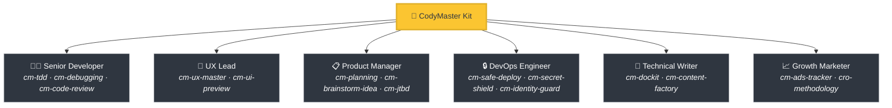
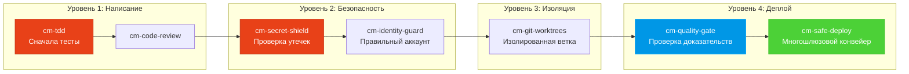

<div align="center">

[English](README.md) | [Tiếng Việt](README-vi.md) | [中文](README-zh.md) | [Русский](README-ru.md) | [한국어](README-ko.md) | [हिन्दी](README-hi.md)

# 🧠 CodyMaster

### Ваш ИИ-Агент умен. CodyMaster делает его *мудрым*.

**33 Навыка · 11 Команд · 1 Плагин · 7+ Платформ · 6 Языков**

<p align="center">
  
  
  
  
  <a href="https://github.com/tody-agent/codymaster#readme" target="_blank">
    
  </a>
</p>


### 🌟 Если CodyMaster экономит ваше время, поставьте ему [Звезду](https://github.com/tody-agent/codymaster)! 🌟

</div>

---

## 🛑 Проблема, о которой никто не говорит

Вы установили ИИ-ассистента для программирования. Он *великолепен*. Он пишет код быстрее любого человека.

Но затем наступает реальность:

| 😤 Что происходит на самом деле | 💀 Истинная цена |
|--------------------------|-----------------|
| ИИ проектирует **по-разному каждый раз** — тот же бренд, 3 разных стиля | Клиенты думают, что вы — 3 разные компании |
| ИИ исправляет один баг, **незаметно ломая 5 других вещей** | Вы переделываете одну и ту же работу 3-4 раза |
| ИИ **забывает все** между сеансами | Каждое утро вы заново объясняете всю структуру кода |
| ИИ не пишет тесты, не пишет документацию | Ваша кодовая база превращается в карточный домик |
| Вы устанавливаете 15 разных навыков — **и ни один из них не связан с другими** | Инструментарий Франкенштейна с нулевой синергией |
| Развертывание в продакшене = **задеплоить и молиться** 🙏 | Сломанные деплои в 2 часа ночи, без возможности отката |

> *"ИИ дал мне 100 рук. Но без дисциплины эти руки создали лишь хаос."*
> — **Tody Le**, Руководитель продукта · 10+ лет опыта · Создатель CodyMaster

---

## 🟢 Решение: Целая команда Senior-разработчиков в одном наборе

CodyMaster — это не просто «очередной пакет ИИ-навыков». Это **10+ лет опыта в управлении продуктами + 6 месяцев проверенного в боях vibe-кодинга**, сжатые в 33 взаимосвязанных навыка, которые работают как **единая интегрированная система**.

Устанавливая CodyMaster, вы не просто добавляете навыки.
**Вы нанимаете целую старшую команду:**



---

## ⚡ Чем CodyMaster отличается от других

Другие пакеты навыков дают вам разрозненные инструменты. CodyMaster дает вам **взаимосвязанную операционную систему** для вашего ИИ.

### 🔄 Полный охват жизненного цикла (от идеи до продакшена)

Никаких пробелов. Никаких ручных передач. Каждый этап охвачен:


### 🧠 Мозг, который учится на ошибках

Ваш ИИ не просто выполняет задачи — он **запоминает и улучшается**:

- **`cm-continuity`** — Рабочая память между сеансами. ИИ помнит, что пошло не так, и никогда не повторяет одни и те же ошибки
- **`cm-skill-mastery`** — Не знает, как что-то сделать? Он **автоматически находит нужный навык** и прокачивает себя
- **`cm-deep-search`** — Потерялись в кодовой базе из 200+ файлов? Семантический поиск по всему проекту за считанные секунды

### 🛡️ Многоуровневая защита (Ваш код не будет разрушен)

Каждая строчка кода проходит через несколько шлюзов безопасности перед отправкой в продакшен:



> **Результат:** Ноль утекших секретов. Ноль деплоев не с того аккаунта. Ноль проблем типа "у меня это работало".

### 🎨 Извлечение дизайн-системы — даже из старых продуктов

У вас есть старый продукт без дизайн-системы? **`cm-ux-master`** сканирует ваш веб-сайт, извлекает цвета, типографику, отступы и токены, а затем перестраивает правильную дизайн-систему. Визуально просматривайте дизайн с помощью **Pencil.dev** или **Google Stitch** до написания единой строки кода.

### 📝 Нет документации? Не проблема.

Не знаете, что делает старый код? **`cm-dockit`** читает всю вашу кодовую базу и генерирует:
- 📚 Документы по технической архитектуре
- 📖 Руководства пользователя и СОП
- 🔌 Справочники по API
- 🎯 Анализ персон и картирование JTBD
- 🌐 На нескольких языках. Оптимизировано для SEO.

**Одно сканирование = Полная база знаний.**

### 📊 Визуальная панель — все как на ладони

Больше никаких догадок. Отслеживайте каждую задачу, каждого агента, каждое развертывание на канбан-доске в реальном времени. Прогресс конвейера, счетчик токенов, журнал событий — все на одном экране.

---

## 🆚 Разрозненные навыки против CodyMaster

| | 😵 15 случайных навыков | 🧠 CodyMaster |
|---|---|---|
| **Интеграция** | Каждый навык автономен, без общего контекста | 33 навыка, которые объединяются в цепочки, обмениваются памятью и общаются |
| **Жизненный цикл** | Охватывает только кодирование | Охватывает Идея → Дизайн → Код → Тест → Деплой → Документация → Обучение |
| **Память** | Забывает все между сессиями | 4-х уровневая система памяти: Рабочая → Эпизодическая → Семантическая → Глубокий поиск |
| **Безопасность** | Деплои "на авось" | 4-х уровневая защита: TDD → Безопасность → Изоляция → Мульти-гейт деплой |
| **Дизайн** | Каждый раз случайный пользовательский интерфейс | Извлекает и внедряет дизайн-систему + визуальный просмотр |
| **Документация** | "Возможно, напишу README позже" | Автоматически генерирует полные документы, СОП, API ссылки из кода |
| **Самоулучшение** | Статично — что скачали, то и получили | Учится на ошибках, авто-находит новые навыки, умнеет каждый день |
| **Обслуживание** | Обновляйте 15 репозиториев по-отдельности | Один `git pull` обновляет всё |

---

## 🦥 Создано для ленивых людей (Серьезно)

Будем честны: **CodyMaster был создан для ленивых людей.**

Если вы хотите:
- ✅ Отправить сообщение в чат и получить обратно **работающий продукт**
- ✅ Чтобы ваш ИИ **учился на своих ошибках** и становился лучше каждый день
- ✅ Никогда не настраивать одни и те же шаблоны дважды
- ✅ Развертывать систему с **уверенностью**, а не молиться

**→ CodyMaster — для вас.**

Если вы предпочитаете:
- ❌ Вручную просматривать каждую строчку, сгенерированную ИИ
- ❌ Проходить один и тот же ритуал настройки для каждого проекта
- ❌ Медленные развертывания вручную без подстраховки

**→ CodyMaster — НЕ для вас.**

---

## 🚀 Установка за 1 минуту

### Claude Code (Рекомендуется)
```bash
bash <(curl -fsSL https://raw.githubusercontent.com/tody-agent/codymaster/main/install.sh) --claude
```
*Или: `claude plugin marketplace add tody-agent/codymaster` → `claude plugin install cm@codymaster`*

### Cursor IDE
```
/add-plugin cody-master
```

### Gemini CLI / Antigravity
```bash
gemini extensions install https://github.com/tody-agent/codymaster
```

<details>
<summary><b>Другие Платформы: Codex, OpenCode, Kiro, Copilot, Windsurf, Cline</b></summary>

```bash
# Универсально: клонируйте один раз, копируйте на любую платформу
git clone https://github.com/tody-agent/codymaster.git ~/.cody-master

# Затем перебросьте навыки в каталог вашей платформы:
cp -r ~/.cody-master/skills/* .cursor/skills/
cp -r ~/.cody-master/skills/* .codex/skills/
cp -r ~/.cody-master/skills/* .kiro/steering/
cp -r ~/.cody-master/skills/* .opencode/skills/
cp -r ~/.cody-master/skills/* ~/.gemini/antigravity/skills/
```
</details>

---

## 🧰 Арсенал из 33 Навыков

| Домен | Навыки |
|--------|--------|
| 🔧 **Инженерия** | `cm-tdd` `cm-debugging` `cm-quality-gate` `cm-test-gate` `cm-code-review` |
| ⚙️ **Операции** | `cm-safe-deploy` `cm-identity-guard` `cm-secret-shield` `cm-git-worktrees` `cm-terminal` `cm-safe-i18n` |
| 🎨 **Продукт и UX** | `cm-planning` `cm-ux-master` `cm-ui-preview` `cm-project-bootstrap` `cm-jtbd` `cm-brainstorm-idea` `cm-dockit` `cm-readit` |
| 📈 **Рост/CRO** | `cm-content-factory` `cm-ads-tracker` `cro-methodology` |
| 🎯 **Оркестрация** | `cm-execution` `cm-continuity` `cm-skill-chain` `cm-skill-mastery` `cm-skill-index` `cm-deep-search` `cm-how-it-work` |
| 🖥️ **Воркфлоу** | `cm-start` `cm-dashboard` `cm-status` |

---

## 🎮 Команды

```
/cm:demo         → Интерактивный вводный тур
/cm:bootstrap    → Создайте новый проект с нуля
/cm:plan         → Спланируйте функцию с анализом
/cm:build        → Сборка со строгим TDD
/cm:debug        → Систематическая отладка
/cm:ux           → Извлечение дизайн-системы и превью UI
/cm:track        → Настройка пикселей маркетолога и трекинга
```

---

## 👤 Кто это создал

**Tody Le** — Руководитель продукта с более чем 10-летним опытом работы. Не умеет писать код. Использовал ИИ для создания реальных продуктов 6 месяцев подряд. Каждый навык в этом наборе родился из-за реального провала, который стоил реального времени и реальных слез.

> *"33 навыка. Каждый навык — это урок. Каждый урок — это бессонная ночь. И теперь вам не придется переживать эти ночи."*

📖 [Читайте полную историю →](https://cody-master.pages.dev/story)

---

## 📚 Ресурсы

- 🌍 [Сайт](https://cody-master.pages.dev) — Обзор и демо
- 📖 [Документация](https://cody-master.pages.dev/docs) — Полное погружение
- 🛠️ [Справочник по навыкам](skills/) — Просмотр всех файлов SKILL.md
- 📖 [Наша История](https://cody-master.pages.dev/story) — Почему это существует

---

## 🤝 Внесение вклада

1. ⭐ **Поставьте звезду репо** — это помогает другим разработчикам найти проект
2. Сделайте Fork → Создайте `skills/cm-your-skill/SKILL.md`
3. Отправьте Pull Request

---

<div align="center">

*Лицензия MIT — Свободное использование, изменение и распространение.* <br/>
**Создано с ❤️ для сообщества vibe-coding.**

*"Cody" = "Code Đi" (По-вьетнамски: "Иди программируй") — просто начни создавать.*

</div>
