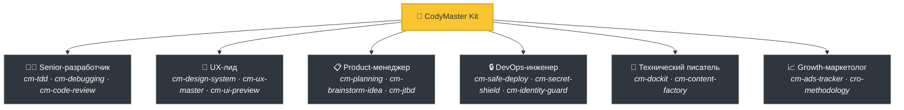
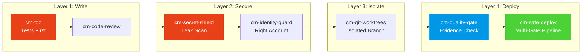

<div align="center">

[English](README.md) | [Tiếng Việt](README-vi.md) | [中文](README-zh.md) | [Русский](README-ru.md) | [한국어](README-ko.md) | [हिन्दी](README-hi.md)

# 🧠 CodyMaster

### Ваш AI-агент умен. CodyMaster делает его *мудрым*.

**68+ навыков · 11 команд · 1 плагин · 7+ платформ · 6 языков**

<p align="center">
  
  
  
  
  <a href="https://github.com/tody-agent/codymaster#readme" target="_blank">
    
  </a>
</p>


### 🌟 Если CodyMaster экономит ваше время, поставьте ему [Star](https://github.com/tody-agent/codymaster)! 🌟

</div>

---

## 🛑 Проблема, о которой никто не говорит

Вы установили AI-агента для написания кода. Он *великолепен*. Он пишет код быстрее любого человека.

Но затем наступает реальность:

| 😤 Что происходит на самом деле | 💀 Реальная цена |
|--------------------------|-----------------|
| AI создает **разный дизайн каждый раз** — один бренд, 3 разных стиля | Клиенты думают, что вы — 3 разные компании |
| AI исправляет один баг, но при этом **незаметно ломает 5 других вещей** | Вы переделываете одну и ту же работу 3-4 раза |
| AI **забывает всё** между сессиями | Вы каждое утро заново объясняете одну и ту же кодовую базу |
| AI не пишет ни тестов, ни документации | Ваша кодовая база превращается в карточный домик |
| Вы устанавливаете 15 разных навыков — **ни один из них не "общается" с другими** | Набор инструментов Франкенштейна с нулевой синергией |
| Деплой в продакшн = **деплой и молитва** 🙏 | Сломанные деплои в 2 часа ночи, никакого отката |

> *"AI дал мне 100 рук. Но без дисциплины эти руки создали хаос."*
> — **Тоди Ле**, Head of Product · 10+ лет опыта · Создатель CodyMaster

---

## 🟢 Решение: Целая команда Senior-специалистов в одном наборе

CodyMaster — это не просто "очередной набор навыков для AI". Это **10+ лет опыта управления продуктами + 6 месяцев проверенного в боях vibe coding**, воплощенные в 68+ взаимосвязанных навыках, которые работают как **единая интегрированная система**.

Когда вы устанавливаете CodyMaster, вы не просто добавляете навыки.
**Вы нанимаете целую команду Senior-специалистов:**



---

## ⚡ Что отличает CodyMaster

Другие наборы навыков дают вам разрозненные инструменты. CodyMaster дает вам **взаимосвязанную операционную систему** для вашего AI.

### 🔄 Охват всего жизненного цикла (Идея → Продакшн)

Никаких пробелов. Никакой ручной передачи задач. Каждая фаза охвачена:


### 🧠 Объединенный Мозг: 5-уровневая архитектура памяти

Ваш AI не просто исполняет команды — он **понимает и запоминает** с помощью 5-уровневой системы Объединенного Мозга, которая сохраняется между сессиями и устройствами:

1. **Sensory Memory (Сессия)** — Непосредственный контекст активных файлов и терминалов.
2. **Working Memory (`cm-continuity`)** — Рабочая память (черновик) между сессиями. AI никогда не повторяет одну и ту же ошибку.
3. **Long-Term Memory (`learnings.json`)** — Закрепленные уроки с умным затуханием Ebbinghaus TTL.
4. **Semantic Memory (`cm-deep-search`)** — Локальный векторный поиск по документам с использованием `qmd`.
5. **Structural Memory (`cm-codeintell`)** — CodeGraph на основе AST. Сжатие до 95% токенов для получения контекста всей кодовой базы.

☁️ **Cloud Brain (`cm-notebooklm`)**
Ценные знания и паттерны проектирования синхронизируются с NotebookLM, предоставляя универсальную "Душу" для вашего проекта, доступную на разных устройствах. Автоматически генерируйте подкасты и флэш-карточки для адаптации разработчиков-людей, работающих вместе с AI.

📖 [Прочитать полную Архитектуру Знаний (EN) →](docs/knowledge-architecture.md)

### 🛡️ Многоуровневая защита (Ваша кодовая база не будет уничтожена)

Каждая строка кода проходит через несколько защитных шлюзов, прежде чем попасть в продакшн:



> **Результат:** Ноль утечек секретов. Ноль деплоев на неправильный аккаунт. Ноль сбоев типа «на моей машине работало».

### 🎨 Извлечение дизайн-системы — Даже из старых продуктов

У вас есть легаси-продукт без дизайн-системы? **cm-design-system** сканирует ваш сайт, извлекает цвета, типографику, отступы и токены, а затем перестраивает полноценную дизайн-систему. Визуально просматривайте дизайн в **Pencil.dev** или **Google Stitch** перед написанием первой строки кода.

### 📝 Ноль документации? Без проблем.

Не знаете, что делает старый код? **`cm-dockit`** считывает всю вашу кодовую базу и генерирует:
- 📚 Документацию по технической архитектуре
- 📖 Руководства пользователя и SOP
- 🔌 API-справочники
- 🎯 Анализ персон и карту JTBD
- 🌐 Мультиязычность. SEO-оптимизация.

**Один скан = Полная база знаний.**

### 💡 Стратегический мозговой штурм (Design Thinking + 9 Windows)

Прежде чем писать код для сложных запросов, **`cm-brainstorm-idea`** оценивает ваш продукт с помощью многомерного анализа (Технологии, Продукт, Дизайн, Бизнес). Он предлагает 2-3 квалифицированных варианта с использованием фреймворка 9 окон (TRIZ) и предоставляет визуальный предпросмотр UI через **Pencil.dev** или **Google Stitch**, чтобы подтвердить направление до детального планирования.

📖 [Узнать больше о этапе предварительного просмотра UI →](docs/Brainstorm-UI-Preview.md)

### 🏭 AI Content Factory v2.0 & Визуальный дашборд

Нужно масштабировать контент? **`cm-content-factory`** — это самообучающийся контент-движок с несколькими агентами. Он автоматически исследует, пишет, проверяет (SEO и Убеждение) и публикует статьи с высокой конверсией с помощью фреймворка Content Mastery (StoryBrand + Cialdini).

Отслеживайте все на **Визуальном дашборде** (`cm-dashboard`): Больше никаких догадок. Отслеживайте каждую задачу, каждого агента, каждое развертывание на Kanban-доске в реальном времени. Прогресс пайплайна, трекер токенов, лог событий — всё на одном экране.

---

## 🆚 Разрозненные навыки против CodyMaster

| | 😵 15 случайных навыков | 🧠 CodyMaster |
|---|---|---|
| **Интеграция** | Каждый навык автономен, нет общего контекста | 68+ навыков, которые объединяются в цепочки, разделяют память и взаимодействуют |
| **Жизненный цикл** | Охватывает только написание кода | Охватывает путь: Идея → Дизайн → Код → Тест → Деплой → Доки → Обучение |
| **Память** | Забывает всё между сессиями | 5-уровневая система Объединенного Мозга: Sensory → Working → Long-term → Semantic → Structural + Cloud Brain |
| **Безопасность** | YOLO-деплои | 4 уровня защиты: TDD → Безопасность → Изоляция → Многоуровневый деплой |
| **Дизайн** | Случайный UI каждый раз | Извлекает и внедряет дизайн-систему + визуальный просмотр |
| **Документация** | «Может, напишу README позже» | Автогенерация полной документации, SOP и API-справочников из кода |
| **Самосовершенствование** | Статично — что установили, то и получили | Учится на ошибках, авто-обнаруживает новые навыки, становится умнее с каждым днем |
| **Обслуживание** | Обновление 15 репозиториев по отдельности | Один `git pull` обновляет всё |

---

## 🦥 Создано для ленивых (Серьезно)

Будем честны: **CodyMaster был создан для ленивых людей.**

Если вы хотите:
- ✅ Отправить сообщение в чат и получить обратно **рабочий продукт**
- ✅ Чтобы ваш AI **учился на своих ошибках** и становился лучше с каждым днем
- ✅ Никогда не настраивать один и тот же шаблон дважды
- ✅ Деплоить с **уверенностью**, а не с молитвой

**→ CodyMaster — для вас.**

Если вы предпочитаете:
- ❌ Вручную проверять каждую строку вывода AI
- ❌ Выполнять один и тот же ритуал настройки для каждого проекта
- ❌ Медленные ручные деплои без страховки

**→ CodyMaster НЕ для вас.**

---

## 🚀 Установка за 1 минуту

### 1. Установка AI-навыков (Все платформы)

Одна команда устанавливает все 68+ навыков в вашу среду. Поддерживает Claude Code, Gemini CLI, Cursor, Aider, Windsurf, Cline, OpenCode и многие другие платформы:

```bash
bash <(curl -fsSL https://raw.githubusercontent.com/tody-agent/codymaster/main/install.sh) --all
```

*Пользователи Cursor IDE также могут просто ввести `/add-plugin cody-master` в чате агента.*

### 2. Установка панели управления (Опционально, но рекомендуется)

Визуализируйте свой прогресс, управляйте задачами и отслеживайте свои достижения в кодинге с хомяком Cody 🐹.

```bash
npm install -g codymaster
cm
```

CLI поприветствует вас и поможет организовать долгие сессии кодинга!

```text
    ( . \ --- / . )
     /   ^   ^   \        Hi! I'm Cody 🐹
    (      u      )        Your smart coding companion.
     |  \ ___ /  |
      '--w---w--'

│
◆  Quick menu
│  ● 📊  Dashboard (Start & open)
│  ○ 📋  My Tasks
│  ○ 📈 Status
│  ○ 🧩  Browse Skills
```

---

## 🧰 Арсенал из 68+ навыков

| Область | Навыки |
|--------|--------|
| 🔧 **Инженерия** | `cm-tdd` `cm-debugging` `cm-quality-gate` `cm-test-gate` `cm-code-review` |
| ⚙️ **Операции** | `cm-safe-deploy` `cm-identity-guard` `cm-secret-shield` `cm-git-worktrees` `cm-terminal` `cm-safe-i18n` |
| 🎨 **Продукт и UX** | `cm-planning` `cm-design-system` `cm-ux-master` `cm-ui-preview` `cm-project-bootstrap` `cm-jtbd` `cm-brainstorm-idea` `cm-dockit` `cm-readit` |
| 📈 **Рост/CRO** | `cm-content-factory` `cm-ads-tracker` `cro-methodology` |
| 🎯 **Оркестрация** | `cm-execution` `cm-continuity` `cm-skill-chain` `cm-skill-mastery` `cm-skill-index` `cm-deep-search` `cm-notebooklm` `cm-how-it-work` |
| 🖥️ **Рабочий процесс** | `cm-start` `cm-dashboard` `cm-status` |

---

## 🎮 Команды

```
/cm:demo         → Интерактивный ознакомительный тур
/cm:bootstrap    → Создание структуры нового проекта с нуля
/cm:plan         → Планирование функции с анализом
/cm:build        → Сборка со строгим TDD
/cm:debug        → Систематическая отладка
/cm:ux           → Извлечение дизайн-системы и превью UI
/cm:track        → Настройка маркетинговых пикселей и отслеживания
```

---

## 👤 Кто это создал

**Tody Le** — Head of Product с опытом более 10 лет. Не умеет писать код. Использовал ИИ для создания реальных продуктов 6 месяцев подряд. Каждый навык в этом наборе родился из реальной неудачи, стоившей реального времени и реальных слез.

> *"68+ навыков. Каждый навык — это урок. Каждый урок — бессонная ночь. И теперь вам не придется проходить через эти ночи."*

📖 [Прочитать полную историю →](https://cody.todyle.com/story)

---

## 📚 Ресурсы

- 🌍 [Веб-сайт](https://cody.todyle.com) — Обзор и демо
- 📖 [Документация](https://cody.todyle.com/docs) — Полное погружение
- 🛠️ [Справочник навыков](skills/) — Просмотреть все 68+ файлов SKILL.md
- 📖 [Наша история](https://cody.todyle.com/story) — Почему это существует

---

## 🤝 Участие в разработке

1. ⭐ **Star the repo** — это поможет большему числу разработчиков найти его
2. Fork → Создайте `skills/cm-your-skill/SKILL.md`
3. Отправьте Pull Request

---

<div align="center">

*Лицензия MIT — можно свободно использовать, изменять и распространять.* <br/>
**Создано с ❤️ для сообщества вайб-кодинга.**

*"CodyMaster" = "Code Đi" (вьетнамский: «Иди кодь!») — просто начни создавать.*

</div>