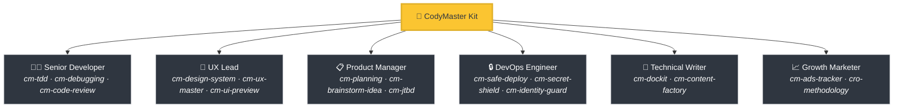
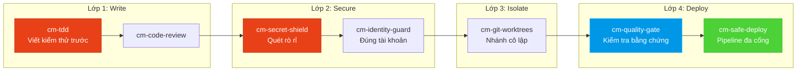

<div align="center">

[English](README.md) | [Tiếng Việt](README-vi.md) | [中文](README-zh.md) | [Русский](README-ru.md) | [한국어](README-ko.md) | [हिन्दी](README-hi.md)

# 🧠 CodyMaster

### AI Agent của bạn thông minh. CodyMaster làm nó trở nên *thông thái*.

**34 Kỹ năng · 11 Lệnh · 1 Plugin · 7+ Nền tảng · 6 Ngôn ngữ**

<p align="center">
  
  
  
  
  <a href="https://github.com/tody-agent/codymaster#readme" target="_blank">
    
  </a>
</p>


### 🌟 Nếu CodyMaster giúp bạn tiết kiệm thời gian, hãy tặng một [Star](https://github.com/tody-agent/codymaster)! 🌟

</div>

---

## 🛑 Vấn đề mà không ai nói đến

Bạn đã cài đặt một AI coding agent. Nó thật *tuyệt vời*. Nó viết code nhanh hơn bất kỳ con người nào.

Nhưng rồi thực tế ập đến:

| 😤 Điều thực sự xảy ra | 💀 Cái giá thực sự |
|--------------------------|-----------------|
| AI thiết kế **khác nhau sau mỗi lần** — cùng một thương hiệu, 3 phong cách khác nhau | Khách hàng nghĩ bạn là 3 công ty khác nhau |
| AI sửa một lỗi, **âm thầm làm hỏng 5 thứ khác** | Bạn phải làm lại cùng một công việc 3-4 lần |
| AI **quên mọi thứ** giữa các phiên làm việc | Bạn phải giải thích lại cùng một codebase vào mỗi sáng |
| AI viết không dòng test, không tài liệu | Codebase của bạn trở nên mong manh như một ngôi nhà bằng bài |
| Bạn cài đặt 15 kỹ năng khác nhau — **không cái nào giao tiếp với cái nào** | Bộ công cụ Frankenstein với con số không về sự hiệp lực |
| Deploy lên production = **deploy và cầu nguyện** 🙏 | Deploy lỗi lúc 2 giờ sáng, không có rollback |

> *"AI cho tôi 100 cánh tay. Nhưng nếu thiếu kỷ luật, những cánh tay đó chỉ tạo ra sự hỗn loạn."*
> — **Tody Le**, Head of Product · 10+ năm kinh nghiệm · Người sáng tạo ra CodyMaster

---

## 🟢 Giải pháp: Cả một đội ngũ Senior trong một bộ công cụ

CodyMaster không chỉ là "một gói kỹ năng AI khác". Đó là **10+ năm kinh nghiệm quản lý sản phẩm + 6 tháng vibe coding thực chiến**, được đúc kết thành 34 kỹ năng kết nối với nhau, hoạt động như một **hệ thống tích hợp duy nhất**.

Khi bạn cài đặt CodyMaster, bạn không chỉ thêm các kỹ năng.
**Bạn đang thuê cả một đội ngũ senior:**



---

## ⚡ Điều gì làm nên sự khác biệt của CodyMaster

Các gói kỹ năng khác cung cấp cho bạn những công cụ rời rạc. CodyMaster mang đến một **hệ điều hành kết nối** cho AI của bạn.

### 🔄 Bao phủ toàn bộ vòng đời (Ý tưởng → Production)

Không có lỗ hổng. Không cần bàn giao thủ công. Mọi giai đoạn đều được bao phủ:


### 🧠 Một bộ não học hỏi từ những sai lầm

AI của bạn không chỉ thực thi — nó còn **ghi nhớ và cải thiện**:

- **`cm-continuity`** — Bộ nhớ làm việc qua các phiên làm việc. AI ghi nhớ những gì đã xảy ra lỗi và không bao giờ lặp lại cùng một sai lầm
- **`cm-skill-mastery`** — Không biết cách làm gì đó? Nó sẽ **tự động tìm kỹ năng phù hợp** và tự nâng cấp chính mình
- **`cm-deep-search`** — Bị lạc trong một codebase hơn 200 tệp? Tìm kiếm ngữ nghĩa trên mọi thứ chỉ trong vài giây

### 🛡️ Bảo vệ đa lớp (Codebase của bạn sẽ không bị phá hủy)

Mọi dòng mã đều đi qua nhiều cổng an toàn trước khi đến môi trường production:



> **Kết quả:** Không rò rỉ bí mật. Không triển khai nhầm tài khoản. Không còn những lỗi kiểu "chạy tốt trên máy tôi".

### 🎨 Trích xuất hệ thống thiết kế — Ngay cả từ các sản phẩm cũ

Bạn có một sản phẩm cũ không có hệ thống thiết kế? **cm-design-system** sẽ quét trang web của bạn, trích xuất màu sắc, kiểu chữ, khoảng cách và token, sau đó xây dựng lại một hệ thống thiết kế chuẩn chỉnh. Xem trước thiết kế một cách trực quan với **Pencil.dev** hoặc **Google Stitch** trước khi viết dù chỉ một dòng mã.

### 📝 Không có tài liệu? Không vấn đề gì.

Không biết mã nguồn cũ thực hiện những gì? **`cm-dockit`** đọc toàn bộ codebase của bạn và tạo ra:
- 📚 Tài liệu kiến trúc kỹ thuật
- 📖 Hướng dẫn sử dụng & SOP
- 🔌 Tham chiếu API
- 🎯 Phân tích Persona & lập bản đồ JTBD
- 🌐 Đa ngôn ngữ. Tối ưu hóa SEO.

**Một lần quét = Cơ sở tri thức hoàn chỉnh.**

### 📊 Bảng điều khiển trực quan — Xem mọi thứ trong nháy mắt

Không còn phải đoán mò. Theo dõi mọi tác vụ, mọi agent, mọi lần triển khai trên bảng Kanban thời gian thực. Tiến độ pipeline, trình theo dõi token, nhật ký sự kiện — tất cả trên một màn hình.

---

## 🆚 Kỹ năng rời rạc so với CodyMaster

| | 😵 15 kỹ năng ngẫu nhiên | 🧠 CodyMaster |
|---|---|---|
| **Tích hợp** | Mỗi kỹ năng là độc lập, không có ngữ cảnh chung | 34 kỹ năng liên kết thành chuỗi, chia sẻ bộ nhớ và giao tiếp với nhau |
| **Vòng đời** | Chỉ bao gồm phần lập trình (coding) | Bao gồm Ý tưởng → Thiết kế → Code → Kiểm thử → Triển khai → Tài liệu → Học tập |
| **Bộ nhớ** | Quên mọi thứ giữa các phiên làm việc | Hệ thống bộ nhớ 4 tầng: Working → Episodic → Semantic → Deep Search |
| **An toàn** | Triển khai kiểu phó mặc (YOLO) | Bảo vệ 4 lớp: TDD → Security → Isolation → Triển khai đa cổng |
| **Thiết kế** | UI ngẫu nhiên mỗi lần thực hiện | Trích xuất & thực thi hệ thống thiết kế + xem trước trực quan |
| **Tài liệu** | "Có lẽ sẽ viết README sau" | Tự động tạo tài liệu đầy đủ, SOP, tham chiếu API từ mã nguồn |
| **Tự cải thiện** | Tĩnh — những gì bạn cài đặt là những gì bạn nhận được | Học hỏi từ sai lầm, tự động khám phá kỹ năng mới, thông minh hơn mỗi ngày |
| **Bảo trì** | Cập nhật 15 repo riêng biệt | Một lệnh `git pull` cập nhật tất cả mọi thứ |

---

## 🦥 Dành cho những người lười (Nghiêm túc đấy)

Chúng tôi sẽ thành thực: **CodyMaster được xây dựng dành cho những người lười.**

Nếu bạn muốn:
- ✅ Nhập một tin nhắn chat và nhận lại một **sản phẩm hoạt động được**
- ✅ Để AI của bạn **học hỏi từ những sai lầm** và tiến bộ hơn mỗi ngày
- ✅ Không bao giờ phải thiết lập cùng một boilerplate hai lần
- ✅ Triển khai với sự **tự tin** thay vì cầu nguyện

**→ CodyMaster dành cho bạn.**

Nếu bạn thích:
- ❌ Tự tay xem xét từng dòng kết quả từ AI
- ❌ Thực hiện cùng một nghi thức thiết lập cho mọi dự án
- ❌ Triển khai thủ công, chậm chạp mà không có lưới bảo vệ

**→ CodyMaster KHÔNG dành cho bạn.**

---

## 🚀 Cài đặt trong 1 phút

### Claude Code (Được khuyến nghị)
```bash
bash <(curl -fsSL https://raw.githubusercontent.com/tody-agent/codymaster/main/install.sh) --claude
```
*Hoặc: `claude plugin marketplace add tody-agent/codymaster` → `claude plugin install cm@codymaster`*

### Cursor IDE
```
/add-plugin cody-master

### Gemini CLI / Antigravity
```bash
gemini extensions install https://github.com/tody-agent/codymaster
```

<details>
<summary><b>Các nền tảng khác: Codex, OpenCode, Kiro, Copilot, Windsurf, Cline</b></summary>

```bash
# Universal: clone once, copy to any platform
git clone https://github.com/tody-agent/codymaster.git ~/.cody-master

# Then drop skills into your platform's directory:
cp -r ~/.cody-master/skills/* .cursor/skills/
cp -r ~/.cody-master/skills/* .codex/skills/
cp -r ~/.cody-master/skills/* .kiro/steering/
cp -r ~/.cody-master/skills/* .opencode/skills/
cp -r ~/.cody-master/skills/* ~/.gemini/antigravity/skills/
```
</details>

---

## 🧰 Kho vũ khí 34 kỹ năng

| Lĩnh vực | Kỹ năng |
|--------|--------|
| 🔧 **Kỹ thuật** | `cm-tdd` `cm-debugging` `cm-quality-gate` `cm-test-gate` `cm-code-review` |
| ⚙️ **Vận hành** | `cm-safe-deploy` `cm-identity-guard` `cm-secret-shield` `cm-git-worktrees` `cm-terminal` `cm-safe-i18n` |
| 🎨 **Sản phẩm & UX** | `cm-planning` `cm-design-system` `cm-ux-master` `cm-ui-preview` `cm-project-bootstrap` `cm-jtbd` `cm-brainstorm-idea` `cm-dockit` `cm-readit` |
| 📈 **Tăng trưởng/CRO** | `cm-content-factory` `cm-ads-tracker` `cro-methodology` |
| 🎯 **Điều phối** | `cm-execution` `cm-continuity` `cm-skill-chain` `cm-skill-mastery` `cm-skill-index` `cm-deep-search` `cm-how-it-work` |
| 🖥️ **Quy trình làm việc** | `cm-start` `cm-dashboard` `cm-status` |

---

## 🎮 Lệnh

```
/cm:demo         → Tour làm quen tương tác
/cm:bootstrap    → Khởi tạo dự án mới từ đầu
/cm:plan         → Lập kế hoạch tính năng kèm phân tích
/cm:build        → Xây dựng với quy trình TDD nghiêm ngặt
/cm:debug        → Gỡ lỗi có hệ thống
/cm:ux           → Trích xuất hệ thống thiết kế & xem trước giao diện
/cm:track        → Thiết lập pixel marketing & theo dõi
```

---

## 👤 Người xây dựng

**Tody Le** — Trưởng bộ phận Sản phẩm với hơn 10 năm kinh nghiệm. Không biết viết code. Đã dùng AI để xây dựng các sản phẩm thực tế trong 6 tháng liên tục. Mỗi kỹ năng trong bộ công cụ này đều ra đời từ những thất bại thực tế tiêu tốn nhiều thời gian và cả những giọt nước mắt thực sự.

> *"34 kỹ năng. Mỗi kỹ năng là một bài học. Mỗi bài học là một đêm mất ngủ. Và giờ đây, bạn không cần phải trải qua những đêm đó nữa."*

📖 [Đọc toàn bộ câu chuyện →](https://cody-master-a5q.pages.dev/story)

---

## 📚 Tài nguyên

- 🌍 [Website](https://cody-master-a5q.pages.dev) — Tổng quan & bản demo
- 📖 [Tài liệu](https://cody-master-a5q.pages.dev/docs) — Phân tích chuyên sâu toàn diện
- 🛠️ [Tham khảo kỹ năng](skills/) — Xem toàn bộ 34 tệp SKILL.md
- 📖 [Câu chuyện của chúng tôi](https://cody-master-a5q.pages.dev/story) — Tại sao công cụ này tồn tại

---

## 🤝 Đóng góp

1. ⭐ **Star kho lưu trữ này** — điều này giúp nhiều người xây dựng tìm thấy nó hơn
2. Fork → Tạo `skills/cm-your-skill/SKILL.md`
3. Gửi một Pull Request

---

<div align="center">

*Giấy phép MIT — Miễn phí sử dụng, sửa đổi và phân phối.* <br/>
**Được xây dựng với ❤️ dành cho cộng đồng vibe coding.**

*"Cody" = "Code Đi" — hãy bắt đầu xây dựng ngay thôi.*

</div>