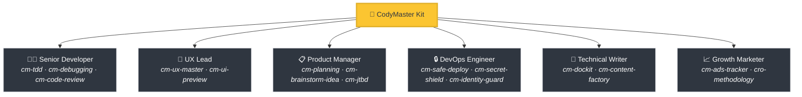
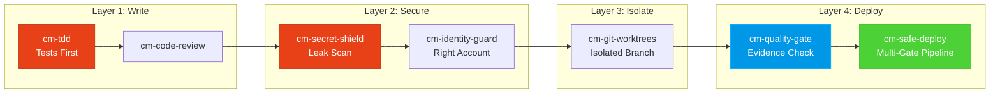

<div align="center">

[English](README.md) | [Tiếng Việt](README-vi.md) | [中文](README-zh.md) | [Русский](README-ru.md) | [한국어](README-ko.md) | [हिन्दी](README-hi.md)

# 🧠 CodyMaster

### AI Agent của bạn thông minh. CodyMaster làm cho nó trở nên *sáng suốt*.

**33 Kỹ năng · 11 Lệnh · 1 Plugin · 7+ Nền tảng · 6 Ngôn ngữ**

<p align="center">
  
  
  
  
  <a href="https://github.com/tody-agent/codymaster#readme" target="_blank">
    
  </a>
</p>


### 🌟 Nếu CodyMaster giúp bạn tiết kiệm thời gian, hãy tặng một [Star](https://github.com/tody-agent/codymaster)! 🌟

</div>

---

## 🛑 Vấn đề mà không ai nhắc tới

Bạn đã cài đặt một AI coding agent. Nó thật *tuyệt vời*. Nó viết code nhanh hơn bất kỳ con người nào.

Nhưng rồi thực tế ập đến:

| 😤 Điều gì thực sự xảy ra | 💀 Cái giá phải trả thực tế |
|--------------------------|-----------------|
| AI thiết kế **khác nhau mọi lúc** — cùng một thương hiệu, 3 phong cách khác nhau | Khách hàng nghĩ bạn là 3 công ty khác nhau |
| AI sửa một lỗi, **âm thầm làm hỏng 5 thứ khác** | Bạn phải làm lại cùng một công việc 3-4 lần |
| AI **quên mọi thứ** giữa các phiên làm việc | Bạn phải giải thích lại cùng một codebase vào mỗi sáng |
| AI viết không dòng test nào, không tài liệu nào | Codebase của bạn trở thành một "lâu đài trên cát" |
| Bạn cài đặt 15 kỹ năng khác nhau — **không cái nào giao tiếp với nhau** | Bộ công cụ Frankenstein với con số không về sự cộng hưởng |
| Deploy lên production = **deploy và cầu nguyện** 🙏 | Deploy bị hỏng lúc 2 giờ sáng, không có rollback |

> *"AI cho tôi 100 cánh tay. Nhưng nếu không có kỷ luật, những cánh tay đó chỉ tạo ra sự hỗn loạn."*
> — **Tody Le**, Trưởng phòng Sản phẩm · 10+ năm kinh nghiệm · Người sáng tạo ra CodyMaster

---

## 🟢 Giải pháp: Một đội ngũ Senior toàn diện trong một Bộ công cụ

CodyMaster không chỉ là "một gói kỹ năng AI khác." Đó là **hơn 10 năm kinh nghiệm quản lý sản phẩm + 6 tháng vibe coding đã qua thực chiến**, được đúc kết thành 33 kỹ năng liên kết với nhau, hoạt động như một **hệ thống tích hợp duy nhất**.

Khi bạn cài đặt CodyMaster, bạn không chỉ thêm các kỹ năng.
**Bạn đang thuê cả một đội ngũ senior:**



---

## ⚡ Điều gì tạo nên sự khác biệt của CodyMaster

Các gói kỹ năng khác cung cấp cho bạn những công cụ rời rạc. CodyMaster cung cấp cho bạn một **hệ điều hành liên kết** cho AI của bạn.

### 🔄 Bao phủ toàn bộ vòng đời (Ý tưởng → Production)

Không có khoảng trống. Không bàn giao thủ công. Mọi giai đoạn đều được bao phủ:


### 🧠 Một bộ não học hỏi từ sai lầm

AI của bạn không chỉ thực thi — nó còn **ghi nhớ và cải thiện**:

[English](README.md) | [Tiếng Việt](README-vi.md) | [中文](README-zh.md) | [Русский](README-ru.md) | [한국어](README-ko.md) | [हिन्दी](README-hi.md)

- **`cm-continuity`** — Bộ nhớ làm việc xuyên suốt các phiên làm việc. AI ghi nhớ những gì đã xảy ra lỗi và không bao giờ lặp lại cùng một sai lầm
- **`cm-skill-mastery`** — Không biết cách làm điều gì đó? Nó sẽ **tự động tìm kỹ năng phù hợp** và tự nâng cấp chính mình
- **`cm-deep-search`** — Bị lạc trong một cơ sở mã nguồn hơn 200 tệp? Tìm kiếm ngữ nghĩa trên mọi thứ chỉ trong vài giây

### 🛡️ Bảo vệ đa lớp (Cơ sở mã nguồn của bạn sẽ không bị phá hủy)

Mọi dòng mã đều phải đi qua nhiều cổng an toàn trước khi đưa vào môi trường sản xuất (production):



> **Kết quả:** Không rò rỉ bí mật. Không triển khai nhầm tài khoản. Không có lỗi kiểu "chạy tốt trên máy tôi".

### 🎨 Trích xuất Design System — Ngay cả từ các sản phẩm cũ

Bạn có một sản phẩm cũ không có hệ thống thiết kế (design system)? **`cm-ux-master`** sẽ quét trang web của bạn, trích xuất màu sắc, kiểu chữ, khoảng cách và các token, sau đó xây dựng lại một design system chuẩn chỉnh. Xem trước các thiết kế trực quan với **Pencil.dev** hoặc **Google Stitch** trước khi viết bất kỳ dòng mã nào.

### 📝 Không có tài liệu? Không vấn đề gì.

Không biết mã cũ làm gì? **`cm-dockit`** đọc toàn bộ cơ sở mã nguồn của bạn và tạo ra:
- 📚 Tài liệu kiến trúc kỹ thuật
- 📖 Hướng dẫn sử dụng & SOPs
- 🔌 Tài liệu tham khảo API
- 🎯 Phân tích chân dung người dùng (Persona) & sơ đồ JTBD
- 🌐 Đa ngôn ngữ. Tối ưu hóa SEO.

**Một lần quét = Cơ sở tri thức hoàn chỉnh.**

### 📊 Bảng điều khiển trực quan — Xem mọi thứ trong nháy mắt

Không còn phải đoán nữa. Theo dõi mọi nhiệm vụ, mọi tác nhân (agent), mọi đợt triển khai trên bảng Kanban thời gian thực. Tiến độ pipeline, theo dõi token, nhật ký sự kiện — tất cả trên một màn hình.

---

## 🆚 Các kỹ năng rời rạc so với CodyMaster

| | 😵 15 Kỹ năng ngẫu nhiên | 🧠 CodyMaster |
|---|---|---|
| **Tích hợp** | Mỗi kỹ năng hoạt động riêng lẻ, không có ngữ cảnh chung | 33 kỹ năng có tính liên kết, chia sẻ bộ nhớ và giao tiếp với nhau |
| **Vòng đời** | Chỉ bao gồm việc lập trình | Bao gồm Ý tưởng → Thiết kế → Mã nguồn → Kiểm thử → Triển khai → Tài liệu → Học hỏi |
| **Bộ nhớ** | Quên mọi thứ giữa các phiên làm việc | Hệ thống bộ nhớ 4 tầng: Working → Episodic → Semantic → Deep Search |
| **An toàn** | Triển khai kiểu YOLO | Bảo vệ 4 lớp: TDD → Security → Isolation → Multi-gate deploy |
| **Thiết kế** | Giao diện ngẫu nhiên mỗi lần | Trích xuất & thực thi design system + xem trước trực quan |
| **Tài liệu** | "Có lẽ sẽ viết README sau" | Tự động tạo tài liệu đầy đủ, SOPs, API refs từ mã nguồn |
| **Tự cải thiện** | Tĩnh — những gì bạn cài đặt là những gì bạn nhận được | Học hỏi từ sai lầm, tự động khám phá kỹ năng mới, thông minh hơn mỗi ngày |
| **Bảo trì** | Cập nhật 15 kho lưu trữ riêng biệt | Một lệnh `git pull` cập nhật tất cả mọi thứ |

---

## 🦥 Được xây dựng cho những người lười (Nghiêm túc đấy)

Chúng tôi sẽ thành thật: **CodyMaster được xây dựng cho những người lười.**

Nếu bạn muốn:
- ✅ Nhập một tin nhắn chat và nhận lại một **sản phẩm đang hoạt động**
- ✅ Để AI của bạn **học hỏi từ những sai lầm** và tốt hơn mỗi ngày
- ✅ Không bao giờ phải thiết lập cùng một mã nguồn mẫu (boilerplate) hai lần
- ✅ Triển khai với sự **tự tin** thay vì cầu nguyện

**→ CodyMaster là dành cho bạn.**

Nếu bạn thích:
- ❌ Xem xét thủ công từng dòng đầu ra của AI
- ❌ Thực hiện cùng một quy trình thiết lập cho mọi dự án
- ❌ Triển khai chậm, thủ công và không có lưới an toàn

**→ CodyMaster KHÔNG dành cho bạn.**

---

## 🚀 Cài đặt trong 1 phút

### Claude Code (Khuyến nghị)
```bash
bash <(curl -fsSL https://raw.githubusercontent.com/tody-agent/codymaster/main/install.sh) --claude
```
*Hoặc: `claude plugin marketplace add tody-agent/codymaster` → `claude plugin install cm@codymaster`*

### Cursor IDE
```
/add-plugin cody-master

[English](README.md) | [Tiếng Việt](README-vi.md) | [中文](README-zh.md) | [Русский](README-ru.md) | [한국어](README-ko.md) | [हिन्दी](README-hi.md)

### Gemini CLI / Antigravity
```bash
gemini extensions install https://github.com/tody-agent/codymaster
```

<details>
<summary><b>Các nền tảng khác: Codex, OpenCode, Kiro, Copilot, Windsurf, Cline</b></summary>

```bash
# Toàn cầu: clone một lần, sao chép vào bất kỳ nền tảng nào
git clone https://github.com/tody-agent/codymaster.git ~/.cody-master

# Sau đó đưa các skills vào thư mục của nền tảng của bạn:
cp -r ~/.cody-master/skills/* .cursor/skills/
cp -r ~/.cody-master/skills/* .codex/skills/
cp -r ~/.cody-master/skills/* .kiro/steering/
cp -r ~/.cody-master/skills/* .opencode/skills/
cp -r ~/.cody-master/skills/* ~/.gemini/antigravity/skills/
```
</details>

---

## 🧰 Kho vũ khí 33-Skill

| Lĩnh vực | Skills |
|--------|--------|
| 🔧 **Kỹ thuật** | `cm-tdd` `cm-debugging` `cm-quality-gate` `cm-test-gate` `cm-code-review` |
| ⚙️ **Vận hành** | `cm-safe-deploy` `cm-identity-guard` `cm-secret-shield` `cm-git-worktrees` `cm-terminal` `cm-safe-i18n` |
| 🎨 **Sản phẩm & UX** | `cm-planning` `cm-ux-master` `cm-ui-preview` `cm-project-bootstrap` `cm-jtbd` `cm-brainstorm-idea` `cm-dockit` `cm-readit` |
| 📈 **Tăng trưởng/CRO** | `cm-content-factory` `cm-ads-tracker` `cro-methodology` |
| 🎯 **Điều phối** | `cm-execution` `cm-continuity` `cm-skill-chain` `cm-skill-mastery` `cm-skill-index` `cm-deep-search` `cm-how-it-work` |
| 🖥️ **Quy trình** | `cm-start` `cm-dashboard` `cm-status` |

---

## 🎮 Các câu lệnh

```
/cm:demo         → Tour hướng dẫn tương tác
/cm:bootstrap    → Khởi tạo dự án mới từ đầu
/cm:plan         → Lập kế hoạch tính năng kèm phân tích
/cm:build        → Xây dựng với TDD nghiêm ngặt
/cm:debug        → Debug có hệ thống
/cm:ux           → Trích xuất design system & xem trước UI
/cm:track        → Thiết lập marketing pixel & theo dõi
```

---

## 👤 Người xây dựng

**Tody Le** — Head of Product với hơn 10 năm kinh nghiệm. Không biết viết code. Đã dùng AI để xây dựng các sản phẩm thực tế trong suốt 6 tháng liên tục. Mỗi kỹ năng trong bộ công cụ này đều ra đời từ những thất bại thực tế, đánh đổi bằng thời gian và cả nước mắt thực sự.

> *"33 kỹ năng. Mỗi kỹ năng là một bài học. Mỗi bài học là một đêm mất ngủ. Và giờ đây, bạn không cần phải trải qua những đêm đó nữa."*

📖 [Đọc toàn bộ câu chuyện →](https://cody-master.pages.dev/story)

---

## 📚 Tài nguyên

- 🌍 [Website](https://cody-master.pages.dev) — Tổng quan & demo
- 📖 [Tài liệu hướng dẫn](https://cody-master.pages.dev/docs) — Toàn bộ chi tiết
- 🛠️ [Tham khảo Skills](skills/) — Xem tất cả 33 file SKILL.md
- 📖 [Câu chuyện của chúng tôi](https://cody-master.pages.dev/story) — Tại sao dự án này tồn tại

---

## 🤝 Đóng góp

1. ⭐ **Star repo này** — giúp nhiều người xây dựng tìm thấy nó hơn
2. Fork → Tạo `skills/cm-your-skill/SKILL.md`
3. Gửi một Pull Request

---

<div align="center">

*MIT License — Tự do sử dụng, sửa đổi và phân phối.* <br/>
**Được xây dựng với ❤️ dành cho cộng đồng vibe coding.**

*"Cody" = "Code Đi" (Tiếng Việt: "Go code!") — hãy bắt đầu xây dựng ngay.*

</div>