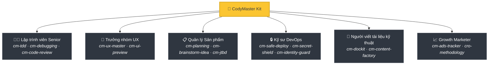
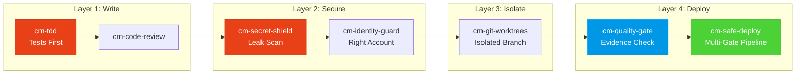

<div align="center">

[English](README.md) | [Tiếng Việt](README-vi.md) | [中文](README-zh.md) | [Русский](README-ru.md) | [한국어](README-ko.md) | [हिन्दी](README-hi.md)

# 🧠 CodyMaster

### AI Agent của bạn thông minh. CodyMaster giúp nó trở nên *thông thái*.

**33 Kỹ năng · 11 Lệnh · 1 Plugin · 7+ Nền tảng · 6 Ngôn ngữ**

<p align="center">
  
  
  
  
  <a href="https://github.com/tody-agent/codymaster#readme" target="_blank">
    
  </a>
</p>


### 🌟 Nếu CodyMaster giúp bạn tiết kiệm thời gian, hãy tặng nó một [Star](https://github.com/tody-agent/codymaster)! 🌟

</div>

---

## 🛑 Vấn đề mà không ai nói đến

Bạn đã cài đặt một AI coding agent. Nó *thật xuất sắc*. Nó viết code nhanh hơn bất kỳ con người nào.

Nhưng sau đó thực tế ập đến:

| 😤 Điều thực sự xảy ra | 💀 Chi phí thực tế |
|--------------------------|-----------------|
| AI thiết kế **khác nhau sau mỗi lần** — cùng một thương hiệu, 3 phong cách khác nhau | Khách hàng nghĩ bạn là 3 công ty khác nhau |
| AI sửa một lỗi, **âm thầm làm hỏng 5 thứ khác** | Bạn phải làm lại cùng một công việc 3-4 lần |
| AI **quên mọi thứ** giữa các phiên làm việc | Bạn phải giải thích lại cùng một codebase mỗi sáng |
| AI không viết test, không viết tài liệu | Codebase của bạn trở nên mong manh như một ngôi nhà bằng bài |
| Bạn cài đặt 15 kỹ năng khác nhau — **không cái nào giao tiếp với nhau** | Bộ công cụ Frankenstein không có sự hiệp đồng |
| Triển khai lên production = **triển khai và cầu nguyện** 🙏 | Triển khai bị lỗi lúc 2 giờ sáng, không có rollback |

> *"AI đã cho tôi 100 bàn tay. Nhưng nếu không có kỷ luật, những bàn tay đó sẽ tạo ra sự hỗn loạn."*
> — **Tody Le**, Head of Product · 10+ năm · Người sáng tạo CodyMaster

---

## 🟢 Giải pháp: Cả một đội ngũ Senior trong một bộ công cụ

CodyMaster không chỉ là "một gói kỹ năng AI khác." Đó là **10+ năm kinh nghiệm quản lý sản phẩm + 6 tháng lập trình theo phong cách "vibe coding" đã được thử thách qua thực tế**, được đúc kết thành 33 kỹ năng liên kết chặt chẽ với nhau, hoạt động như một **hệ thống tích hợp duy nhất**.

Khi bạn cài đặt CodyMaster, bạn không chỉ thêm các kỹ năng.
**Bạn đang thuê cả một đội ngũ senior:**



---

## ⚡ Điều gì làm nên sự khác biệt của CodyMaster

Các gói kỹ năng khác cung cấp cho bạn những công cụ rời rạc. CodyMaster cung cấp cho bạn một **hệ điều hành liên kết chặt chẽ** cho AI của bạn.

### 🔄 Bao phủ toàn bộ vòng đời (Ý tưởng → Sản xuất)

Không có lỗ hổng. Không cần bàn giao thủ công. Mọi giai đoạn đều được bao phủ:


### 🧠 Một "Bộ não" học hỏi từ những sai lầm

AI của bạn không chỉ thực thi — nó còn **ghi nhớ và cải thiện**:

- **`cm-continuity`** — Bộ nhớ làm việc xuyên suốt các phiên làm việc. AI ghi nhớ những gì đã xảy ra lỗi và không bao giờ lặp lại cùng một sai lầm
- **`cm-skill-mastery`** — Không biết cách làm điều gì đó? Nó **tự động tìm thấy kỹ năng phù hợp** và tự nâng cấp chính mình
- **`cm-deep-search`** — Bị lạc trong một cơ sở mã nguồn hơn 200 tệp? Tìm kiếm ngữ nghĩa trên tất cả mọi thứ trong vài giây

### 🛡️ Bảo vệ đa lớp (Cơ sở mã nguồn của bạn sẽ không bị phá hủy)

Mỗi dòng mã đều phải đi qua nhiều cổng an toàn trước khi đến môi trường production:



> **Kết quả:** Không rò rỉ bí mật. Không triển khai nhầm tài khoản. Không lỗi kiểu "chạy được trên máy tôi".

### 🎨 Trích xuất hệ thống thiết kế — Ngay cả từ những sản phẩm cũ

Bạn có một sản phẩm cũ không có hệ thống thiết kế? **`cm-ux-master`** quét trang web của bạn, trích xuất màu sắc, kiểu chữ, khoảng cách và các token, sau đó xây dựng lại một hệ thống thiết kế chuẩn chỉnh. Xem trước các thiết kế một cách trực quan với **Pencil.dev** hoặc **Google Stitch** trước khi viết bất kỳ dòng mã nào.

### 📝 Không có tài liệu? Không vấn đề gì.

Bạn không biết mã nguồn cũ thực hiện chức năng gì? **`cm-dockit`** đọc toàn bộ cơ sở mã của bạn và tạo ra:
- 📚 Tài liệu kiến trúc kỹ thuật
- 📖 Hướng dẫn sử dụng & SOP
- 🔌 Tham chiếu API
- 🎯 Phân tích chân dung người dùng & sơ đồ JTBD
- 🌐 Đa ngôn ngữ. Tối ưu hóa SEO.

**Một lần quét = Cơ sở tri thức hoàn chỉnh.**

### 📊 Bảng điều khiển trực quan — Xem mọi thứ trong nháy mắt

Không còn phải đoán mò. Theo dõi mọi tác vụ, mọi agent, mọi lần triển khai trên bảng Kanban thời gian thực. Tiến độ pipeline, trình theo dõi token, nhật ký sự kiện — tất cả trên một màn hình.

---

## 🆚 Các kỹ năng rời rạc so với CodyMaster

| | 😵 15 Kỹ năng ngẫu nhiên | 🧠 CodyMaster |
|---|---|---|
| **Tích hợp** | Mỗi kỹ năng là độc lập, không chia sẻ ngữ cảnh | 33 kỹ năng kết hợp thành chuỗi, chia sẻ bộ nhớ và giao tiếp |
| **Vòng đời** | Chỉ bao gồm việc viết mã | Bao gồm Ý tưởng → Thiết kế → Mã nguồn → Kiểm thử → Triển khai → Tài liệu → Học hỏi |
| **Bộ nhớ** | Quên mọi thứ giữa các phiên làm việc | Hệ thống bộ nhớ 4 tầng: Working → Episodic → Semantic → Deep Search |
| **An toàn** | Triển khai kiểu YOLO | Bảo vệ 4 lớp: TDD → Bảo mật → Cô lập → Triển khai đa cổng |
| **Thiết kế** | Giao diện ngẫu nhiên mỗi lần | Trích xuất & thực thi hệ thống thiết kế + xem trước trực quan |
| **Tài liệu** | "Có lẽ sẽ viết README sau" | Tự động tạo tài liệu đầy đủ, SOP, tham chiếu API từ mã nguồn |
| **Tự cải thiện** | Tĩnh — những gì bạn cài đặt là những gì bạn có | Học hỏi từ sai lầm, tự động khám phá các kỹ năng mới, thông minh hơn mỗi ngày |
| **Bảo trì** | Cập nhật 15 repo riêng biệt | Một lệnh `git pull` cập nhật mọi thứ |

---

## 🦥 Được xây dựng cho người lười (Nghiêm túc)

Chúng tôi sẽ thành thật: **CodyMaster được xây dựng cho những người lười.**

Nếu bạn muốn:
- ✅ Gõ một tin nhắn chat và nhận lại một **sản phẩm hoạt động được**
- ✅ Để AI của bạn **học hỏi từ những sai lầm** và trở nên tốt hơn mỗi ngày
- ✅ Không bao giờ phải thiết lập cùng một boilerplate hai lần
- ✅ Triển khai với **sự tự tin** thay vì cầu nguyện

**→ CodyMaster dành cho bạn.**

Nếu bạn thích:
- ❌ Kiểm tra thủ công từng dòng đầu ra của AI
- ❌ Thực hiện cùng một nghi thức thiết lập cho mọi dự án
- ❌ Triển khai chậm chạp, thủ công mà không có lưới an toàn

**→ CodyMaster KHÔNG dành cho bạn.**

---

## 🚀 Cài đặt trong 1 phút

### Claude Code (Được khuyến nghị)
```bash
bash <(curl -fsSL https://raw.githubusercontent.com/tody-agent/codymaster/main/install.sh) --claude
```
*Hoặc: `claude plugin marketplace add tody-agent/codymaster` → `claude plugin install cm@codymaster`*

### Cursor IDE
```
/add-plugin cody-master

### Gemini CLI / Antigravity
```bash
gemini extensions install https://github.com/tody-agent/codymaster
```

<details>
<summary><b>Nền tảng khác: Codex, OpenCode, Kiro, Copilot, Windsurf, Cline</b></summary>

```bash
# Vạn năng: clone một lần, sao chép sang bất kỳ nền tảng nào
git clone https://github.com/tody-agent/codymaster.git ~/.cody-master

# Sau đó thả các skills vào thư mục của nền tảng:
cp -r ~/.cody-master/skills/* .cursor/skills/
cp -r ~/.cody-master/skills/* .codex/skills/
cp -r ~/.cody-master/skills/* .kiro/steering/
cp -r ~/.cody-master/skills/* .opencode/skills/
cp -r ~/.cody-master/skills/* ~/.gemini/antigravity/skills/
```
</details>

---

## 🧰 Kho vũ khí 33-Skill

| Lĩnh vực | Skills |
|--------|--------|
| 🔧 **Kỹ thuật** | `cm-tdd` `cm-debugging` `cm-quality-gate` `cm-test-gate` `cm-code-review` |
| ⚙️ **Vận hành** | `cm-safe-deploy` `cm-identity-guard` `cm-secret-shield` `cm-git-worktrees` `cm-terminal` `cm-safe-i18n` |
| 🎨 **Sản phẩm & UX** | `cm-planning` `cm-ux-master` `cm-ui-preview` `cm-project-bootstrap` `cm-jtbd` `cm-brainstorm-idea` `cm-dockit` `cm-readit` |
| 📈 **Tăng trưởng/CRO** | `cm-content-factory` `cm-ads-tracker` `cro-methodology` |
| 🎯 **Điều phối** | `cm-execution` `cm-continuity` `cm-skill-chain` `cm-skill-mastery` `cm-skill-index` `cm-deep-search` `cm-how-it-work` |
| 🖥️ **Quy trình làm việc** | `cm-start` `cm-dashboard` `cm-status` |

---

## 🎮 Lệnh

```
/cm:demo         → Tour làm quen tương tác
/cm:bootstrap    → Khởi tạo khung dự án mới từ đầu
/cm:plan         → Lập kế hoạch tính năng kèm phân tích
/cm:build        → Xây dựng với TDD nghiêm ngặt
/cm:debug        → Gỡ lỗi có hệ thống
/cm:ux           → Trích xuất Design system & xem trước UI
/cm:track        → Thiết lập pixel marketing & theo dõi
```

---

## 👤 Người xây dựng

**Tody Le** — Trưởng phòng Sản phẩm với hơn 10 năm kinh nghiệm. Không biết viết code. Đã sử dụng AI để xây dựng các sản phẩm thực tế trong 6 tháng liên tục. Mỗi skill trong bộ công cụ này được sinh ra từ một thất bại thực tế tiêu tốn thời gian thực và những giọt nước mắt thực.

> *"33 skills. Mỗi skill là một bài học. Mỗi bài học là một đêm mất ngủ. Và giờ đây, bạn không cần phải trải qua những đêm đó nữa."*

📖 [Đọc câu chuyện đầy đủ →](https://cody-master.pages.dev/story)

---

## 📚 Tài liệu

- 🌍 [Trang web](https://cody-master.pages.dev) — Tổng quan & bản demo
- 📖 [Tài liệu hướng dẫn](https://cody-master.pages.dev/docs) — Phân tích chuyên sâu đầy đủ
- 🛠️ [Tham chiếu Skills](skills/) — Duyệt qua tất cả 33 tệp SKILL.md
- 📖 [Câu chuyện của chúng tôi](https://cody-master.pages.dev/story) — Tại sao công cụ này tồn tại

---

## 🤝 Đóng góp

1. ⭐ **Star repo này** — nó giúp nhiều nhà phát triển tìm thấy công cụ này hơn
2. Fork → Tạo `skills/cm-your-skill/SKILL.md`
3. Gửi một Pull Request

---

<div align="center">

*Giấy phép MIT — Miễn phí sử dụng, sửa đổi và phân phối.* <br/>
**Được xây dựng với ❤️ dành cho cộng đồng vibe coding.**

*"Cody" = "Code Đi" (Tiếng Việt: "Go code!") — chỉ cần bắt đầu xây dựng.*

</div>