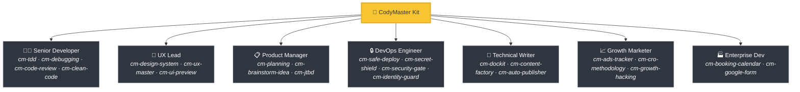
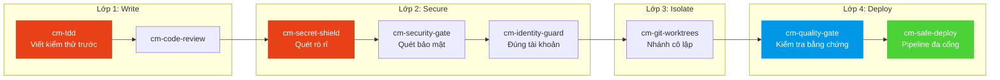

[English](README.md) | [Tiếng Việt](README-vi.md)

# 🧠 CodyMaster

### AI Agent của bạn thông minh. CodyMaster làm nó trở nên *thông thái*.

**60+ Kỹ năng · 20+ Lệnh · 1 Plugin · 8+ Nền tảng · 2 Ngôn ngữ · v6.0.0**

```
    ( . \ --- / . )
     /   ^   ^   \
    (      u      )
     |  \ ___ /  |
      '--w---w--'
       Meet CodyMaster 🐹
  Your smart coding companion.
```

CodyMaster Kanban Dashboard

[](https://discord.gg/codymaster)

### 🌟 Nếu CodyMaster giúp bạn tiết kiệm thời gian, hãy tặng một [Star](https://github.com/tody-agent/codymaster)! 🌟

---

## 🛑 Vấn đề mà không ai nói đến

Bạn đã cài đặt một AI coding agent. Nó thật *tuyệt vời*. Nó viết code nhanh hơn bất kỳ con người nào.

Nhưng rồi thực tế ập đến:

| 😤 Điều thực sự xảy ra | 💀 Cái giá thực sự |
| ---------------------- | ------------------ |
| AI thiết kế **khác nhau sau mỗi lần** — cùng một thương hiệu, 3 phong cách khác nhau | Khách hàng nghĩ bạn là 3 công ty khác nhau |
| AI sửa một lỗi, **âm thầm làm hỏng 5 thứ khác** | Bạn phải làm lại cùng một công việc 3-4 lần |
| AI **quên mọi thứ** giữa các phiên làm việc | Bạn phải giải thích lại cùng một codebase vào mỗi sáng |
| AI viết không dòng test, không tài liệu | Codebase của bạn trở nên mong manh như nhà bài |
| Bạn cài đặt 15 kỹ năng khác nhau — **không cái nào giao tiếp với cái nào** | Bộ công cụ Frankenstein với con số không về sự hiệp lực |
| Deploy lên production = **deploy và cầu nguyện** 🙏 | Deploy lỗi lúc 2 giờ sáng, không có rollback |

> *"AI cho tôi 100 cánh tay. Nhưng nếu thiếu kỷ luật, những cánh tay đó chỉ tạo ra sự hỗn loạn."*
> — **Tody Le**, Head of Product · 10+ năm kinh nghiệm · Người sáng tạo ra CodyMaster

---

## 🟢 Giải pháp: Cả một đội ngũ Senior trong một bộ công cụ

CodyMaster không chỉ là "một gói kỹ năng AI khác". Đó là **10+ năm kinh nghiệm quản lý sản phẩm + 6 tháng vibe coding thực chiến**, được đúc kết thành 68+ kỹ năng kết nối với nhau, hoạt động như một **hệ thống tích hợp duy nhất**.

Khi bạn cài đặt CodyMaster, bạn không chỉ thêm các kỹ năng.
**Bạn đang thuê cả một đội ngũ senior:**


```mermaid
graph TD
    A["🧠 CodyMaster Kit"] --> B["👨‍💻 Senior Developer<br/><i>cm-tdd · cm-debugging · cm-code-review · cm-clean-code</i>"]
    A --> C["🎨 UX Lead<br/><i>cm-design-system · cm-ux-master · cm-ui-preview</i>"]
    A --> D["📋 Product Manager<br/><i>cm-planning · cm-brainstorm-idea · cm-jtbd</i>"]
    A --> E["🔒 DevOps Engineer<br/><i>cm-safe-deploy · cm-secret-shield · cm-security-gate · cm-identity-guard</i>"]
    A --> F["📝 Technical Writer<br/><i>cm-dockit · cm-content-factory · cm-auto-publisher</i>"]
    A --> G["📈 Growth Marketer<br/><i>cm-ads-tracker · cm-cro-methodology · cm-growth-hacking</i>"]
    A --> H["🏭 Enterprise Dev<br/><i>cm-booking-calendar · cm-google-form</i>"]
    style A fill:#fbc531,stroke:#e1b12c,color:#2f3640,stroke-width:3px
    classDef team fill:#2f3640,stroke:#dcdde1,stroke-width:1px,color:#fff;
    class B,C,D,E,F,G,H team;
```

---

## ⚡ Điều gì làm nên sự khác biệt của CodyMaster

Các gói kỹ năng khác cung cấp cho bạn những công cụ rời rạc. CodyMaster mang đến một **hệ điều hành kết nối** cho AI của bạn — 68+ kỹ năng liên kết chuỗi, chia sẻ bộ nhớ và giao tiếp như một đội thực sự.

### 🔄 Bao phủ toàn bộ vòng đời (Ý tưởng → Production)

Không có lỗ hổng. Không cần bàn giao thủ công. Mọi giai đoạn đều được bao phủ:


```mermaid
graph LR
    A["💡 Ý tưởng"] --> B["📋 Lập kế hoạch"]
    B --> C["🎨 Thiết kế"]
    C --> D["🧪 Test trước"]
    D --> E["💻 Viết mã"]
    E --> F["🔍 Gỡ lỗi"]
    F --> G["✅ Quality Gate"]
    G --> H["🔒 Quét bảo mật"]
    H --> I["🚀 Triển khai"]
    I --> J["📊 Giám sát"]
    J --> K["📝 Viết tài liệu"]
    K --> L["🧠 Học hỏi & Cải thiện"]
    L -.-> A
    classDef phase fill:#353b48,stroke:#fbc531,stroke-width:2px,color:#fff;
    class A,B,C,D,E,F,G,H,I,J,K,L phase;
```

### 🧘 Kỷ luật hành vi tích hợp sẵn (Nguyên tắc Karpathy)

Được lấy cảm hứng từ [quan sát của Andrej Karpathy](https://x.com/karpathy/status/2015883857489522876) về các lỗi phổ biến khi LLM viết code, CodyMaster nhúng bốn quy tắc hành vi luôn-bật trực tiếp vào các kỹ năng quản lý từng giai đoạn — để AI của bạn luôn có kỷ luật mà không cần nhắc nhở thêm:

| Quy tắc | Ngăn chặn điều gì | Thực thi ở đâu |
|---|---|---|
| **Suy nghĩ trước khi code** — nêu giả định, làm rõ mơ hồ, phản biện | Phỏng đoán sai im lặng làm lãng phí hàng giờ | `cm-planning` |
| **Ưu tiên đơn giản** — code tối thiểu, không trừu tượng hóa suy đoán | Giải pháp 1000 dòng khi 100 dòng là đủ | `cm-clean-code`, `cm-tdd` |
| **Thay đổi phẫu thuật** — mọi dòng sửa đều có lý do từ task | Chỉnh sửa phụ làm hỏng những thứ không liên quan | `cm-execution`, `cm-code-review` |
| **Thực thi hướng mục tiêu** — tiêu chí thành công có thể xác minh trước khi viết code | Mơ hồ "làm cho nó chạy" → vòng lặp vô tận | `cm-tdd`, `cm-quality-gate` |

> *"Các model đưa ra giả định sai và cứ thế chạy theo. Chúng làm phức tạp code, không dọn dẹp code chết, thay đổi những thứ không nên thay."* — Andrej Karpathy
>
> Phản hồi của CodyMaster: nhúng bản sửa vào quy trình làm việc, không phải vào một prompt mà bạn sẽ quên.

### 🧠 Bộ Não Hợp Nhất: Kiến trúc bộ nhớ 5 tầng + Smart Spine

AI của bạn không chỉ thực thi — nó còn **thấu hiểu và ghi nhớ** qua hệ thống 5 tầng bền vững xuyên suốt phiên làm việc và nhiều thiết bị:

1. **Sensory Memory (Phiên làm việc)** — Ngữ cảnh tức thời của các file đang mở và terminal.
2. **Working Memory (`cm-continuity`)** — Sổ nháp xuyên suốt phiên. AI không bao giờ lặp lại cùng một sai lầm.
3. **Long-Term Memory (`learnings.json`)** — Các bài học được củng cố với cơ chế suy giảm Ebbinghaus TTL thông minh.
4. **Semantic Memory (`cm-deep-search`)** — Tìm kiếm vector cục bộ qua tài liệu bằng `qmd`.
5. **Structural Memory (`cm-codeintell`)** — CodeGraph dựa trên AST. Tiết kiệm đến 95% token cho toàn bộ context codebase.

🦴 **Smart Spine (v4.6+)** — Hệ thần kinh kết nối toàn bộ 5 tầng:

- **SQLite + FTS5** — Tìm kiếm từ khóa xếp hạng BM25, thay thế quét JSON phẳng.
- **Progressive Loading (L0/L1/L2)** & **Smart Brain Router** — Context tải ở mức rẻ nhất đủ dùng qua bộ phân loại task. Tiết kiệm đến **80% token** trên quy trình thông thường.
- **Skill Execution Cache** — Cache FTS5 ấm theo dõi các chuỗi kỹ năng agent thành công. Kết quả khớp bỏ qua vòng lặp LLM tốn token.
- **cm:// URI Scheme** — Kỹ năng yêu cầu context bằng URI, không phải đường dẫn file.
- **Token Budget** — Cửa sổ 200k token được phân bổ sẵn theo danh mục. Không bao giờ tràn ngầm.
- **Context Bus** — Các kỹ năng chia sẻ output theo thời gian thực trong một chuỗi.
- **MCP Server** — 18 công cụ cho Claude Desktop, Goose và mọi MCP client (`src/mcp-context-server.ts`).
- **Intelligent Skill Selection** — `selectTopSkills()` chọn động 2-3 kỹ năng phù hợp nhất cho mỗi chuỗi. Backed by SkillsBench: 2-3 kỹ năng tập trung = **+18.6pp** so với 4+ tải tĩnh.

☁️ **The Cloud Brain (`cm-notebooklm`)**
Kiến thức giá trị cao được đồng bộ hóa với NotebookLM — "Linh hồn" đa thiết bị cho dự án. Tự động tạo podcast và flashcard để đào tạo lập trình viên bên cạnh AI.

📖 [CodyMaster Brain & mô hình bộ nhớ →](docs/architecture/codymaster-brain.md)

### 🛡️ Bảo vệ đa lớp (Codebase của bạn sẽ không bị phá hủy)

Mọi dòng mã đều đi qua nhiều cổng an toàn trước khi đến production:


```mermaid
flowchart LR
    subgraph "Lớp 1: Write"
        A["cm-tdd<br/>Viết kiểm thử trước"] --> B["cm-code-review"]
    end
    subgraph "Lớp 2: Secure"
        B --> C["cm-secret-shield<br/>Quét rò rỉ"] --> S["cm-security-gate<br/>Quét bảo mật"] --> D["cm-identity-guard<br/>Đúng tài khoản"]
    end
    subgraph "Lớp 3: Isolate"
        D --> E["cm-git-worktrees<br/>Nhánh cô lập"]
    end
    subgraph "Lớp 4: Deploy"
        E --> F["cm-quality-gate<br/>Kiểm tra bằng chứng"] --> G["cm-safe-deploy<br/>Pipeline đa cổng"]
    end
    style A fill:#e84118,stroke:#c23616,color:#fff
    style C fill:#e84118,stroke:#c23616,color:#fff
    style F fill:#0097e6,stroke:#00a8ff,color:#fff
    style G fill:#4cd137,stroke:#44bd32,color:#fff
```

> **Kết quả:** Không rò rỉ bí mật. Không deploy nhầm tài khoản. Không còn lỗi "chạy tốt trên máy tôi".

### 🎨 Design System Builder — Ngay cả từ sản phẩm cũ

Bạn có sản phẩm cũ không có hệ thống thiết kế? **cm-design-system** quét trang web, trích xuất màu sắc, kiểu chữ, khoảng cách và token, rồi xây dựng lại hệ thống thiết kế chuẩn. Xem trước trực quan với **Pencil.dev** hoặc **Google Stitch** trước khi viết một dòng code.

### 📝 Không có tài liệu? Không vấn đề gì.

Không biết mã nguồn cũ thực hiện những gì? `cm-dockit` đọc toàn bộ codebase và tạo ra:

- 📚 Tài liệu kiến trúc kỹ thuật
- 📖 Hướng dẫn sử dụng & SOP
- 🔌 Tham chiếu API
- 🎯 Phân tích Persona & lập bản đồ JTBD
- 🌐 Đa ngôn ngữ. Tối ưu hóa SEO.

**Một lần quét = Cơ sở tri thức hoàn chỉnh.**

### 💡 Chiến lược Brainstorming (Design Thinking + 9 Windows)

Trước khi bắt tay vào code, `cm-brainstorm-idea` nhận định sản phẩm bằng phân tích đa chiều (Công nghệ, Sản phẩm, Thiết kế, Kinh doanh). Đưa ra 2-3 tùy chọn khả thi bằng khung 9 Windows (TRIZ) và xem trước UI qua **Pencil.dev** hoặc **Google Stitch** để xác nhận hướng đi trước khi lập kế hoạch chi tiết.

📖 [Quy trình TRIZ-song song & UI preview →](docs/architecture/triz-parallel-engine.md)

### 🏭 AI Content Factory v2.0 & Bảng điều khiển trực quan

Cần mở rộng nội dung? `cm-content-factory` là cỗ máy tạo nội dung đa tác nhân tự học hỏi. Tự động nghiên cứu, viết, kiểm duyệt (SEO & Thuyết phục) và triển khai bài viết chuyển đổi cao với bộ khung Content Mastery (StoryBrand + Cialdini).

Theo dõi mọi thứ trên **Bảng điều khiển trực quan** (`cm-dashboard`): mọi task, mọi agent, mọi lần triển khai trên Kanban thời gian thực. Tiến độ pipeline, trình theo dõi token, nhật ký sự kiện — tất cả trên một màn hình.

### 🧬 Bộ kỹ năng tự phục hồi

CodyMaster có một nhóm skill chuyên dùng để giữ thư viện kỹ năng luôn dùng được khi repo thay đổi.

- `cm-skill-health` kiểm tra sức khỏe thực tế của skill từ tín hiệu đang có: lệch docs, tham chiếu hỏng, retro notes, validate và test gate.
- `cm-skill-evolution` hoàn chỉnh vòng tự trị với 3 chế độ: `FIX`, `DERIVED`, và `CAPTURED`. Sửa đổi, nhân bản và tự động tạo skill mới dựa trên đề xuất của bộ phân tích, kèm bảo vệ chống vòng lặp và backup `.md`.
- `cm-learning-promoter` tìm kiếm trong cơ sở dữ liệu các vấn đề lặp đi lặp lại và tự động nâng cấp chúng thành skill được code cứng (`cm-learned-*`).
- `cm-skill-chain` Auto-Dispatch — điều phối chuỗi tự động với phát hiện task và bàn giao nhiều bước.
- `cm-skill-search` tìm skill phù hợp qua `cm suggest`, skill index và repo search.
- `cm-skill-share` đóng gói skill an toàn giữa các repo và máy khác nhau.

> **Hãy coi đây như hệ miễn dịch cho bộ công cụ AI.** Trước hết xem telemetry, chẩn đoán skill, sửa có chủ đích, rồi lưu lại bài học.

### 🚀 Growth Hacking Engine

Cần popup, luồng đặt lịch hay thu thập lead? `cm-growth-hacking` tạo ra hệ thống chuyển đổi hoàn chỉnh: Bottom Sheet + Calendar CTA + Tracking. Tự động phát hiện ngành, chọn pattern phù hợp, kết nối `cm-booking-calendar` và `cm-ads-tracker`. Không phụ thuộc.

---

## 🆚 Kỹ năng rời rạc so với CodyMaster

| | 😵 15 kỹ năng ngẫu nhiên | 🧠 CodyMaster |
| --- | --- | --- |
| **Tích hợp** | Mỗi kỹ năng là độc lập, không có ngữ cảnh chung | 68+ kỹ năng liên kết chuỗi, chia sẻ bộ nhớ và giao tiếp |
| **Vòng đời** | Chỉ bao gồm phần coding | Ý tưởng → Thiết kế → Code → Kiểm thử → Deploy → Tài liệu → Học tập |
| **Bộ nhớ** | Quên mọi thứ giữa các phiên | 5 tầng: Sensory → Working → Long-term → Semantic → Structural + Cloud Brain (SQLite + FTS5) |
| **An toàn** | Deploy kiểu phó mặc (YOLO) | 4 lớp bảo vệ: TDD → Security → Isolation → Multi-gate deploy |
| **Thiết kế** | UI ngẫu nhiên mỗi lần | Trích xuất & thực thi design system + xem trước trực quan |
| **Tài liệu** | "Có lẽ sẽ viết README sau" | Tự động tạo tài liệu đầy đủ, SOP, tham chiếu API từ code |
| **Tự cải thiện** | Tĩnh — những gì cài là những gì có | Advisory-driven self-healing: xem telemetry → chẩn đoán → sửa với FIX / DERIVED / CAPTURED |
| **Bảo trì** | Cập nhật 15 repo riêng biệt | Một `npm i -g codymaster` cập nhật tất cả |

---

## 🦥 Dành cho những người lười (Nghiêm túc đấy)

Chúng tôi sẽ thành thực: **CodyMaster được xây dựng dành cho những người lười.**

Nếu bạn muốn:

- ✅ Nhập một tin nhắn chat và nhận lại một **sản phẩm hoạt động được**
- ✅ Để AI của bạn **học hỏi từ những sai lầm** và tiến bộ hơn mỗi ngày
- ✅ Không bao giờ phải thiết lập cùng một boilerplate hai lần
- ✅ Deploy với sự **tự tin** thay vì cầu nguyện

**→ CodyMaster dành cho bạn.**

Nếu bạn thích:

- ❌ Tự tay xem xét từng dòng kết quả từ AI
- ❌ Thực hiện cùng một nghi thức thiết lập cho mọi dự án
- ❌ Deploy thủ công, chậm chạp mà không có lưới bảo vệ

**→ CodyMaster KHÔNG dành cho bạn.**

---

## 🚀 Cài đặt trong 1 phút

**Một lệnh. Wizard hamster thân thiện. 14 nền tảng.**

```bash
npm install -g codymaster && cm
```

Lệnh `cm` khởi chạy wizard onboarding:

1. Phát hiện mọi công cụ AI coding bạn đang cài (Claude Code, Cursor, Antigravity, Codex, OpenCode, Windsurf, Cline, Aider, Continue, Kiro, Amazon Q, Amp, Copilot, Claude Desktop)
2. Hỏi bạn muốn cài kỹ năng cho cái nào (chọn nhiều; công cụ đã phát hiện được tick sẵn)
3. Cho phép chọn profile kỹ năng — `core` (khuyến nghị), `growth`, `design`, `knowledge`, hoặc `full`
4. Cài vào vị trí native của từng nền tảng và in gợi ý bước tiếp theo

Sau wizard bạn có:

```bash
cm install <platform>            # cài hoặc làm mới một nền tảng
cm install --all --profile core  # cài một lần vào mọi nền tảng đã phát hiện
cm doctor                        # nền tảng nào đã cài và kỹ năng nằm ở đâu
cm install --list                # liệt kê mọi platform id được hỗ trợ
```

### Đường dẫn plugin native (vẫn được hỗ trợ)

Nếu bạn muốn cài theo platform cụ thể, tất cả 14 đường dẫn vẫn hoạt động:

- **Claude Code:** `claude plugin marketplace add tody-agent/codymaster && claude plugin install cm@codymaster --scope user`
- **Claude Desktop:** `npx codymaster mcp-serve --install-claude`
- **Cursor (trong Agent Chat):** `/add-plugin cody-master`
- **Gemini CLI / Antigravity:** `gemini extensions install https://github.com/tody-agent/codymaster`

`cm install <platform>` bọc các lệnh này và thêm copy kỹ năng + gợi ý sau cài đặt.

### Không có Node?

Bootstrap bash là phương án dự phòng mỏng, ủy thác cho cùng engine khi Node khả dụng:

```bash
bash <(curl -fsSL https://raw.githubusercontent.com/tody-agent/codymaster/main/install.sh) --all --profile core
```

### Mẹo token budget (Antigravity / Gemini / Windsurf)

Các nền tảng này tính **kỹ năng + MCP** vào ngân sách tùy chỉnh. Bắt đầu với profile `core` nhỏ, thêm pack theo dự án sau:

```bash
cm install antigravity --profile core
cm install antigravity --profile growth   # chạy lại để merge pack khác
```

Profile được định nghĩa tại [`skills/profiles/`](skills/profiles/README.md).

### 3. Cài đặt Bảng điều khiển (Tùy chọn nhưng Khuyến nghị)

Theo dõi tiến độ, quản lý công việc và xem thành tích vibe coding cùng Cody the Hamster 🐹.

**Cả hai đều chính thức:** cài **theo dự án** (không `-g`) hoặc **toàn cục**.

Theo dự án:

```bash
npm install codymaster
npx cm
```

Toàn cục — gõ `cm` từ bất kỳ thư mục nào:

```bash
npm install -g codymaster
cm
```

```text
    ( . \ --- / . )
     /   ^   ^   \        Hi! I'm Cody 🐹
    (      u      )        Your smart coding companion.
     |  \ ___ /  |
      '--w---w--'

│
◆  Quick menu
│  ● 📊  Dashboard (Start & open)
│  ○ 📋  My Tasks
│  ○ 📈 Status
│  ○ 🧩  Browse Skills
```

---

## Dùng với Goose

CodyMaster hoạt động như một MCP extension cho [Goose](https://block.github.io/goose/), mang lại bộ nhớ bền vững, điều phối kỹ năng và quản lý token.

**Cài đặt 3 bước:**

```bash
# 1. Cài CodyMaster
npm install -g codymaster

# 2. Lấy snippet cấu hình Goose
cm mcp-serve --print-config

# 3. Dán kết quả vào cấu hình Goose (~/.config/goose/config.yaml)
```

Xem [hướng dẫn tích hợp Goose đầy đủ](docs/integrations/goose.md).

---

## 🎯 Ví dụ thực tế

> **Mẹo:** Bắt đầu phiên làm việc với `/cm:start <mục tiêu>` và CodyMaster sẽ tự chọn kỹ năng phù hợp.

| Tình huống | Kỹ năng sử dụng | Bạn nói gì |
| ---------- | --------------- | ---------- |
| 🐛 **Sửa bug không làm hỏng thứ khác** | `cm-debugging` → `cm-tdd` → `cm-quality-gate` | *"Debug crash này"* |
| 🚀 **Ship tính năng an toàn** | `cm-planning` → `cm-tdd` → `cm-code-review` → `cm-safe-deploy` | *"Build luồng đăng nhập"* |
| 🎨 **Xây dựng UI từ đầu** | `cm-ux-master` → `cm-design-system` → `cm-ui-preview` | *"Thiết kế trang dashboard"* |
| 🔒 **Deploy lên production** | `cm-secret-shield` → `cm-security-gate` → `cm-identity-guard` → `cm-safe-deploy` | *"Deploy lên prod"* |
| 📝 **Hiểu codebase cũ** | `cm-codeintell` → `cm-dockit` | *"Code này làm gì?"* |
| 📈 **Làm landing page** | `cm-brainstorm-idea` → `cm-cro-methodology` → `cm-content-factory` | *"Build landing page SaaS"* |
| 🌍 **Thêm đa ngôn ngữ** | `cm-safe-i18n` | *"Thêm tiếng Nhật và tiếng Anh"* |
| 🔄 **Khởi tạo dự án mới** | `cm-project-bootstrap` → `cm-planning` | *"Bootstrap Next.js SaaS"* |
| 🧠 **Tiếp tục sau khi nghỉ** | `cm-continuity` → `cm-status` | *"Tôi đang làm gì trước đó?"* |
| 🏭 **Scale content SEO** | `cm-content-factory` → `cm-auto-publisher` → `cm-ads-tracker` | *"Tạo 20 bài viết cho blog"* |

---

## 🧰 Kho vũ khí 60+ kỹ năng

| Lĩnh vực | Kỹ năng |
| -------- | ------- |
| 🔧 **Kỹ thuật** | `cm-tdd` `cm-debugging` `cm-quality-gate` `cm-test-gate` `cm-code-review` `cm-clean-code` |
| ⚙️ **Vận hành** | `cm-safe-deploy` `cm-identity-guard` `cm-secret-shield` `cm-security-gate` `cm-git-worktrees` `cm-terminal` `cm-safe-i18n` |
| 🎨 **Sản phẩm & UX** | `cm-planning` `cm-design-system` `cm-ux-master` `cm-ui-preview` `cm-project-bootstrap` `cm-jtbd` `cm-brainstorm-idea` `cm-dockit` `cm-readit` |
| 📈 **Tăng trưởng & CRO** | `cm-content-factory` `cm-auto-publisher` `cm-ads-tracker` `cm-cro-methodology` `cm-growth-hacking` `cm-booking-calendar` `cm-google-form` |
| 🏢 **Enterprise** | `cm-reactor` `cm-notebooklm` |
| 🧬 **Tự phục hồi** | `cm-skill-health` `cm-skill-evolution` `cm-skill-search` `cm-skill-share` `cm-skill-chain` `cm-skill-mastery` `cm-skill-index` |
| 🎯 **Điều phối** | `cm-execution` `cm-continuity` `cm-deep-search` `cm-codeintell` `cm-how-it-work` |
| 🖥️ **Quy trình làm việc** | `cm-start` `cm-dashboard` `cm-status` |

---

## 🎮 Lệnh

Chạy `cm --help` để xem danh sách **theo mã nguồn** (`src/cli/command-registry.ts`). Tóm tắt:

```
cm, codymaster              → CLI
cm status                   → Tóm tắt task & dự án
cm task <cmd> [args...]     → Quản lý task
cm project <cmd> [args...]  → Quản lý dự án
cm deploy <cmd> [args...]   → Deploy / rollback / history / changelog
cm dashboard [start|stop|status|open|url] → Mission Control (mặc định :6969)
cm agent [status|memory|brain|learn]      → Bộ nhớ làm việc / learnings
cm brain                    → Continuity + bước tiếp theo
cm chain <cmd> [args...]    → Skill chain
cm config [key] [value]     → Cấu hình
cm open                     → Mở dashboard trong trình duyệt
cm browse …                 → Browse daemon (Playwright, QA)
cm guardian …               → Kiểm tra lệnh nguy hiểm / đường dẫn
cm sprint …                 → Pipeline sprint + .cm/sprint
cm design-studio [init|status]
cm distro validate …        → Kiểm tra gói skill
```

**Bus, budget, `cm://`, tìm memory:** dùng MCP server — [docs/api/api-reference.md](docs/api/api-reference.md).

**Kỹ thuật:** [engineering-pipeline](docs/workflows/engineering-pipeline.md) · [browse-daemon](docs/browse-daemon.md) · [guardian-hooks](docs/workflows/guardian-hooks.md) · [servers-and-mcp](docs/architecture/servers-and-mcp.md)

**Lệnh Slash (trong AI agent):**

```
/cm:demo         → Tour làm quen tương tác
/cm:plan         → Lập kế hoạch tính năng kèm phân tích
/cm:build        → Xây dựng với quy trình TDD nghiêm ngặt
/cm:debug        → Gỡ lỗi có hệ thống
/cm:ux           → Trích xuất design system & xem trước giao diện
```

---

## 👤 Người xây dựng

**Tody Le** — Trưởng bộ phận Sản phẩm với hơn 10 năm kinh nghiệm. Không biết viết code. Đã dùng AI để xây dựng các sản phẩm thực tế trong 6 tháng liên tục. Mỗi kỹ năng trong bộ công cụ này đều ra đời từ những thất bại thực tế tiêu tốn nhiều thời gian và nước mắt.

> *"68+ kỹ năng. Mỗi kỹ năng là một bài học. Mỗi bài học là một đêm mất ngủ. Và giờ đây, bạn không cần phải trải qua những đêm đó nữa."*

📖 [Đọc toàn bộ câu chuyện →](https://cody.todyle.com/story)

---

## 📚 Tài nguyên

- 🌍 [Website](https://cody.todyle.com) — Tổng quan & bản demo
- 📖 [Tài liệu (site)](https://cody.todyle.com/docs) — Bản host đầy đủ
- 📘 [Tài liệu (repo)](docs/index.md) — Nguồn Markdown; chạy `npm run docs:dev` (VitePress)
- 🛠️ [Tham khảo kỹ năng](skills/) — **56** gói `cm-`* SKILL.md trong repo
- 📖 [Câu chuyện của chúng tôi](https://cody.todyle.com/story) — Tại sao công cụ này tồn tại

---

## 🤝 Đóng góp

1. ⭐ **Star kho lưu trữ này** — giúp nhiều người xây dựng tìm thấy nó hơn
2. Fork → Tạo `skills/cm-your-skill/SKILL.md`
3. Gửi một Pull Request

CI chạy `npm ci` và `npm run test:gate:kit` trên mọi push và pull request (xem `.github/workflows/ci.yml`).

---

*Giấy phép ISC — Miễn phí sử dụng, sửa đổi và phân phối.*

**Được xây dựng với ❤️ dành cho cộng đồng vibe coding.**

*"CodyMaster" = "Code Đi" — hãy bắt đầu xây dựng ngay thôi.*
