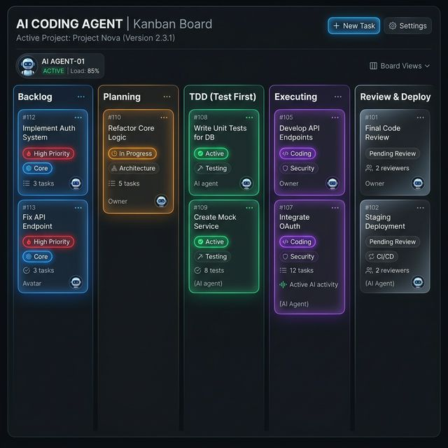
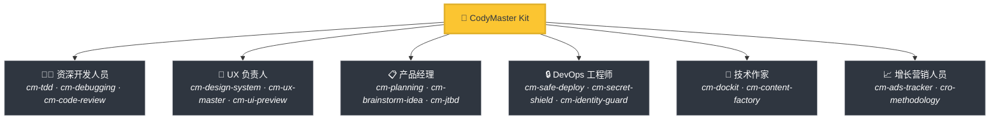
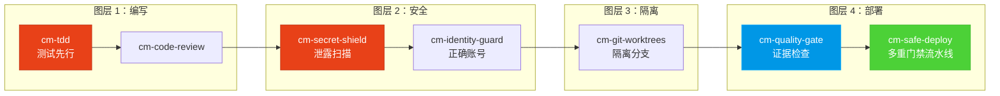

<div align="center">

[English](README.md) | [Tiếng Việt](README-vi.md) | [中文](README-zh.md) | [Русский](README-ru.md) | [한국어](README-ko.md) | [हिन्दी](README-hi.md)

# 🧠 CodyMaster

### 您的 AI 智能体很聪明。CodyMaster 让它变得*睿智*。

**68+ 项技能 · 18 条命令 · 1 个插件 · 7+ 个平台 · 6 种语言**

<p align="center">
  
  
  
  
  <a href="https://github.com/tody-agent/codymaster#readme" target="_blank">
    
  </a>
</p>



### 🌟 如果 CodyMaster 节省了您的时间，请给它一个 [Star](https://github.com/tody-agent/codymaster)！ 🌟

</div>

---

## 🛑 无人谈论的问题

您安装了一个 AI 编程智能体。它非常出色，编写代码的速度比任何人类都快。

但现实接踵而至：

| 😤 实际发生的情况 | 💀 真正的代价 |
|--------------------------|-----------------|
| AI 每次设计都**不一样** —— 同一个品牌，3 种不同的风格 | 客户认为你们是 3 家不同的公司 |
| AI 修复了一个 bug，**却悄悄破坏了其他 5 个地方** | 您重复做同样的工作 3-4 次 |
| AI 在会话之间**会忘记一切** | 您每天早上都要重新解释同一个代码库 |
| AI 零测试、零文档 | 您的代码库变成了一座纸牌屋 |
| 您安装了 15 种不同的技能 —— **它们之间互不沟通** | 零协同作用的科学怪人工具包 |
| 部署到生产环境 = **部署并祈祷** 🙏 | 凌晨 2 点部署失败，无法回滚 |

> *“AI 给了我 100 只手。但如果没有纪律，这些手只会创造混乱。”*
> — **Tody Le**，产品负责人 · 10+ 年经验 · CodyMaster 创作者

---

## 🟢 解决方案：一个套件包含整个资深团队

CodyMaster 不仅仅是“另一个 AI 技能包”。它是 **10 多年的产品 management 经验 + 6 个月经过实战测试的 vibe coding** 的结晶，浓缩成了 68+ 项互连技能，作为一个**单一的集成系统**运行。

当您安装 CodyMaster 时，您不仅仅是在添加技能。
**您是在聘请一整个资深团队：**



---

## ⚡ 是什么让 CodyMaster 与众不同

其他技能包提供零散的工具。CodyMaster 为您的 AI 提供了一个**互连的操作系统**。

### 🔄 全生命周期覆盖（创意 → 生产）

无缝衔接。无需手动交接。涵盖每个阶段：


### 🧠 统一大脑：5层记忆架构 + Smart Spine

您的 AI 不仅仅是执行 —— 它还会通过跨会话和跨机器持久化的5层 + Smart Spine 架构来**理解并记忆**：

1. **Sensory Memory (会话上下文)** — 当前活动文件和终端的即时上下文。
2. **Working Memory (`cm-continuity`)** — 跨会话的草稿本。AI 绝不会重复同样的错误。
3. **Long-Term Memory (`learnings.json`)** — 带有智能艾宾浩斯 TTL 衰减机制的强化经验。
4. **Semantic Memory (`cm-deep-search`)** — 使用 `qmd` 对文档进行本地向量搜索。
5. **Structural Memory (`cm-codeintell`)** — 基于 AST 的代码图。压缩高达95%的 token 以获取完整的代码库上下文。

🦴 **Smart Spine (v4.5+)** — 连接所有 5 层的神经系统：
- **SQLite + FTS5** — BM25 排名的关键词搜索，替代平坦 JSON 扫描。
- **Progressive Loading (L0/L1/L2)** — 上下文以最低成本加载。节省 78% token。
- **cm:// URI Scheme** — 技能通过 URI 请求上下文，而非文件路径。
- **Token Budget** — 200k token 窗口按类别预分配。不再静默溢出。
- **Context Bus** — 技能在链中实时共享输出。
- **MCP Server** — 7 个工具支持 Claude Desktop 和所有 MCP 客户端。

☁️ **Cloud Brain (`cm-notebooklm`)**
高价值的知识和设计模式将同步到 NotebookLM，为您的项目提供通用且跨机器的"灵魂"。自动生成播客和抽认卡，以便在 AI 旁边培训人类开发者。

📖 [阅读完整的知识架构文档 (EN) →](docs/architecture/knowledge-architecture.md)

### 🛡️ 多层保护（你的代码库不会被毁掉）

每一行代码在进入生产环境之前都会经过多个安全门禁：



> **结果：** 零密钥泄露。零错误账号部署。零“在我机器上能运行”的故障。

### 🎨 设计系统提取 —— 即使是旧产品

有一个没有设计系统的遗留产品？**cm-design-system** 会扫描你的网站，提取颜色、排版、间距和 Token，然后重建一个规范的设计系统。在编写任何代码之前，使用 **Pencil.dev** 或 **Google Stitch** 可视化预览设计。

### 📝 零文档？没问题。

不知道旧代码是做什么的？**`cm-dockit`** 会读取你的整个代码库并生成：
- 📚 技术架构文档
- 📖 用户指南和 SOPs
- 🔌 API 参考
- 🎯 用户画像分析和 JTBD 映射
- 🌐 多语言。SEO 优化。

**一次扫描 = 完整的知识库。**

### 💡 战略级头脑风暴 (Design Thinking + 9 Windows)

在为复杂请求编写代码之前，**`cm-brainstorm-idea`** 会通过多维度分析（技术、产品、设计、业务）来评估您的产品。它使用 9 窗口 (TRIZ) 框架生成 2-3 个合格的选项，并通过 **Pencil.dev** 或 **Google Stitch** 提供可视化的 UI 预览，以便在详细规划之前验证方向。

📖 [阅读更多关于 UI 预览阶段的信息 →](docs/workflows/brainstorm-ui-preview.md)

### 🏭 AI 内容工厂 v2.0 与可视化仪表盘

需要扩大内容规模？**`cm-content-factory`** 是一个具有自学习能力的多智能体内容引擎。它会自动研究、写作、审核（SEO 和 说服力转化）并部署高转化率的文章，并结合 Content Mastery 框架 (StoryBrand + Cialdini) 保证转化率。

在**可视化仪表盘** (`cm-dashboard`) 上跟踪一切：不再凭空猜测。在实时看板上跟踪每个任务、每个智能体和每次部署。流水线进度、 Token 追踪器、事件日志 —— 尽在一个屏幕中。

---

## 🆚 零散技能 vs CodyMaster

| | 😵 15 个随机技能 | 🧠 CodyMaster |
|---|---|---|
| **集成** | 每个技能都是独立的，没有共享上下文 | 68+ 个技能相互链接、共享记忆并进行通信 |
| **生命周期** | 仅涵盖编码 | 涵盖 想法 → 设计 → 代码 → 测试 → 部署 → 文档 → 学习 |
| **记忆** | 会话之间会遗忘所有内容 | 5层统一大脑系统：Sensory → Working → Long-term → Semantic → Structural + Cloud Brain |
| **安全性** | YOLO 式部署 | 4 层保护：TDD → 安全 → 隔离 → 多重门禁部署 |
| **设计** | 每次都是随机 UI | 提取并强制执行设计系统 + 视觉预览 |
| **文档** | “以后再写 README 吧” | 从代码自动生成完整的文档、SOP 和 API 参考 |
| **自我提升** | 静态 —— 安装了什么就是什么 | 从错误中学习，自动发现新技能，每天都在变得更聪明 |
| **维护** | 分别更新 15 个仓库 | 一个 `git pull` 即可更新所有内容 |

---

## 🦥 专为懒人打造（认真的）

我们坦白说：**CodyMaster 是为懒人打造的。**

如果你想：
- ✅ 输入一条聊天消息，就能得到一个**可以运行的产品**
- ✅ 让你的 AI **从错误中学习**，并且每天都在进步
- ✅ 永不重复设置相同的样板代码
- ✅ 带着**信心**去部署，而不是靠祈祷

**→ CodyMaster 适合你。**

如果你偏好：
- ❌ 手动检查 AI 输出的每一行内容
- ❌ 为每个项目执行相同的安装流程
- ❌ 缓慢、手动的部署，且没有安全网

**→ CodyMaster 不适合你。**

---

## 🚀 1 分钟安装

### 1. 安装 AI 技能 (所有平台)

一条命令即可将所有 68+ 项技能安装到您的环境中。支持 Claude Code、Gemini CLI、Cursor、Aider、Windsurf、Cline、OpenCode 等更多平台：

```bash
bash <(curl -fsSL https://raw.githubusercontent.com/tody-agent/codymaster/main/install.sh) --all
```

*对于 Cursor IDE 用户，您也可以直接在智能体聊天中输入 `/add-plugin cody-master`。*

### 2. 安装控制台仪表盘 (可选但推荐)

使用仓鼠 Cody 🐹 可视化您的进度、管理任务并追踪您的 10 倍编码连续记录。

```bash
npm install -g codymaster
cm
```

CLI 会在漫长的编码会话中与您打招呼并帮助您保持条理！

```text
    ( . \ --- / . )
     /   ^   ^   \        Hi! I'm Cody 🐹
    (      u      )        Your smart coding companion.
     |  \ ___ /  |
      '--w---w--'

│
◆  Quick menu
│  ● 📊  Dashboard (Start & open)
│  ○ 📋  My Tasks
│  ○ 📈 Status
│  ○ 🧩  Browse Skills
```

---

## 🧰 68+项技能军火库

| 领域 | 技能 |
|--------|--------|
| 🔧 **工程** | `cm-tdd` `cm-debugging` `cm-quality-gate` `cm-test-gate` `cm-code-review` |
| ⚙️ **运维** | `cm-safe-deploy` `cm-identity-guard` `cm-secret-shield` `cm-git-worktrees` `cm-terminal` `cm-safe-i18n` |
| 🎨 **产品与UX** | `cm-planning` `cm-design-system` `cm-ux-master` `cm-ui-preview` `cm-project-bootstrap` `cm-jtbd` `cm-brainstorm-idea` `cm-dockit` `cm-readit` |
| 📈 **增长/CRO** | `cm-content-factory` `cm-ads-tracker` `cro-methodology` |
| 🎯 **编排** | `cm-execution` `cm-continuity` `cm-skill-chain` `cm-skill-mastery` `cm-skill-index` `cm-deep-search` `cm-notebooklm` `cm-how-it-work` |
| 🖥️ **工作流** | `cm-start` `cm-dashboard` `cm-status` |

---

## 🎮 命令

**CLI 命令：**
```
cm                          → 快速菜单 with Cody 🐹
cm task add "..."           → 添加任务
cm task list                → 查看任务
cm status                   → 项目健康状态
cm dashboard                → 打开控制台
cm continuity index         → 重新生成 L0 内存索引
cm continuity budget        → 查看 token 预算分配
cm continuity bus           → 查看 context bus 状态
cm continuity mcp           → 打印 MCP 服务器配置
cm continuity migrate       → 迁移 JSON → SQLite
cm continuity export        → 导出 SQLite → JSON
cm resolve <uri>            → 解析任何 cm:// URI
```

**Slash 命令（在 AI 智能体中）：**
```
/cm:demo         → 交互式入职导览
/cm:bootstrap    → 从零开始构建新项目脚手架
/cm:plan         → 通过分析规划功能
/cm:build        → 通过严格的TDD进行构建
/cm:debug        → 系统化调试
/cm:ux           → 设计系统提取与UI预览
/cm:track        → 营销像素与追踪设置
```

---

## 👤 谁构建了它

**Tody Le** — 拥有10+年经验的产品负责人。不会写代码。连续6个月使用AI构建真实产品。这个工具包中的每一项技能都源于真实的失败，这些失败耗费了真实的时间和泪水。

> *“68+项技能。每一项技能都是一课。每一课都是一个不眠之夜。而现在，你无需再经历那些夜晚。”*

📖 [阅读完整故事 →](https://cody.todyle.com/story)

---

## 📚 资源

- 🌍 [网站](https://cody.todyle.com) — 概览与演示
- 📖 [文档](https://cody.todyle.com/docs) — 完整深度探索
- 🛠️ [技能参考](skills/) — 浏览所有 68+ 个 SKILL.md 文件
- 📖 [我们的故事](https://cody.todyle.com/story) — 为什么存在这个项目

---

## 🤝 贡献

1. ⭐ **Star本仓库** — 这能帮助更多开发者发现这个项目
2. Fork → 创建 `skills/cm-your-skill/SKILL.md`
3. 提交 Pull Request

---

<div align="center">

*MIT 许可证 — 免费使用、修改和分发。* <br/>
**为 vibe coding 社区用心 ❤️ 构建。**

*“Cody” = “Code Đi”（越南语：“去代码吧！”）—— 立即开始构建。*

</div>