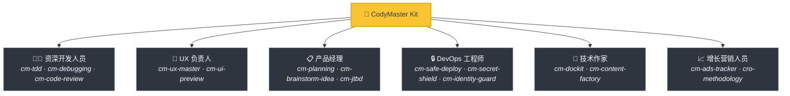
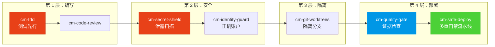

<div align="center">

[English](README.md) | [Tiếng Việt](README-vi.md) | [中文](README-zh.md) | [Русский](README-ru.md) | [한국어](README-ko.md) | [हिन्दी](README-hi.md)

# 🧠 CodyMaster

### 你的 AI 智能体很聪明。CodyMaster 让它更*明智*。

**33 项技能 · 11 个命令 · 1 个插件 · 7+ 个平台 · 6 种语言**

<p align="center">
  
  
  
  
  <a href="https://github.com/tody-agent/codymaster#readme" target="_blank">
    
  </a>
</p>


### 🌟 如果 CodyMaster 为你节省了时间，请给它一个 [Star](https://github.com/tody-agent/codymaster)！ 🌟

</div>

---

## 🛑 没人谈论的问题

你安装了一个 AI 编程智能体。它非常*出色*。它写代码的速度比任何人都快。

但现实情况是：

| 😤 实际发生的情况 | 💀 真实代价 |
|--------------------------|-----------------|
| AI 每次设计都**不一样** —— 同一个品牌，3 种不同的风格 | 客户认为你是 3 家不同的公司 |
| AI 修复了一个错误，却**静默地破坏了另外 5 个功能** | 你重复做同样的工作 3-4 次 |
| AI 会在会话之间**遗忘所有内容** | 你每天早上都要重新解释一遍相同的代码库 |
| AI 不写测试，不写文档 | 你的代码库变得像纸牌屋一样脆弱 |
| 你安装了 15 种不同的技能 —— **它们之间互不沟通** | 毫无协同作用的科学怪人工具包 |
| 部署到生产环境 = **部署并祈祷** 🙏 | 凌晨 2 点部署失败，无法回滚 |

> *“AI 给了我 100 只手。但如果没有纪律，这些手只会制造混乱。”*
> — **Tody Le**，产品负责人 · 10 年以上经验 · CodyMaster 创作者

---

## 🟢 解决方案：一个工具包里的完整资深团队

CodyMaster 不仅仅是“另一个 AI 技能包”。它是 **10 多年的产品管理经验 + 6 个月的实战 vibe coding** 的结晶，浓缩成了 33 项互联技能，作为一个**单一的集成系统**运行。

当你安装 CodyMaster 时，你不是在添加技能。
**你是在聘请一整个资深团队：**



---

## ⚡ 为什么 CodyMaster 与众不同

其他技能包给你的是零散的工具。CodyMaster 为你的 AI 提供了一个**互联的操作系统**。

### 🔄 全生命周期覆盖（创意 → 生产）

没有缝隙。没有手动交接。每个阶段都已覆盖：


### 🧠 一个从错误中学习的大脑

你的 AI 不仅仅是执行 —— 它还会**记忆并改进**：

MCP issues detected. Run /mcp list for status.[English](README.md) | [Tiếng Việt](README-vi.md) | [中文](README-zh.md) | [Русский](README-ru.md) | [한국어](README-ko.md) | [हिन्दी](README-hi.md)

- **`cm-continuity`** — 跨会话的工作记忆。AI 记住哪里出了问题，永远不会重复同样的错误
- **`cm-skill-mastery`** — 不知道如何做某事？它会**自动找到正确的技能**并升级自己
- **`cm-deep-search`** — 迷失在 200+ 文件的代码库中？数秒内即可跨越一切进行语义搜索

### 🛡️ 多层防护（你的代码库不会被摧毁）

每一行代码在进入生产环境之前都要经过多个安全网关：



> **结果：** 零密钥泄露。零错误账户部署。零“在我的机器上运行正常”的失败。

### 🎨 设计系统提取 —— 即使是旧产品

面对没有设计系统的遗留产品？**`cm-ux-master`** 扫描你的网站，提取颜色、排版、间距和令牌，然后重建一个规范的设计系统。在编写第一行代码之前，通过 **Pencil.dev** 或 **Google Stitch** 直观地预览设计。

### 📝 零文档？没问题。

不知道旧代码是做什么的？**`cm-dockit`** 读取你的整个代码库并生成：
- 📚 技术架构文档
- 📖 用户指南和 SOPs
- 🔌 API 参考
- 🎯 用户画像分析和 JTBD 映射
- 🌐 多语言。SEO 优化。

**一次扫描 = 完整的知识库。**

### 📊 可视化仪表盘 —— 一切尽在掌握

不再猜测。在实时看板上跟踪每个任务、每个代理、每个部署。流水线进度、令牌跟踪器、事件日志 —— 全都在一个屏幕上。

---

## 🆚 零散技能 vs CodyMaster

| | 😵 15 个随机技能 | 🧠 CodyMaster |
|---|---|---|
| **集成** | 每个技能都是独立的，没有共享上下文 | 33 个技能链式连接、共享记忆并相互通信 |
| **生命周期** | 仅涵盖编码 | 涵盖 想法 → 设计 → 编码 → 测试 → 部署 → 文档 → 学习 |
| **记忆** | 会话之间会遗忘一切 | 4 层记忆系统：工作 → 情节 → 语义 → 深度搜索 |
| **安全** | YOLO 式部署 | 4 层防护：TDD → 安全 → 隔离 → 多重门禁部署 |
| **设计** | 每次都是随机 UI | 提取并强制执行设计系统 + 视觉预览 |
| **文档** | “也许以后再写 README” | 从代码自动生成完整的文档、SOPs、API 参考 |
| **自我提升** | 静态 —— 安装了什么就是什么 | 从错误中学习，自动发现新技能，每天变得更聪明 |
| **维护** | 分别更新 15 个仓库 | 一次 `git pull` 更新一切 |

---

## 🦥 为懒人打造（说真的）

我们实话实说：**CodyMaster 是为懒人打造的。**

如果你想：
- ✅ 输入聊天消息并获得一个**可运行的产品**
- ✅ 让你的 AI **从错误中学习**并每天进步
- ✅ 永远不要两次设置同样的样板代码
- ✅ 带着**信心**部署，而不是祈祷

**→ CodyMaster 适合你。**

如果你更喜欢：
- ❌ 手动审查 AI 输出的每一行
- ❌ 为每个项目重复同样的设置流程
- ❌ 没有安全网的缓慢、手动部署

**→ CodyMaster 不适合你。**

---

## 🚀 1 分钟安装

### Claude Code (推荐)
```bash
bash <(curl -fsSL https://raw.githubusercontent.com/tody-agent/codymaster/main/install.sh) --claude
```
*或者：`claude plugin marketplace add tody-agent/codymaster` → `claude plugin install cm@codymaster`*

### Cursor IDE
```
/add-plugin cody-master

<div align="center">

*MIT 许可证 — 免费使用、修改和分发。* <br/>
**为 vibe coding 社区倾情打造 ❤️**

*“Cody” = “Code Đi”（越南语：“去编码吧！”）—— 动手开始构建。*

</div>