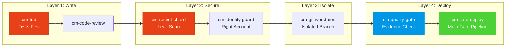

<div align="center">

[English](README.md) | [Tiếng Việt](README-vi.md) | [中文](README-zh.md) | [Русский](README-ru.md) | [한국어](README-ko.md) | [हिन्दी](README-hi.md)

# 🧠 CodyMaster

### 你的 AI 智能体很聪明。CodyMaster 赋予它*智慧*。

**33 项技能 · 11 个命令 · 1 个插件 · 7+ 个平台 · 6 种语言**

<p align="center">
  
  
  
  
  <a href="https://github.com/tody-agent/codymaster#readme" target="_blank">
    
  </a>
</p>


### 🌟 如果 CodyMaster 为你节省了时间，请给它一个 [Star](https://github.com/tody-agent/codymaster)！ 🌟

</div>

---

## 🛑 无人提及的问题

你安装了一个 AI 编程智能体。它非常*出色*。它编写代码的速度比任何人类都快。

但现实接踵而至：

| 😤 实际发生的情况 | 💀 真实代价 |
|--------------------------|-----------------|
| AI 每次的设计都**截然不同** —— 同一个品牌，3 种不同的风格 | 客户以为你们是 3 家不同的公司 |
| AI 修复了一个错误，却**悄悄搞砸了其他 5 件事** | 你需要重复做同样的工作 3-4 次 |
| AI 在会话之间会**忘掉所有事情** | 每天早上你都要重新解释同一个代码库 |
| AI 不写任何测试，不写任何文档 | 你的代码库变成了一个空中楼阁 |
| 你安装了 15 种不同的技能 —— **它们之间互不沟通** | 零协同作用的科学怪人工具包 |
| 部署到生产环境 = **部署并祈祷** 🙏 | 凌晨 2 点部署失败，且无法回滚 |

> *“AI 给了我 100 只手。但如果没有纪律，这些手只会制造混乱。”*
> — **Tody Le**，产品负责人 · 10 年以上经验 · CodyMaster 创始人

---

## 🟢 解决方案：一个工具包即是一支资深团队

CodyMaster 不仅仅是“另一个 AI 技能包”。它是 **10 年以上的产品管理经验 + 6 个月的实战 vibe coding** 的结晶，浓缩成了 33 项互联技能，作为一个**单一集成系统**运行。

当你安装 CodyMaster 时，你不仅仅是在添加技能。
**你是在聘请一支完整的资深团队：**


---

## ⚡ CodyMaster 的独特之处

其他技能包只给你零散的工具。CodyMaster 为你的 AI 提供了一个**互联的操作系统**。

### 🔄 全生命周期覆盖（创意 → 生产）

无缝衔接。无须手动交接。涵盖每一个阶段：


### 🧠 一个能从错误中学习的大脑

你的 AI 不仅仅是执行 —— 它还能**记忆并改进**：

- **`cm-continuity`** — 跨会话的工作记忆。AI 记住哪里出错了，并且永远不会重复同样的错误
- **`cm-skill-mastery`** — 不知道如何做某事？它会**自动找到合适的技能**并升级自己
- **`cm-deep-search`** — 迷失在拥有 200 多个文件的代码库中？数秒内即可对所有内容进行语义搜索

### 🛡️ 多层保护（您的代码库不会被破坏）

每一行代码在进入生产环境之前都要经过多个安全关卡：



> **结果：** 零密钥泄露。零错误账户部署。零“在我的机器上能运行”的失败。

### 🎨 设计系统提取 —— 即使是旧产品

有一个没有设计系统的遗留产品？**`cm-ux-master`** 扫描您的网站，提取颜色、排版、间距和 tokens，然后重建一个规范的设计系统。在编写第一行代码之前，即可使用 **Pencil.dev** 或 **Google Stitch** 视觉化预览设计。

### 📝 零文档？没问题。

不知道旧代码是做什么的？**`cm-dockit`** 读取您的整个代码库并生成：
- 📚 技术架构文档
- 📖 用户指南和 SOPs
- 🔌 API 参考
- 🎯 用户画像分析和 JTBD 映射
- 🌐 多语言。SEO 优化。

**一次扫描 = 完整的知识库。**

### 📊 可视化仪表板 —— 一切尽在掌握

不再有猜想。在实时看板上跟踪每个任务、每个代理和每次部署。流水线进度、 token 跟踪器、事件日志 —— 全部显示在一个屏幕上。

---

## 🆚 零散技能 vs CodyMaster

| | 😵 15 个随机技能 | 🧠 CodyMaster |
|---|---|---|
| **集成** | 每个技能都是独立的，没有共享上下文 | 33 个技能串联、共享记忆并相互沟通 |
| **生命周期** | 仅涵盖编码 | 涵盖 创意 → 设计 → 编码 → 测试 → 部署 → 文档 → 学习 |
| **记忆** | 在会话之间忘记一切 | 4 层记忆系统：工作记忆 → 情节记忆 → 语义记忆 → 深度搜索 |
| **安全** | YOLO 式部署 | 4 层保护：TDD → 安全 → 隔离 → 多关卡部署 |
| **设计** | 每次都是随机的 UI | 提取并强制执行设计系统 + 视觉预览 |
| **文档** | “以后再写 README 吧” | 自动从代码生成完整的文档、SOPs、API 参考 |
| **自我改进** | 静态的 —— 安装什么就是什么 | 从错误中学习，自动发现新技能，每天变得更聪明 |
| **维护** | 分别更新 15 个仓库 | 一次 `git pull` 更新所有内容 |

---

## 🦥 为懒人打造（说认真的）

我们要说实话：**CodyMaster 是为懒人打造的。**

如果您想：
- ✅ 输入一条聊天消息，然后获得一个**可以运行的产品**
- ✅ 让您的 AI **从错误中学习**并每天进步
- ✅ 永远不再设置同样的模板代码
- ✅ 带着**信心**部署，而不是祈祷

**→ CodyMaster 适合您。**

如果您更喜欢：
- ❌ 手动审查 AI 输出的每一行代码
- ❌ 为每个项目重复同样的设置流程
- ❌ 缓慢的、没有安全网的手动部署

**→ CodyMaster 不适合您。**

---

## 🚀 1 分钟安装

### Claude Code (推荐)
```bash
bash <(curl -fsSL https://raw.githubusercontent.com/tody-agent/codymaster/main/install.sh) --claude
```
*或者： `claude plugin marketplace add tody-agent/codymaster` → `claude plugin install cm@codymaster`*

### Cursor IDE
```
/add-plugin cody-master

### Gemini CLI / Antigravity
```bash
gemini extensions install https://github.com/tody-agent/codymaster
```

<details>
<summary><b>其他平台：Codex, OpenCode, Kiro, Copilot, Windsurf, Cline</b></summary>

```bash
# Universal: clone once, copy to any platform
git clone https://github.com/tody-agent/codymaster.git ~/.cody-master

# Then drop skills into your platform's directory:
cp -r ~/.cody-master/skills/* .cursor/skills/
cp -r ~/.cody-master/skills/* .codex/skills/
cp -r ~/.cody-master/skills/* .kiro/steering/
cp -r ~/.cody-master/skills/* .opencode/skills/
cp -r ~/.cody-master/skills/* ~/.gemini/antigravity/skills/
```
</details>

---

## 🧰 33 项技能库

| 领域 | 技能 |
|--------|--------|
| 🔧 **工程** | `cm-tdd` `cm-debugging` `cm-quality-gate` `cm-test-gate` `cm-code-review` |
| ⚙️ **运维** | `cm-safe-deploy` `cm-identity-guard` `cm-secret-shield` `cm-git-worktrees` `cm-terminal` `cm-safe-i18n` |
| 🎨 **产品与 UX** | `cm-planning` `cm-ux-master` `cm-ui-preview` `cm-project-bootstrap` `cm-jtbd` `cm-brainstorm-idea` `cm-dockit` `cm-readit` |
| 📈 **增长/CRO** | `cm-content-factory` `cm-ads-tracker` `cro-methodology` |
| 🎯 **编排** | `cm-execution` `cm-continuity` `cm-skill-chain` `cm-skill-mastery` `cm-skill-index` `cm-deep-search` `cm-how-it-work` |
| 🖥️ **工作流** | `cm-start` `cm-dashboard` `cm-status` |

---

## 🎮 命令

```
/cm:demo         → 交互式入门导览
/cm:bootstrap    → 从零开始搭建新项目
/cm:plan         → 通过分析规划功能
/cm:build        → 遵循严格的 TDD 进行构建
/cm:debug        → 系统化调试
/cm:ux           → 设计系统提取与 UI 预览
/cm:track        → 营销 Pixel 与追踪设置
```

---

## 👤 开发者

**Tody Le** —— 拥有 10 年以上经验的产品负责人。不会写代码。连续 6 个月使用 AI 构建真实产品。这个工具包中的每项技能都源于真实的失败，这些失败花费了真实的时间，流下了真实的泪水。

> *“33 项技能。每一项技能都是一个教训。每一个教训都是一个不眠之夜。而现在，你不再需要经历那些夜晚。”*

📖 [阅读完整故事 →](https://cody-master.pages.dev/story)

---

## 📚 资源

- 🌍 [网站](https://cody-master.pages.dev) —— 概述与演示
- 📖 [文档](https://cody-master.pages.dev/docs) —— 全面深入研究
- 🛠️ [技能参考](skills/) —— 浏览所有 33 个 SKILL.md 文件
- 📖 [我们的故事](https://cody-master.pages.dev/story) —— 为什么这会存在

---

## 🤝 贡献

1. ⭐ **在仓库加星** —— 这有助于更多开发者发现它
2. Fork → 创建 `skills/cm-your-skill/SKILL.md`
3. 提交 Pull Request

---

<div align="center">

*MIT 许可证 —— 免费使用、修改和分发。* <br/>
**为 vibe coding 社区用 ❤️ 构建。**

*“Cody” = “Code Đi”（越南语：“去编码吧！”） —— 立即开始构建。*

</div>