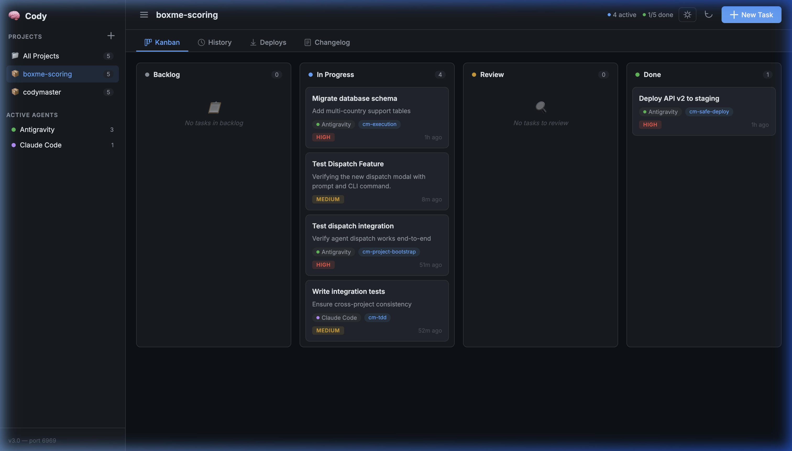
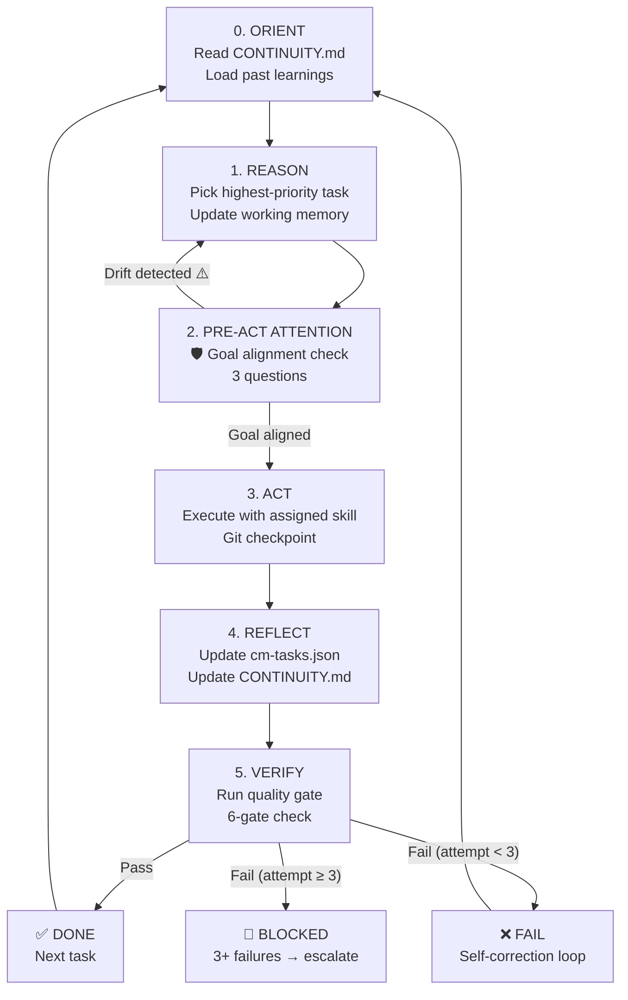

<div align="center">

# 🧠 CodyMaster

**The Universal AI Coding Automation & Skills Framework**
**One Bootstrap → Configs for 7+ AI Agent Platforms**

<p align="center">
  
  
  
  <a href="https://github.com/tody-agent/codymaster#readme" target="_blank">
    
  </a>
  <a href="https://github.com/tody-agent/codymaster/graphs/commit-activity" target="_blank">
    
  </a>
</p>

# 🧠 CodyMaster

> *The ultimate prompt library and workflow engine for AI-assisted software engineering. Turns Cursor, Cline, OpenClaw, and RooCode into autonomous senior developer agents.*

CodyMaster provides **30+ built-in skills** representing specialized developer personas: from TDD experts and UX Researchers to Deployment Engineers and Knowledge Architects.

<br/>

<br/>

</div>

---

## What is CodyMaster?

CodyMaster is a **skills framework** that gives AI coding agents the discipline of a 10-year senior engineer. Instead of letting AI write spaghetti code, CodyMaster enforces:

- 🔴 **TDD** (Test-Driven Development) — write tests before code
- 🛡️ **6-Gate Quality System** — blind review, anti-sycophancy, security scan
- 🧠 **Working Memory** — context persists across sessions via CONTINUITY.md
- 🤖 **Judge Agent** — auto-detects stuck tasks, suggests pivots
- 📊 **Real-time Dashboard** — Kanban board, agent logs, deployment tracking
- 🔍 **Self-Enhancing** — auto-discovers & installs new skills from [skills.sh](https://skills.sh)
- 🌐 **Universal Agent Bootstrap** — one AGENTS.md → configs for OpenClaw, Claude, Cursor, OpenFang, Manus, MaxClaw

```
Your Idea → CodyMaster Skills → Production-Ready Code
```

---

## Quick Start

<br/>

<br/>

```bash
# Install globally
npm install -g cody-master

# Or clone and build
git clone https://github.com/omisocial/cody-master.git
cd cody-master && npm install && npm run build

# Launch dashboard
cm dashboard start

# Initialize working memory for a project
cm continuity init
```

---

## 🎯 Supported AI Platforms

| Platform | Status | Skill Prefix |
|----------|--------|-------------|
| 🟢 **Google Antigravity** (Gemini) | ✅ | `@[/skill-name]` |
| 🟣 **Claude Code / Desktop** | ✅ | `/skill-name` |
| 🔵 **Cursor** | ✅ | `@skill-name` |
| 🟠 **Windsurf** | ✅ | `@skill-name` |
| 🟤 **Cline / RooCode** | ✅ | `@skill-name` |
| 🐈 **GitHub Copilot** | ✅ | `skill-name` |
| 🐾 **OpenClaw / MaxClaw** | ✅ | `@skill-name` |
| 🦷 **OpenFang** | ✅ | `@skill-name` |
| 🤖 **Manus** | ✅ | `@skill-name` |
| 💻 **Gemini CLI** | ✅ | `@[/skill-name]` |

---

## 🧩 Skills Library (30+ Skills in 5 Swarms)

Skills are organized into **5 swarms** for intelligent auto-selection:

### 🔧 Engineering Swarm

| Skill | Purpose |
|-------|---------|
| `cm-tdd` | Red-Green-Refactor cycle — test before code |
| `cm-debugging` | 5-phase root cause investigation |
| `cm-quality-gate` | 6-gate verification: static → blind review → security → ship |
| `cm-test-gate` | Setup 4-layer test infrastructure for any project |
| `cm-code-review` | Professional PR review lifecycle |

### ⚙️ Operations Swarm

| Skill | Purpose |
|-------|---------|
| `cm-safe-deploy` | Multi-gate deploy pipeline with rollback |
| `cm-identity-guard` | Prevent wrong-account deploys |
| `cm-git-worktrees` | Isolated feature branches |
| `cm-terminal` | Safe terminal execution with output logging |

### 🎨 Product Swarm

| Skill | Purpose |
|-------|---------|
| `cm-planning` | Brainstorm intent → design → implementation plan |
| `cm-brainstorm-idea` | Strategic analysis gate — Design Thinking + 9 Windows (TRIZ) |
| `cm-ux-master` | 48 UX Laws + 37 Design Tests + Figma/Stitch |
| `cm-ui-preview` | AI-powered UI preview with Stitch/Pencil MCP |
| `cm-dockit` | Complete knowledge base from codebase |
| `cm-readit` | Audio reading mode + voice CRO for any website |
| `cm-project-bootstrap` | Full project setup: design system → CI → deploy + **universal agent configs** |

### 📈 Growth Swarm

| Skill | Purpose |
|-------|---------|
| `cm-content-factory` | AI content engine: research → generate → deploy |
| `cm-ads-tracker` | Facebook/TikTok/Google tracking setup |

### 🎯 Orchestration Swarm

| Skill | Purpose |
|-------|---------|
| `cm-execution` | Execute plans: batch, parallel, subagent, or RARV |
| `cm-continuity` | Working memory: read at start, update at end |
| `cm-skill-chain` | Compose skills into automated multi-step pipelines |
| `cm-skill-index` | Progressive disclosure — scan 30 skills in 100 tokens |
| `cm-safe-i18n` | Multi-pass translation with 8 audit gates |
| `cm-skill-mastery` | Meta: when to invoke skills, how to create new ones |
| `cm-identity-guard` | Prevent wrong-account deploys across git/Cloudflare/Supabase |

---

## 🧠 Working Memory (v3.2.0)

CodyMaster maintains context across sessions through **CONTINUITY.md**:

```bash
cm continuity init       # Create .cm/ working memory directory
cm continuity status     # View current state
cm continuity learnings  # View captured error patterns
cm continuity decisions  # View architecture decisions
cm continuity reset      # Clear state (preserves learnings)
```

The `.cm/` directory structure:
```
.cm/
├── CONTINUITY.md          # Active goal, task, learnings
├── config.yaml            # RARV cycle settings
└── memory/
    ├── learnings.json     # Error patterns (auto-captured)
    └── decisions.json     # Architecture decisions
```

---

## 🤖 Judge Agent

The Judge Agent automatically evaluates task health:

| Badge | Action | When |
|-------|--------|------|
| 🟢 | CONTINUE | Task progressing normally |
| 🏁 | COMPLETE | All subtasks done |
| ⚠️ | ESCALATE | Stuck >10 minutes without updates |
| 🔄 | PIVOT | 3+ failures → suggests alternative approach |

```bash
# API endpoints
curl http://codymaster.localhost:6969/api/judge                    # All tasks
curl http://codymaster.localhost:6969/api/judge/:taskId             # Single task
curl http://codymaster.localhost:6969/api/agents/suggest?skill=cm-tdd  # Best agent for skill
```

---

## 📊 Dashboard

Real-time web dashboard at `http://codymaster.localhost:6969`:

- **Kanban Board** — drag tasks across backlog → in-progress → review → done
- **Agent Activity** — see what each AI agent is doing
- **Deployment Tracking** — staging/production with rollback
- **Changelog** — version history and release notes
- **Working Memory** — CONTINUITY.md state per project
- **Judge Badges** — 🟢🏁⚠️🔄 on every active task

```bash
cm dashboard start           # Launch on port 6969
cm dashboard start -p 8080   # Custom port
```

---

## 🔄 RARV Cycle (Autonomous Execution)

The enhanced RARV (Reason-Act-Reflect-Verify) cycle runs tasks autonomously:



**Key innovation:** PRE-ACT ATTENTION prevents goal drift — the #1 AI failure mode.

---

## 📚 Documentation

| Doc | Description |
|-----|-------------|
| [How It Works](docs/how-it-work.md) | Mermaid workflow diagrams, use cases, exception handling |
| [Showcase](docs/showcase.md) | Step-by-step examples with real commands |
| [Skills Reference](skills/) | Full SKILL.md for each skill |

### 🌐 Universal Agent Bootstrap (NEW in v3.0)

`cm-project-bootstrap` now auto-generates platform-specific configs from a single `AGENTS.md`:

| Platform | Generated Config |
|----------|------------------|
| AGENTS.md (Open Standard) | `AGENTS.md` — always generated, source of truth |
| Claude Desktop / Claude Code | `CLAUDE.md` |
| Cursor | `.cursor/rules/*.mdc` |
| OpenClaw / MaxClaw | `IDENTITY.md`, `MEMORY.md`, `TOOLS.md`, `SHIELD.md` |
| OpenFang | `HAND.toml` |
| Manus | Project instructions |
| Gemini / Antigravity | Uses `AGENTS.md` directly |

---

## 🤝 Contributing

1. Fork the repository
2. Create a skill folder: `skills/your-skill-name/SKILL.md`
3. Follow the structure in `cm-skill-mastery` and `skill-creator-ultra`
4. Submit a Pull Request

---

## 📜 License

MIT License — free to use, modify, and distribute for personal and commercial projects.

<div align="center">
<br/>

*Built with ❤️ for the vibe coding community.*  
*Focus on solving business problems, not chasing UI bugs.*

</div>
