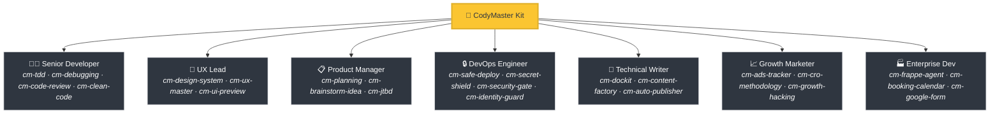
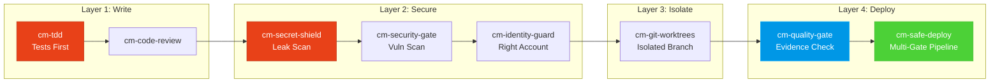

<div align="center">

[English](README.md) | [Tiếng Việt](README-vi.md) | [中文](README-zh.md) | [Русский](README-ru.md) | [한국어](README-ko.md) | [हिन्दी](README-hi.md)

# 🧠 CodyMaster

### Your AI Agent is smart. CodyMaster makes it *wise*.

**68+ Skills · 18 Commands · 1 Plugin · 7+ Platforms · 6 Languages**

<p align="center">
  
  
  
  
  <a href="https://github.com/tody-agent/codymaster#readme" target="_blank">
    
  </a>
</p>

```
    ( . \ --- / . )
     /   ^   ^   \
    (      u      )
     |  \ ___ /  |
      '--w---w--'
       Meet CodyMaster 🐹
  Your smart coding companion.
```


### 🌟 If CodyMaster saves you time, give it a [Star](https://github.com/tody-agent/codymaster)! 🌟

</div>

---

## 🛑 The Problem Nobody Talks About

You installed an AI coding agent. It's *brilliant*. It writes code faster than any human.

But then reality hits:

| 😤 What Actually Happens                                                            | 💀 The Real Cost                               |
| ----------------------------------------------------------------------------------- | ---------------------------------------------- |
| AI designs**differently every single time** — same brand, 3 different styles | Clients think you're 3 different companies     |
| AI fixes one bug,**silently breaks 5 other things**                           | You redo the same work 3-4 times               |
| AI**forgets everything** between sessions                                     | You re-explain the same codebase every morning |
| AI writes zero tests, zero docs                                                     | Your codebase becomes a house of cards         |
| You install 15 different skills —**none of them talk to each other**         | Frankenstein toolkit with zero synergy         |
| Deploy to production =**deploy and pray** 🙏                                  | Broken deploys at 2 AM, no rollback            |

> *"AI gave me 100 hands. But without discipline, those hands created chaos."*
> — **Tody Le**, Head of Product · 10+ years · Creator of CodyMaster

---

## 🟢 The Solution: An Entire Senior Team in One Kit

CodyMaster isn't just "another AI skills pack." It's **10+ years of product management experience + 6 months of battle-tested vibe coding**, distilled into 68+ interconnected skills that work as a **single integrated system**.

When you install CodyMaster, you're not adding skills.
**You're hiring an entire senior team:**



---

## ⚡ What Makes CodyMaster Different

Other skill packs give you loose tools. CodyMaster gives you an **interconnected operating system** for your AI — 68+ skills that chain, share memory, and communicate like a real team.

### 🔄 Full Lifecycle Coverage (Idea → Production)

No gaps. No manual handoffs. Every phase is covered:


### 🧠 The Unified Brain: 5-Tier Memory + Smart Spine

Your AI doesn't just execute — it **understands and remembers** using a multi-scale, 5-Tier + Smart Spine architecture that persists across sessions and machines:

1. **Sensory Memory (Session)** — Immediate context of active files and terminals.
2. **Working Memory (`cm-continuity`)** — Cross-session scratchpad. AI never repeats the same mistake.
3. **Long-Term Memory (`learnings.json`)** — Reinforced lessons with smart Ebbinghaus TTL decay.
4. **Semantic Memory (`cm-deep-search`)** — Local vector search across docs using `qmd`.
5. **Structural Memory (`cm-codeintell`)** — AST-based CodeGraph. Up to 95% token compression for full codebase context.

🦴 **Smart Spine (v4.5+)** — The nervous system connecting all 5 tiers:
- **SQLite + FTS5** — BM25-ranked keyword search replaces flat JSON scans.
- **Progressive Loading (L0/L1/L2)** — Context loaded at cheapest sufficient depth. 78% token savings.
- **cm:// URI Scheme** — Skills request context by URI, not file paths.
- **Token Budget** — 200k window pre-allocated by category. No more silent overflow.
- **Context Bus** — Skills share outputs in real-time within a chain.
- **MCP Server** — 7 tools exposed to Claude Desktop and any MCP client.

☁️ **The Cloud Brain (`cm-notebooklm`)**
High-value knowledge and design patterns are synced to NotebookLM, providing a universal, cross-machine "Soul" for your project. Auto-generate podcasts and flashcards to onboard human developers alongside the AI.

📖 [Read the full Knowledge Architecture →](docs/architecture/knowledge-architecture.md)

### 🛡️ Multi-Layer Protection (Your Codebase Won't Get Destroyed)

Every line of code passes through multiple safety gates before reaching production:



> **Result:** Zero leaked secrets. Zero wrong-account deploys. Zero "worked on my machine" failures.

### 🎨 Design System Builder — Even From Old Products

Got a legacy product with no design system? **cm-design-system** scans your website, extracts colors, typography, spacing, and tokens, then rebuilds a proper design system. Preview designs visually with **Pencil.dev** or **Google Stitch** before writing a single line of code.

### 📝 Zero Documentation? No Problem.

Don't know what the old code does? **`cm-dockit`** reads your entire codebase and generates:

- 📚 Technical architecture docs
- 📖 User guides & SOPs
- 🔌 API references
- 🎯 Persona analysis & JTBD mapping
- 🌐 Multi-language. SEO-optimized.

**One scan = Complete knowledge base.**

### 💡 Strategic Brainstorming (Design Thinking + 9 Windows)

Before diving into code for complex requests, **`cm-brainstorm-idea`** evaluates your product using multi-dimensional analysis (Tech, Product, Design, Business). It generates 2-3 qualified options using the 9 Windows (TRIZ) framework and provides a visual UI Preview via **Pencil.dev** or **Google Stitch** to validate the direction before detailed planning. 

📖 [Read more about the UI Preview Phase →](docs/workflows/brainstorm-ui-preview.md)


### 🏭 AI Content Factory v2.0 & Visual Dashboard

Need to scale content? **`cm-content-factory`** is a self-learning, multi-agent content engine. It automatically researches, writes, audits (SEO & Persuasion), and deploys high-converting articles with the Content Mastery framework (StoryBrand + Cialdini) to guarantee conversion.

Track it all on the **Visual Dashboard** (`cm-dashboard`): No more guessing. Track every task, every agent, every deployment on a real-time Kanban board. Pipeline progress, token tracker, event log — all on one screen.

### 🧬 Self-Healing AI (Skills That Fix Themselves)

CodyMaster doesn't just run skills — it **watches them, scores them, and heals them automatically.**

- **`cm-skill-health`** monitors every invocation: success rate, token usage, error patterns.
- **`cm-skill-evolution`** auto-patches degraded skills (Mode: FIX) when health scores drop below threshold.
- **`cm-skill-search`** uses BM25 ranking to find the right skill for any task.
- **`cm-skill-share`** exports & imports skills across teams and machines.

> **Think of it like an immune system for your AI toolkit.** Skills that break get healed. Skills that work well get reinforced. Dead skills get archived.

### 🏢 Enterprise-Ready: Frappe/ERPNext Full-Stack

Building on Frappe Framework? **`cm-frappe-agent`** is a 7-layer architecture agent covering the entire Frappe lifecycle — from `bench new-app` to production deploys. Custom doctypes, workflows, REST APIs, permissions, fixtures, and performance optimization — all battle-tested.

### 🚀 Growth Hacking Engine

Need popups, booking flows, or lead capture? **`cm-growth-hacking`** generates complete conversion systems: Bottom Sheet + Calendar CTA + Tracking. Auto-detects industry, selects the right pattern, wires up **`cm-booking-calendar`** for appointments and **`cm-ads-tracker`** for pixel tracking. Zero dependencies.

---

## 🆚 Scattered Skills vs CodyMaster

|                            | 😵 15 Random Skills                         | 🧠 CodyMaster                                                         |
| -------------------------- | ------------------------------------------- | --------------------------------------------------------------------- |
| **Integration**      | Each skill is standalone, no shared context | 68+ skills that chain, share memory, and communicate                   |
| **Lifecycle**        | Covers coding only                          | Covers Idea → Design → Code → Test → Deploy → Docs → Learn      |
| **Memory**           | Forgets everything between sessions         | 5-tier Unified Brain: Sensory → Working → Long-term → Semantic → Structural + Cloud Brain  |
| **Safety**           | YOLO deploys                                | 4-layer protection: TDD → Security → Isolation → Multi-gate deploy |
| **Design**           | Random UI every time                        | Extracts & enforces design system + visual preview                    |
| **Documentation**    | "Maybe write a README later"                | Auto-generates complete docs, SOPs, API refs from code                |
| **Self-improvement** | Static — what you install is what you get  | Self-healing: monitors health → auto-patches → reinforces winners   |
| **Maintenance**      | Update 15 repos separately                  | One `npm i -g codymaster` updates everything                        |

---

## 🦥 Built For Lazy People (Seriously)

We're going to be honest: **CodyMaster was built for lazy people.**

If you want to:

- ✅ Type a chat message and get a **working product** back
- ✅ Have your AI **learn from its mistakes** and get better every day
- ✅ Never setup the same boilerplate twice
- ✅ Deploy with **confidence** instead of praying

**→ CodyMaster is for you.**

If you prefer:

- ❌ Manually reviewing every line of AI output
- ❌ Doing the same setup ritual for every project
- ❌ Slow, manual deploys with no safety net

**→ CodyMaster is NOT for you.**

---

## 🚀 1-Minute Install

### 1. Install AI Skills (All Platforms)

One command installs all 68+ skills to your environment. Supports Claude Code, Gemini CLI, Cursor, Aider, Windsurf, Cline, OpenCode, and more:

```bash
bash <(curl -fsSL https://raw.githubusercontent.com/tody-agent/codymaster/main/install.sh) --all
```

*For Cursor IDE users, you can also just type `/add-plugin cody-master` in your agent chat.*

### 2. Install Mission Control Dashboard (Optional but Recommended)

Visualize your progress, manage tasks, and track your 10x coding streak with Cody the Hamster 🐹.

```bash
npm install -g codymaster
cm
```

The CLI will greet you and keep you organized on your long coding sessions!

```text
    ( . \ --- / . )
     /   ^   ^   \        Hi! I'm Cody 🐹
    (      u      )        Your smart coding companion.
     |  \ ___ /  |
      '--w---w--'

│
◆  Quick menu
│  ● 📊  Dashboard (Start & open)
│  ○ 📋  My Tasks
│  ○ 📈 Status
│  ○ 🧩  Browse Skills
```

</details>

---

## 🧰 The 68+ Skill Arsenal

| Domain                    | Skills                                                                                                                                                          |
| ------------------------- | --------------------------------------------------------------------------------------------------------------------------------------------------------------- |
| 🔧 **Engineering**   | `cm-tdd` `cm-debugging` `cm-quality-gate` `cm-test-gate` `cm-code-review` `cm-clean-code`                                                                             |
| ⚙️ **Operations**  | `cm-safe-deploy` `cm-identity-guard` `cm-secret-shield` `cm-security-gate` `cm-git-worktrees` `cm-terminal` `cm-safe-i18n`                                             |
| 🎨 **Product & UX**  | `cm-planning` `cm-design-system` `cm-ux-master` `cm-ui-preview` `cm-project-bootstrap` `cm-jtbd` `cm-brainstorm-idea` `cm-dockit` `cm-readit` |
| 📈 **Growth & CRO**    | `cm-content-factory` `cm-auto-publisher` `cm-ads-tracker` `cm-cro-methodology` `cm-growth-hacking` `cm-booking-calendar` `cm-google-form`                                                                                                   |
| 🏢 **Enterprise**  | `cm-frappe-agent` `cm-reactor` `cm-notebooklm`                                                                                                  |
| 🧬 **Self-Healing**   | `cm-skill-health` `cm-skill-evolution` `cm-skill-search` `cm-skill-share` `cm-skill-chain` `cm-skill-mastery` `cm-skill-index`             |
| 🎯 **Orchestration** | `cm-execution` `cm-continuity` `cm-deep-search` `cm-codeintell` `cm-how-it-work`             |
| 🖥️ **Workflow**    | `cm-start` `cm-dashboard` `cm-status`                                                                                                                     |

---

## 🎮 Commands

```
cm                          → Quick menu with Cody 🐹
cm task add "..."           → Add a task
cm task list                → View tasks
cm status                   → Project health
cm dashboard                → Open Mission Control
cm list                     → Browse 68+ skills
cm profile                  → Your stats & achievements
cm deploy <env>             → Record deployment
cm continuity index         → Regenerate L0 memory indexes
cm continuity budget        → Show token budget allocation
cm continuity bus           → View context bus state
cm continuity mcp           → Print MCP server config
cm continuity migrate       → Migrate JSON → SQLite
cm continuity export        → Export SQLite → JSON
cm resolve <uri>            → Resolve any cm:// URI
```

**Slash Commands (inside AI agents):**

```
/cm:demo         → Interactive onboarding tour
/cm:plan         → Plan a feature with analysis
/cm:build        → Build with strict TDD
/cm:debug        → Systematic debugging
/cm:ux           → Design system extraction & UI preview
```

---

## 👤 Who Built This

**Tody Le** — Head of Product with 10+ years of experience. Can't write code. Used AI to build real products for 6 months straight. Every skill in this kit was born from a real failure that cost real time and real tears.

> *"68+ skills. Each skill is a lesson. Each lesson is a sleepless night. And now, you don't have to go through those nights."*

📖 [Read the full story →](https://cody.todyle.com/story)

---

## 📚 Resources

- 🌍 [Website](https://cody.todyle.com) — Overview & demos
- 📖 [Documentation](https://cody.todyle.com/docs) — Full deep-dive
- 🛠️ [Skills Reference](skills/) — Browse all 68+ SKILL.md files
- 📖 [Our Story](https://cody.todyle.com/story) — Why this exists

---

## 🤝 Contributing

1. ⭐ **Star the repo** — it helps more builders find this
2. Fork → Create `skills/cm-your-skill/SKILL.md`
3. Submit a Pull Request

---

<div align="center">

*MIT License — Free to use, modify, and distribute.* `<br/>`
**Built with ❤️ for the vibe coding community.**

*"CodyMaster" = "Code Đi" (Vietnamese: "Go code!") — just start building.*

</div>
