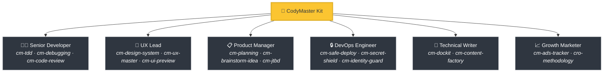
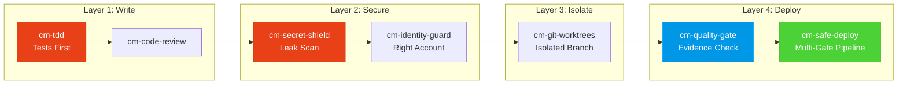

<div align="center">

[English](README.md) | [Tiếng Việt](README-vi.md) | [中文](README-zh.md) | [Русский](README-ru.md) | [한국어](README-ko.md) | [हिन्दी](README-hi.md)

# 🧠 CodyMaster

### Your AI Agent is smart. CodyMaster makes it *wise*.

**34 Skills · 11 Commands · 1 Plugin · 7+ Platforms · 6 Languages**

<p align="center">
  
  
  
  
  <a href="https://github.com/tody-agent/codymaster#readme" target="_blank">
    
  </a>
</p>


### 🌟 If CodyMaster saves you time, give it a [Star](https://github.com/tody-agent/codymaster)! 🌟

</div>

---

## 🛑 The Problem Nobody Talks About

You installed an AI coding agent. It's *brilliant*. It writes code faster than any human.

But then reality hits:

| 😤 What Actually Happens | 💀 The Real Cost |
|--------------------------|-----------------|
| AI designs **differently every single time** — same brand, 3 different styles | Clients think you're 3 different companies |
| AI fixes one bug, **silently breaks 5 other things** | You redo the same work 3-4 times |
| AI **forgets everything** between sessions | You re-explain the same codebase every morning |
| AI writes zero tests, zero docs | Your codebase becomes a house of cards |
| You install 15 different skills — **none of them talk to each other** | Frankenstein toolkit with zero synergy |
| Deploy to production = **deploy and pray** 🙏 | Broken deploys at 2 AM, no rollback |

> *"AI gave me 100 hands. But without discipline, those hands created chaos."*
> — **Tody Le**, Head of Product · 10+ years · Creator of CodyMaster

---

## 🟢 The Solution: An Entire Senior Team in One Kit

CodyMaster isn't just "another AI skills pack." It's **10+ years of product management experience + 6 months of battle-tested vibe coding**, distilled into 34 interconnected skills that work as a **single integrated system**.

When you install CodyMaster, you're not adding skills.
**You're hiring an entire senior team:**



---

## ⚡ What Makes CodyMaster Different

Other skill packs give you loose tools. CodyMaster gives you an **interconnected operating system** for your AI.

### 🔄 Full Lifecycle Coverage (Idea → Production)

No gaps. No manual handoffs. Every phase is covered:


### 🧠 A Brain That Learns From Mistakes

Your AI doesn't just execute — it **remembers and improves**:

- **`cm-continuity`** — Working memory across sessions. AI remembers what went wrong and never repeats the same mistake
- **`cm-skill-mastery`** — Doesn't know how to do something? It **finds the right skill automatically** and upgrades itself
- **`cm-deep-search`** — Lost in a 200+ file codebase? Semantic search across everything in seconds

### 🛡️ Multi-Layer Protection (Your Codebase Won't Get Destroyed)

Every line of code passes through multiple safety gates before reaching production:



> **Result:** Zero leaked secrets. Zero wrong-account deploys. Zero "worked on my machine" failures.

### 🎨 Design System Builder — Even From Old Products

Got a legacy product with no design system? **cm-design-system** scans your website, extracts colors, typography, spacing, and tokens, then rebuilds a proper design system. Preview designs visually with **Pencil.dev** or **Google Stitch** before writing a single line of code.

### 📝 Zero Documentation? No Problem.

Don't know what the old code does? **`cm-dockit`** reads your entire codebase and generates:
- 📚 Technical architecture docs
- 📖 User guides & SOPs
- 🔌 API references
- 🎯 Persona analysis & JTBD mapping
- 🌐 Multi-language. SEO-optimized.

**One scan = Complete knowledge base.**

### 📊 Visual Dashboard — See Everything at a Glance

No more guessing. Track every task, every agent, every deployment on a real-time Kanban board. Pipeline progress, token tracker, event log — all on one screen.

---

## 🆚 Scattered Skills vs CodyMaster

| | 😵 15 Random Skills | 🧠 CodyMaster |
|---|---|---|
| **Integration** | Each skill is standalone, no shared context | 34 skills that chain, share memory, and communicate |
| **Lifecycle** | Covers coding only | Covers Idea → Design → Code → Test → Deploy → Docs → Learn |
| **Memory** | Forgets everything between sessions | 4-tier memory system: Working → Episodic → Semantic → Deep Search |
| **Safety** | YOLO deploys | 4-layer protection: TDD → Security → Isolation → Multi-gate deploy |
| **Design** | Random UI every time | Extracts & enforces design system + visual preview |
| **Documentation** | "Maybe write a README later" | Auto-generates complete docs, SOPs, API refs from code |
| **Self-improvement** | Static — what you install is what you get | Learns from mistakes, auto-discovers new skills, gets smarter daily |
| **Maintenance** | Update 15 repos separately | One `git pull` updates everything |

---

## 🦥 Built For Lazy People (Seriously)

We're going to be honest: **CodyMaster was built for lazy people.**

If you want to:
- ✅ Type a chat message and get a **working product** back
- ✅ Have your AI **learn from its mistakes** and get better every day
- ✅ Never setup the same boilerplate twice
- ✅ Deploy with **confidence** instead of praying

**→ CodyMaster is for you.**

If you prefer:
- ❌ Manually reviewing every line of AI output
- ❌ Doing the same setup ritual for every project
- ❌ Slow, manual deploys with no safety net

**→ CodyMaster is NOT for you.**

---

## 🚀 1-Minute Install

### Claude Code (Recommended)
```bash
bash <(curl -fsSL https://raw.githubusercontent.com/tody-agent/codymaster/main/install.sh) --claude
```
*Or: `claude plugin marketplace add tody-agent/codymaster` → `claude plugin install cm@codymaster`*

### Cursor IDE
```
/add-plugin cody-master
```

### Gemini CLI / Antigravity
```bash
gemini extensions install https://github.com/tody-agent/codymaster
```

<details>
<summary><b>Other Platforms: Codex, OpenCode, Kiro, Copilot, Windsurf, Cline</b></summary>

```bash
# Universal: clone once, copy to any platform
git clone https://github.com/tody-agent/codymaster.git ~/.cody-master

# Then drop skills into your platform's directory:
cp -r ~/.cody-master/skills/* .cursor/skills/
cp -r ~/.cody-master/skills/* .codex/skills/
cp -r ~/.cody-master/skills/* .kiro/steering/
cp -r ~/.cody-master/skills/* .opencode/skills/
cp -r ~/.cody-master/skills/* ~/.gemini/antigravity/skills/
```
</details>

---

## 🧰 The 34-Skill Arsenal

| Domain | Skills |
|--------|--------|
| 🔧 **Engineering** | `cm-tdd` `cm-debugging` `cm-quality-gate` `cm-test-gate` `cm-code-review` |
| ⚙️ **Operations** | `cm-safe-deploy` `cm-identity-guard` `cm-secret-shield` `cm-git-worktrees` `cm-terminal` `cm-safe-i18n` |
| 🎨 **Product & UX** | `cm-planning` `cm-design-system` `cm-ux-master` `cm-ui-preview` `cm-project-bootstrap` `cm-jtbd` `cm-brainstorm-idea` `cm-dockit` `cm-readit` |
| 📈 **Growth/CRO** | `cm-content-factory` `cm-ads-tracker` `cro-methodology` |
| 🎯 **Orchestration** | `cm-execution` `cm-continuity` `cm-skill-chain` `cm-skill-mastery` `cm-skill-index` `cm-deep-search` `cm-how-it-work` |
| 🖥️ **Workflow** | `cm-start` `cm-dashboard` `cm-status` |

---

## 🎮 Commands

```
/cm:demo         → Interactive onboarding tour
/cm:bootstrap    → Scaffold a new project from scratch
/cm:plan         → Plan a feature with analysis
/cm:build        → Build with strict TDD
/cm:debug        → Systematic debugging
/cm:ux           → Design system extraction & UI preview
/cm:track        → Marketing pixel & tracking setup
```

---

## 👤 Who Built This

**Tody Le** — Head of Product with 10+ years of experience. Can't write code. Used AI to build real products for 6 months straight. Every skill in this kit was born from a real failure that cost real time and real tears.

> *"34 skills. Each skill is a lesson. Each lesson is a sleepless night. And now, you don't have to go through those nights."*

📖 [Read the full story →](https://cody.todyle.com/story)

---

## 📚 Resources

- 🌍 [Website](https://cody.todyle.com) — Overview & demos
- 📖 [Documentation](https://cody.todyle.com/docs) — Full deep-dive
- 🛠️ [Skills Reference](skills/) — Browse all 34 SKILL.md files
- 📖 [Our Story](https://cody.todyle.com/story) — Why this exists

---

## 🤝 Contributing

1. ⭐ **Star the repo** — it helps more builders find this
2. Fork → Create `skills/cm-your-skill/SKILL.md`
3. Submit a Pull Request

---

<div align="center">

*MIT License — Free to use, modify, and distribute.* <br/>
**Built with ❤️ for the vibe coding community.**

*"Cody" = "Code Đi" (Vietnamese: "Go code!") — just start building.*

</div>
