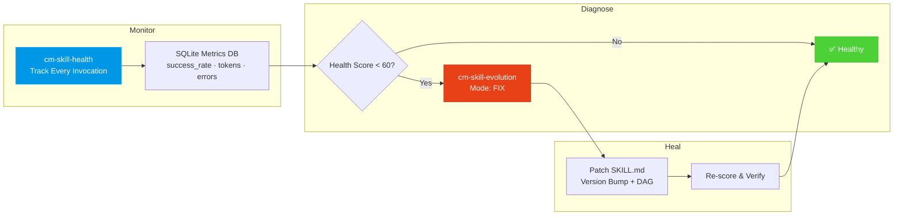

# 🧬 Self-Healing AI — Skills That Fix Themselves

> *"What if your AI toolkit had an immune system?"*

Most AI skill packs are **static**. What you install is what you get. If a skill degrades, produces bad output, or wastes tokens — nobody notices until a human reviews the mess.

CodyMaster v4.4+ introduces a **Self-Healing Pipeline**: an autonomous quality engine that monitors, diagnoses, and repairs skills in real-time.

---

## How It Works



---

## The 4 Pillars

### 1. 📊 `cm-skill-health` — Quality Monitoring Engine

Every time a skill runs, CodyMaster logs:

| Metric | What it tracks |
|--------|---------------|
| **Invocation count** | How often the skill is actually used |
| **Success rate** | % of runs that completed without errors |
| **Token usage** | Average tokens consumed per run |
| **Error patterns** | Recurring error types (context_mismatch, timeout, etc.) |
| **Health score** | Composite 0-100 score combining all metrics |

**Health Score Zones:**
- 🟢 **80-100** — Healthy. No action needed.
- 🟡 **60-79** — Warning. Flagged for review.
- 🔴 **0-59** — Critical. Auto-evolution triggered.

### 2. 🔧 `cm-skill-evolution` — 3-Mode Evolution Engine

When a skill's health drops into the danger zone, the evolution engine activates:

| Mode | Trigger | Action |
|------|---------|--------|
| **FIX** | Health score < 60, recurring errors | Patches the SKILL.md to fix the root cause |
| **DERIVED** | New use case discovered | Creates a specialized variant of an existing skill |
| **CAPTURED** | Novel workflow succeeds | Captures a successful ad-hoc workflow as a new skill |

Every evolution is tracked in a **Version DAG** (Directed Acyclic Graph), so you can trace the entire lineage of any skill back to its origin.

### 3. 🔍 `cm-skill-search` — Intelligent Skill Discovery

Instead of keyword matching, CodyMaster uses **BM25 ranking** combined with health scores to find the right skill for any task:

```
User: "I need to set up tracking for my Facebook ads"

BM25 Search Results:
1. cm-ads-tracker      (score: 94, health: 100) ← Winner
2. cm-cro-methodology  (score: 71, health: 95)
3. cm-growth-hacking   (score: 65, health: 100)
```

Degraded skills are automatically ranked lower, so the system naturally routes work to healthy skills.

### 4. 📤 `cm-skill-share` — Cross-Team Sharing

Export skills as portable bundles, import them on other machines, share across teams — all with version integrity checks.

```bash
# Export a skill
skill-share export cm-planning

# Import from a teammate
skill-share import ./cm-planning-v3.bundle

# Catalog: list all available skills
skill-share catalog
```

---

## Real Example: Auto-Healing in Action

During a routine session, `cm-tdd` produced a `context_mismatch` error because it hardcoded `npm test` — but the project used `pytest`.

Here's what happened automatically:

1. **`cm-skill-health`** logged the failure → health score dropped to **2/100** 🔴
2. **`cm-skill-evolution`** detected the pattern → activated **FIX mode**
3. The SKILL.md was patched: hardcoded `npm test` replaced with framework-agnostic instructions
4. Version was bumped, change logged in the DAG
5. Health score recovered to **94/100** 🟢

**Total human intervention: Zero.**

---

## Why This Matters for Vibe Coders

| Without Self-Healing | With Self-Healing |
|---------------------|-------------------|
| Skills break silently | Breaks are detected in real-time |
| You discover issues during a deadline | Issues are fixed before you notice |
| Manual SKILL.md editing | Automatic patching + version tracking |
| "Which skill should I use?" | BM25 finds the best one automatically |
| Skills work on your machine only | Export/import across any setup |

---

## Related Skills

- [📖 Knowledge Architecture](./knowledge-architecture.md) — How CodyMaster's 5-Tier Memory works
- [🎨 Brainstorm & UI Preview](./Brainstorm-UI-Preview.md) — Visual mockups before coding
- [📋 OpenSpec Protocol](./CodyMaster-OpenSpec-Upgrade.md) — Standardized documentation format

---

<div align="center">

*Self-Healing AI is available in CodyMaster v4.4.3+*

**Your skills don't just work. They get better every day.**

</div>
