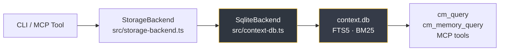

# Storage and Memory Architecture

> [!TIP]
> **One-liner:** CodyMaster gives your AI a durable 5-tier brain that persists across sessions, avoids token overflow, and gets smarter over time.

---

## The 5-Tier Memory Model

Every CodyMaster project has five layers of memory, each with a different lifespan and purpose:

| Tier | Name | Storage | Lifespan | Purpose |
|------|------|---------|----------|---------|
| 1 | **Sensory** | Chat context | This turn | Active files, terminals, current selection |
| 2 | **Working** | `CONTINUITY.md` | Session → next session | Goal, phase, blockers, last actions |
| 3 | **Long-term** | `context.db` (SQLite) | Indefinite | Learnings, decisions, BM25-ranked retrieval |
| 4 | **Semantic** | `qmd` index | Until re-embed | Full-text + vector search across docs/code |
| 5 | **Structural** | Skeleton index + CodeGraph | Until re-index | AST, call graphs, 95% token compression |

Tiers 1–3 are **always active**. Tiers 4–5 are opt-in and activated by skills automatically when the project grows large enough.

---

## Global vs Project State

### Global user data (`~/.codymaster/`)

Shared across all projects, managed by `src/data.ts`:

```
~/.codymaster/
└── kanban.json     ← projects, tasks, activities, deployments, changelog, chain executions
```

### Per-project memory (`.cm/`)

Isolated per repo, never committed to git (add `.cm/` to `.gitignore`):

```
.cm/
├── CONTINUITY.md           ← Working memory (Tier 2): goal, phase, blockers, last actions
├── config.yaml             ← Runtime configuration
├── context.db              ← SQLite: learnings + decisions with FTS5 index
├── context-bus.json        ← Real-time output sharing between skills in a chain
├── skeleton.md             ← L0 codebase index (auto-generated by cm-codeintell)
├── token-budget.json       ← Token allocation by category
└── memory/
    ├── learnings.json      ← Legacy flat-file (migrated to SQLite on first run)
    └── decisions.json      ← Legacy flat-file (migrated to SQLite on first run)
```

---

## Storage Backend

`src/storage-backend.ts` defines a `StorageBackend` interface with 11 methods covering learnings, decisions, skill outputs, and index caching. The backend is swapped via `.cm/config.yaml`:

```yaml
# .cm/config.yaml — default (no changes needed)
storage:
  backend: sqlite
```

### SQLite backend (default, always recommended)

The production backend. Implemented in `src/context-db.ts` using `better-sqlite3`:

- **WAL mode** — concurrent reads during writes
- **FTS5 virtual tables** — BM25-ranked full-text search on learnings and decisions
- **Auto-sync triggers** — FTS index stays in sync on every INSERT/DELETE
- **Zero external dependencies** — runs in-process, no server required



### Removed OpenViking backend

Older CodyMaster revisions experimented with an OpenViking-backed implementation. That runtime path has been removed after proving too costly to install and too unreliable for the supported product path.

> [!WARNING]
> Keep `storage.backend: sqlite`. If an older project config still says `viking`, CodyMaster warns and falls back to SQLite automatically.

---

## Search and Retrieval

### Tier 3 — SQLite FTS5 (Memory search)

Used by `cm-continuity` and MCP tools to recall relevant learnings and decisions:

```
Skill: "I need context about the auth module"
  ↓
cm_query("auth module")
  ↓
SQLite FTS5 BM25 search → top-k learnings + decisions sorted by relevance
  ↓
Agent receives focused context slice (not the entire learnings file)
```

**When to use:** automatically. Skills call `cm_query` via MCP without user action.

### Tier 4 — qmd semantic search (Code + doc search)

For codebases >200 files or doc sets >50 pages, grep and file reads cause context overflow. `qmd` provides BM25 + vector search that returns precise snippets instead of full files.

**Activated by:** `cm-deep-search` — triggers automatically when it detects a large project.

**Setup:** See [Semantic Search Guide →](/operations/semantic-search)

### Tier 5 — Skeleton Index + CodeGraph (Structural search)

For understanding codebases without reading every file:

| Layer | Tool | Cost | Output |
|-------|------|------|--------|
| L0 | Skeleton index | ~4s, <500 tokens | Directory map, exports, imports |
| L1 | CodeGraph (AST) | ~30s, <2K tokens | Function signatures, class interfaces |
| L2 | Full context | On-demand | Vector embeddings per file |

**Activated by:** `cm-codeintell` when you ask "what does this codebase do?" or "how does X work?"

---

## The Context Bus

`.cm/context-bus.json` enables skills in a chain to share outputs without re-deriving state from chat history:

```
cm-planning writes: { "plan": "...", "phase": "design" }
       ↓
cm-tdd reads: { "plan": "..." }  ← no need to re-explain the plan
       ↓
cm-code-review reads: { "plan": "...", "test_results": "..." }
```

MCP tools: `cm_bus_read`, `cm_bus_write` in `src/mcp-context-server.ts`.

---

## Token Budget

`.cm/token-budget.json` pre-allocates the 200k context window by category to prevent silent overflow:

```
engineering:    60k tokens
product:        30k tokens
operations:     20k tokens
growth:         20k tokens
orchestration:  30k tokens
reserved:       40k tokens
```

MCP tool: `cm_budget_check` — skills call this before loading large context.

---

## `cm://` URI Scheme

Skills reference context by URI, not file paths. The URI resolver (`src/uri-resolver.ts`) maps:

| URI | Resolves to |
|-----|-------------|
| `cm://memory/learnings` | `.cm/context.db` learnings table |
| `cm://memory/decisions` | `.cm/context.db` decisions table |
| `cm://index/l0` | `.cm/skeleton.md` |
| `cm://bus/current` | `.cm/context-bus.json` |
| `cm://skill/cm-tdd` | `skills/cm-tdd/SKILL.md` |

MCP tool: `cm_resolve` — loads the right context at the cheapest sufficient depth.

---

## Configuration Reference

Full `.cm/config.yaml` with all options:

```yaml
storage:
  backend: sqlite        # supported default; legacy "viking" values fall back to sqlite

memory:
  max_learnings: 50      # Trigger Ebbinghaus TTL cleanup above this count
  archive_decisions: true

quality:
  velocity_tracking: true
  code_review_mode: strict  # "strict" | "normal"

rarv:
  max_retries: 3
  self_correction: true
  goal_alignment_check: true
```

---

## See Also

- [CodyMaster Brain](/architecture/codymaster-brain) — working memory, continuity, context bus
- [Semantic Search Guide](/operations/semantic-search) — qmd setup, context overflow prevention
- [Servers and MCP Runtime](/architecture/servers-and-mcp) — MCP tools reference
- [API Reference](/api/api-reference) — `cm_query`, `cm_resolve`, `cm_budget_check`
