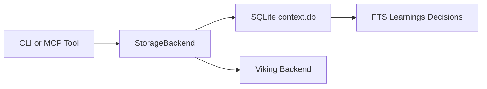

# Storage and Memory Model

> [!TIP]
> **Quick reference:** CodyMaster uses global JSON for kanban/deploy state and per-project `.cm` storage for memory and context.

## Global User Data

The global data file is `~/.codymaster/kanban.json` and contains projects, tasks, activities, deployments, changelog entries, and chain executions (`src/data.ts`).

## Project Memory Data

Project-scoped memory lives inside `.cm/`, including:

- `CONTINUITY.md`
- `memory/learnings.json`
- `memory/decisions.json`
- `context-bus.json`
- `context.db` (SQLite)

## Storage Backend Abstraction

`src/storage-backend.ts` exposes `StorageBackend` with two backend paths:

- `sqlite` (default)
- `viking` (configured through `.cm/config.yaml`)

## Search and Indexing

SQLite-backed memory supports FTS query operations for learnings and decisions, then powers MCP query tools in `src/mcp-context-server.ts`.

Text fallback: callers use a backend interface, most deployments use SQLite, and FTS tables support semantic memory lookup.

See also:

- [System Overview](./system-overview.md)
- [Servers and MCP Runtime](./servers-and-mcp.md)
- [REST and MCP API Surface](../api/rest-and-mcp.md)

