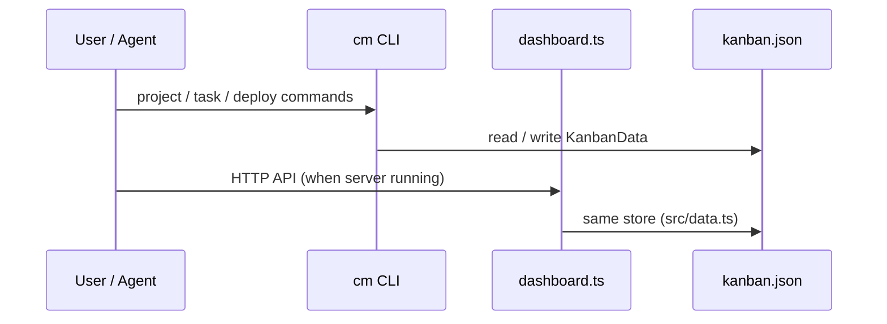
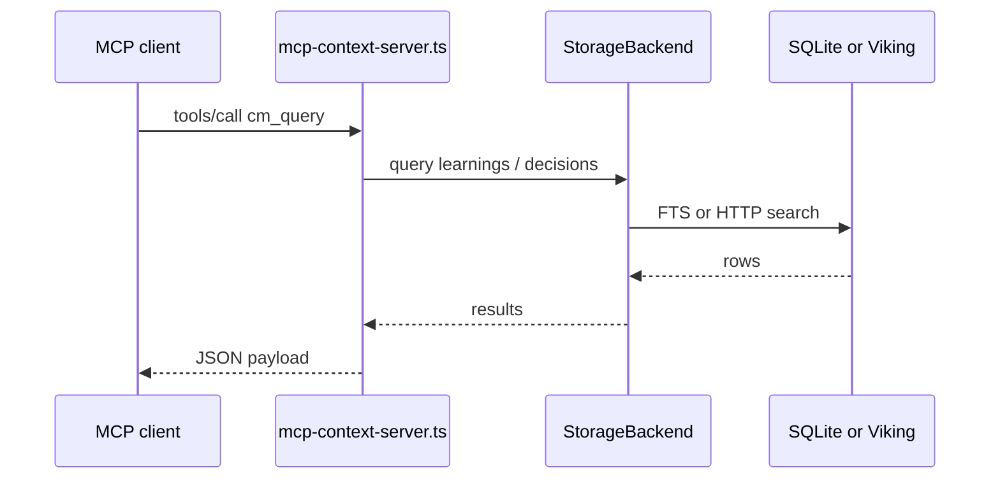

# Data Flow

## Global kanban and activity

Text fallback: CLI and dashboard share `~/.codymaster/kanban.json` via `loadData` / `saveData` (`src/data.ts`).

## Project memory and MCP

## Skill chain and bus

When a chain advances, steps can publish summaries and artifact paths to the bus (`src/context-bus.ts`). Downstream automation reads the same file instead of scraping chat.

## Sprint and engineering artifacts

Engineering commands write under `.cm/sprint` (see `src/sprint-pipeline.ts` and [Engineering pipeline](../workflows/engineering-pipeline.md)).

## See also

- [Storage and memory](./data-and-memory.md)  
- [TRIZ-Parallel engine](./triz-parallel-engine.md)  
- [API reference](../api/api-reference.md)

