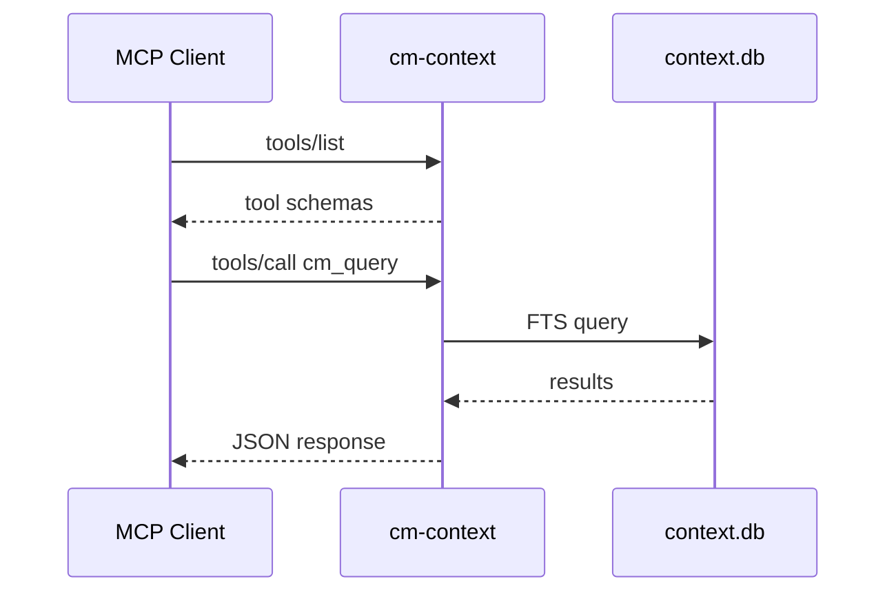

# Servers and MCP Runtime

> [!TIP]
> **Quick reference:** CodyMaster runs HTTP servers for dashboard and browse automation, plus a stdio MCP server for tool-based context access.

## Mission Control Dashboard

`src/dashboard.ts` runs an Express server that serves:

- static dashboard UI
- project/task/deploy/changelog APIs
- continuity and chain-related APIs

## Browse Daemon

`src/browse-server.ts` runs local browser automation endpoints such as:

- `/health`
- `/session/start`
- `/navigate`
- `/click`
- `/fill`
- `/screenshot`

Operator guide (token, Chromium, troubleshooting): [Browse daemon runbook](../browse-daemon.md). Architecture: [ADR 001](../adr/001-playwright-browse-daemon.md).

## MCP Context Server

`src/mcp-context-server.ts` runs JSON-RPC over stdio and exposes tools including:

- `cm_query`, `cm_resolve`
- `cm_bus_read`, `cm_bus_write`
- `cm_budget_check`, `cm_memory_decay`, `cm_index_refresh`
- `cm_advisory_report`, `cm_advisory_metrics`, `cm_advisory_handoff`
- `cm_plan`, `cm_review`, `cm_qa`, `cm_deploy`, `cm_search`, `cm_memory_query`

## Protocol Model

Text fallback: an MCP client requests tool metadata and execution, and the server maps tool handlers to project memory operations.

See also:

- [REST and MCP API Surface](../api/rest-and-mcp.md)
- [Engineering Pipeline](../workflows/engineering-pipeline.md)
- [Storage and Memory Model](./data-and-memory.md)
