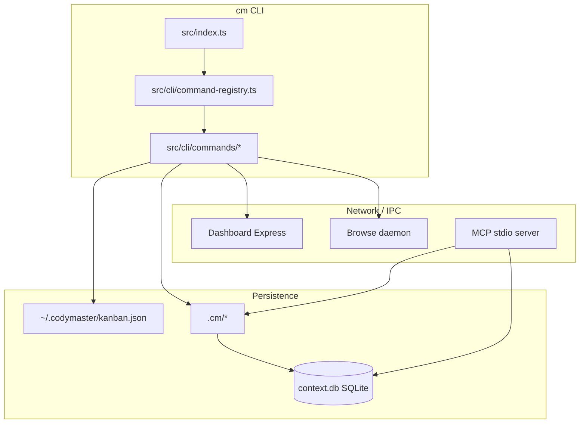

# System Architecture

> [!TIP]
> **Read this if:** you need a single map of how pieces connect before customizing skills or wiring MCP.

## High-level diagram

Text fallback: CLI commands read/write global kanban and per-project `.cm` data; dashboard and browse are HTTP servers; MCP talks to the same project memory.

## Layer responsibilities

| Layer       | Role                                | Key paths                                                               |
| ----------- | ----------------------------------- | ----------------------------------------------------------------------- |
| Entry       | Parse argv, register commands       | `src/index.ts`                                                          |
| Commands    | User-facing operations              | `src/cli/commands/*.ts`                                                 |
| Domain      | Data rules, continuity, bus, sprint | `src/continuity.ts`, `src/context-bus.ts`, `src/sprint-pipeline.ts`     |
| Storage     | SQLite FTS + optional Viking HTTP   | `src/context-db.ts`, `src/storage-backend.ts`, `src/backends/*`         |
| Integration | Dashboard, browse, MCP              | `src/dashboard.ts`, `src/browse-server.ts`, `src/mcp-context-server.ts` |

## Extension points

- **New CLI command** — add module under `src/cli/commands/`, register in `src/cli/command-registry.ts`.
- **New skill** — add `skills/<id>/SKILL.md` (validated by `npm run validate:skills`).
- **Storage engine** — implement or configure `StorageBackend` (`src/storage-backend.ts`); `viking` uses `src/backends/viking-backend.ts`.

## Related docs

- [CodyMaster Brain](./codymaster-brain.md)  
- [Data flow](./data-flow.md)  
- [Storage and memory](./data-and-memory.md)  
- [Servers and MCP](./servers-and-mcp.md)

