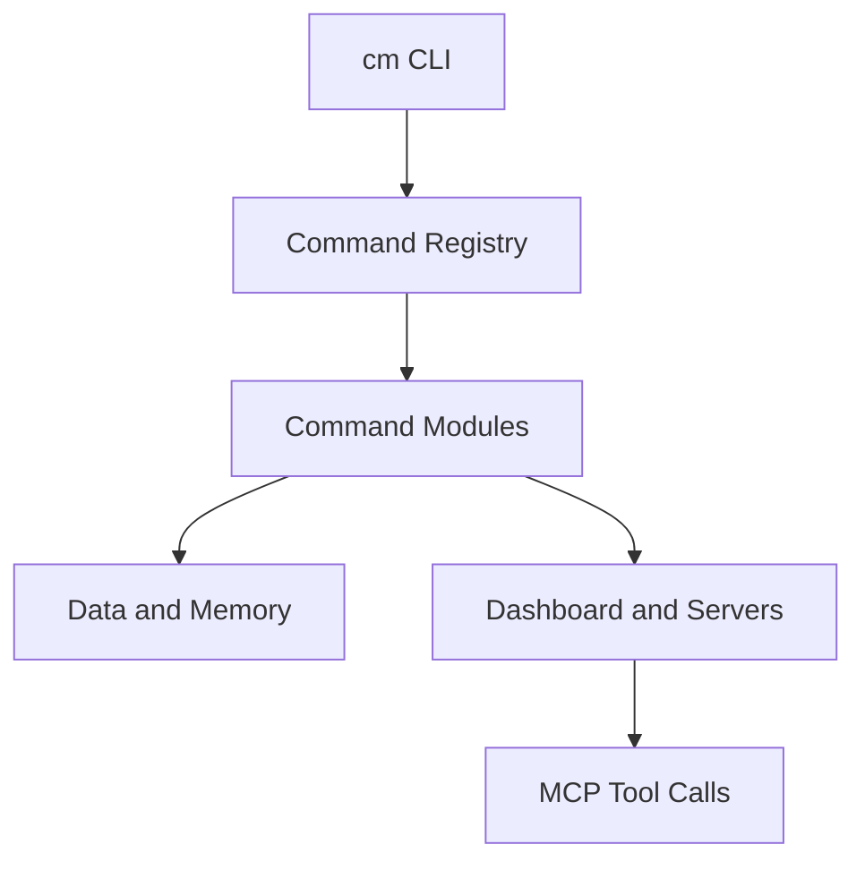

# System Overview

> [!TIP]
> **Quick read (5 minutes):** this page is the short version. For the full breakdown, see [System architecture](./system-architecture.md).

> [!TIP]
> **Quick reference:** CodyMaster is a modular CLI with local data persistence, project-level memory, and an MCP tool bridge.

## Runtime Layers

1. **CLI layer** (`src/index.ts`, `src/cli/command-registry.ts`) initializes the command surface.
2. **Command modules** (`src/cli/commands/`*) implement project, task, dashboard, engineering, and distro operations.
3. **Persistence and memory** (`src/data.ts`, `src/context-db.ts`, `src/storage-backend.ts`) manage user-level and project-level state.
4. **Server bridges** (`src/dashboard.ts`, `src/browse-server.ts`, `src/mcp-context-server.ts`) expose APIs and MCP tools.

## Primary Flows

### CLI flow

`cm` starts Commander, registers all command groups, and executes the selected subcommand.

### Memory flow

Project memory is stored under `.cm/` plus SQLite (`.cm/context.db`) for searchable learnings and decisions.

### Engineering flow

Engineering commands orchestrate browse daemon, guardian checks, sprint artifacts, and review/release helpers.

Text fallback: the CLI routes to modules, modules interact with storage and server components, and MCP tools expose memory/pipeline operations.

See also:

- [Storage and Memory Model](./data-and-memory.md)
- [Servers and MCP Runtime](./servers-and-mcp.md)
- [REST and MCP API Surface](../api/rest-and-mcp.md)

