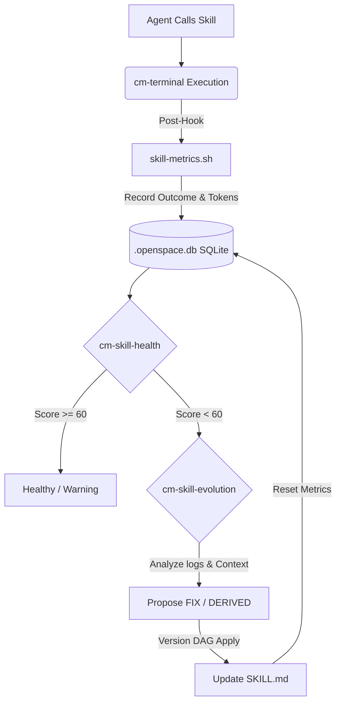

# Năng Lực Tự Kiểm Tra Sức Khỏe & Tự Cải Tiến Của Hệ Sinh Thái Skill

> **Philosophy**: Kế thừa nguyên lý TRIZ #23 (Phản hồi - Feedback) và #25 (Tự phục vụ - Self-Service) — Một hệ thống AI bền vững phải có khả năng tự nhận biết lỗi sai thông qua tín hiệu thực tế (signal), đo lường mức độ suy thoái, và tự động đề xuất lộ trình sửa lỗi cho chính nó.

Tài liệu này mô tả chi tiết năng lực **Đo lường phân tích (Health Check)** và **Tự cải tiến (Evolution)** tạo nên sự tự chủ dài hạn (long-term autonomy) trong hệ sinh thái CodyMaster thông qua sự kết hợp của hai engine cốt lõi: `cm-skill-health` và `cm-skill-evolution`.

---

## 1. Đo Lường và Phân Tích Mức Độ Suy Thoái (Skill Health Engine)

Mỗi lần một Agent invoke một skill (thông qua `cm-terminal` hoặc các workflow khác), hệ thống không bỏ qua sự kiện này mà biến nó thành một **data point**.

### 1.1 Khơi nguồn dữ liệu (Metrics Logging)
Cơ chế bắt dữ liệu được tích hợp ngầm:
1. **Thực thi:** Lệnh gọi skill hoàn tất (thành công, lỗi hoặc bán thành công).
2. **Post-Execution Hook:** Khởi chạy `skill-metrics.sh` để ghi nhận: `outcome` (kết quả), lượng token đã tiêu thụ, thời gian thực thi (duration), và loại lỗi nếu có.
3. **Lưu trữ:** Ghi vào cơ sở dữ liệu nội bộ `.openspace.db` (SQLite) cho bảng `skill_metrics` và `skill_invocations`.

### 1.2 Health Scoring (Chấm điểm Sức Khỏe)
Quy trình đánh giá mức độ sống còn của một kỹ năng dựa trên công thức cốt lõi:
`health_score = (success_rate × 60) + (effective_rate × 30) + (usage_bonus × 10)`

Dịch ra trạng thái hành động:
- **80-100 (🟢 Healthy)**: Kỹ năng hoạt động hoàn hảo, hiệu suất token tốt.
- **60-79 (🟡 Warning)**: Có vòng lặp lỗi nhẹ xảy ra gần đây, cần chú ý theo dõi.
- **40-59 (🟠 Degraded)**: Suy thoái. Cờ `needs_fix = 1` được kích hoạt. Chuyển sang chu trình tiến hóa.
- **0-39 (🔴 Critical)**: Cực kì tệ, gây lãng phí tokens. Yêu cầu ngưng lập tức và sửa đổi khẩn cấp.

### 1.3 Phân Tích (Dashboard Data)
Thông qua các query CLI mạnh mẽ, hệ thống cung cấp bức tranh về:
- Danh sách các kỹ năng bị suy thoái.
- Những kỹ năng "ăn" nhiều token nhất nhưng hiệu quả thấp.
- Những kỹ năng không bao giờ được dùng đến (nhầm loại bỏ bloatware).

---

## 2. Năng Lực Tự Cải Tiến (Self-Evolution Engine)

Nếu `cm-skill-health` là *hệ thần kinh cảm giác* (nhận biết đau đớn/lỗi), thì `cm-skill-evolution` là *hệ miễn dịch* (chữa lành và thích nghi).

Khi một skill rơi vào trạng thái suy thoái (Tỷ lệ thành công < 70% sau 3 lần dùng), engine tự cải tiến sẽ được kích hoạt.

### 2.1 Ba Chế Độ Tiến Hóa (The 3 Modes)

| Chế độ | Mô tả | Trigger / Phê duyệt |
| :--- | :--- | :--- |
| **🔧 FIX (Sửa lỗi)** | Sửa các hardcode bị gãy, nâng cấp SDK, hoặc loại bỏ các hướng dẫn lỗi thời trong file `SKILL.md` nội tại. Giữ nguyên mục tiêu cốt lõi của skill, với độ lệch (diff) nhỏ nhất có thể. | Trigger bởi Health Score thấp. *Auto* nếu score < 40, *Human* nếu > 40. |
| **🚀 DERIVED (Dẫn xuất)** | Khi một skill có vẻ hoạt động tốt nhưng user liên tục yêu cầu nó làm các tác vụ chuyên biệt mà rẽ nhánh khỏi tính chất ban đầu. Chế độ này sinh ra skill B từ skill A. | Trigger khi phát hiện pattern sử dụng bị sai lệch. Luôn cần *Human duyệt*. |
| **✨ CAPTURED (Thu phóng)** | Lưu lại một quy trình hoàn toàn mới chưa từng có trước đây khi agent vô tình giải quyết thành công một kiến trúc lạ. Chụp lại và biến nó thành một skill mới tinh độc lập. | Trigger sau một quá trình sửa lỗi hoặc sáng tạo đột phá. Luôn cần *Human duyệt*. |

### 2.2 Luồng Vận Hành Tự Điều Chỉnh (The Evolution Loop)

Quá trình "chữa lành" không diễn ra ngẫu nhiên mà được kiểm soát nghiêm ngặt:

1. **Chẩn đoán (Diagnose):** Đọc lại error logs từ database, đối chiếu nội dung `SKILL.md` hiện tại và những công cụ/API đang có. Agent phải trả lời: *Tại sao nó sai?*.
2. **Generates Proposal:** Agent tạo một bản đề xuất thay đổi (cấp độ file diff) cùng dự kiến token được tiết kiệm và tỷ lệ thành công tăng lên.
3. **Applied via DAG:** Lịch sử tiến hóa được lưu trữ bằng Version DAG (Directed Acyclic Graph) để quản lý lineage. Điều này cho phép *Rollback* ngay lập tức nếu bản vá lỗi (fix) khiến tình hình tệ hơn.
4. **Safeguards Checks:**
   - Chống lặp (Anti-loop): Tối đa 3 lần evolve cho một skill trong 1 tuần.
   - Quét bảo mật (Safety checks): Đảm bảo bản vá tự động không cài cắm hardcoded secrets hay bash commands nguy hiểm.

---

## 3. Tổng Kết Kiến Trúc Vận Hành

Sự kết hợp này tạo ra một vòng lặp kín (Closed-loop Ecosystem):

**EXECUTION ⮕ MEASUREMENT ⮕ DIAGNOSIS ⮕ EVOLUTION ⮕ REGISTRY UPDATE**

Không giống như các hệ thống tĩnh yêu cầu kỹ sư phần mềm phải ngồi cập nhật prompt liên tục, **Năng lực Đo lường và Tự Cải tiến** biến các Agents và Skills thành các *thực thể sống* (living entities): Ngày càng rẻ hơn (tối ưu token) và hiệu quả hơn (tăng success rate) dựa theo cách mà chính Người Dùng sử dụng chúng.
