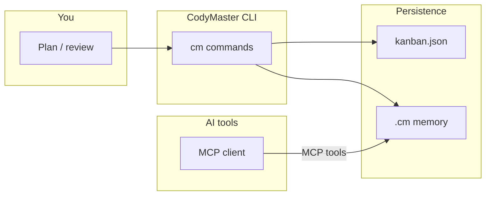

---

## title: How It Works
description: Mental model of CodyMaster — CLI, persistence planes, memory tiers, MCP, and engineering commands.
keywords: codymaster architecture mental model, context bus, mcp
robots: index, follow

# How It Works

## The three planes of state

1. **Global user state** — `~/.codymaster/kanban.json` holds projects, tasks, deployments, changelog, chain executions (`src/data.ts`).
2. **Per-project agent state** — `.cm/` holds continuity, memory JSON (legacy path), SQLite DB, bus, sprint artifacts, config (`src/continuity.ts`, `src/context-db.ts`, `src/context-bus.ts`).
3. **Runtime processes** — dashboard HTTP server, optional browse daemon, MCP stdio server (`src/dashboard.ts`, `src/browse-server.ts`, `src/mcp-context-server.ts`).

## How a typical day looks

Text fallback: you use `cm` for ops; global kanban and `.cm` store continuity; MCP clients read/write the same project memory.

## Skills vs commands

- **Commands** (`cm …`) are implemented in TypeScript under `src/cli/commands/`.
- **Skills** are **documentation + procedure** for agents, living in `skills/<name>/SKILL.md`. They tell *how* to think and act; the CLI wires *where* data goes.

## Progressive loading (L0 / L1 / L2)

CodyMaster can resolve `cm://` URIs at different depths so agents do not load huge context at once (`src/uri-resolver.ts`, MCP tool `cm_resolve` in `src/mcp-context-server.ts`).

## See also

- [CodyMaster Brain](../architecture/codymaster-brain.md)  
- [Data flow](../architecture/data-flow.md)  
- [Using skills](../operations/using-skills.md)

