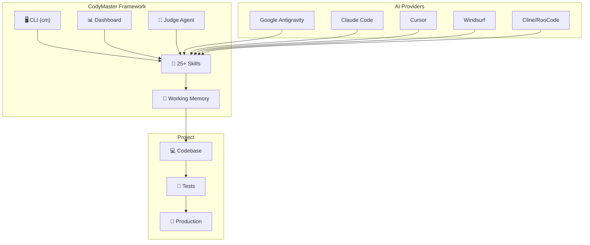
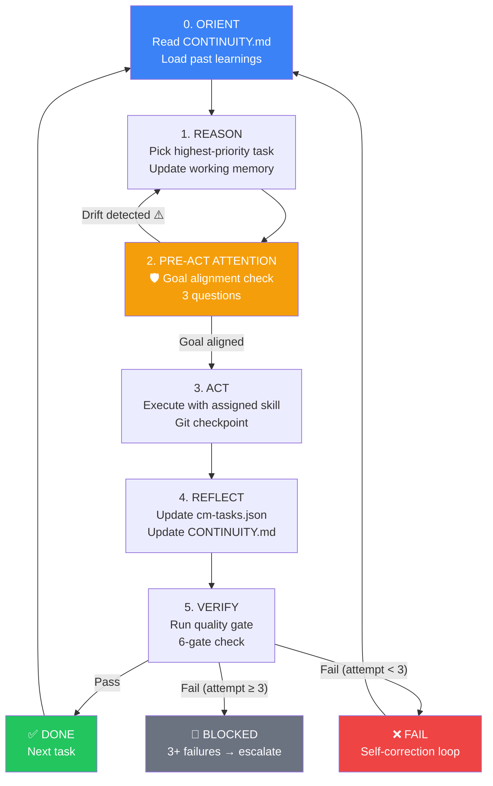
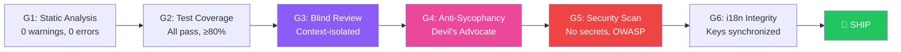
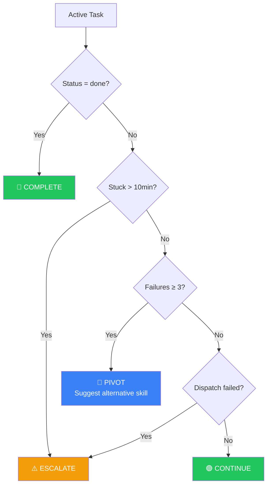
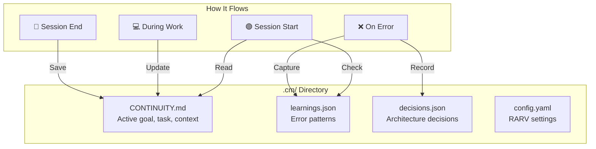
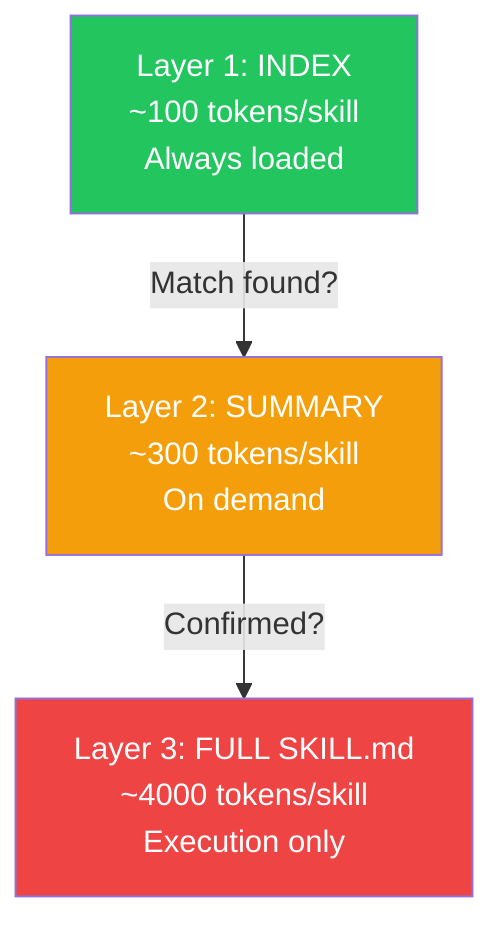
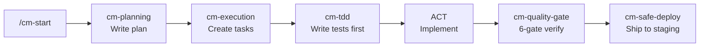
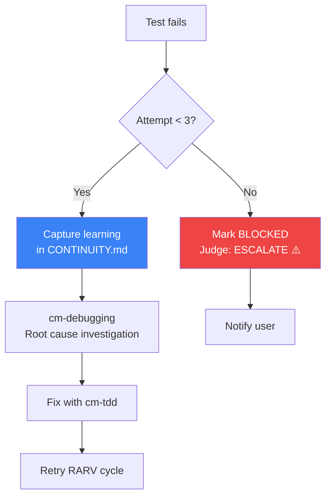
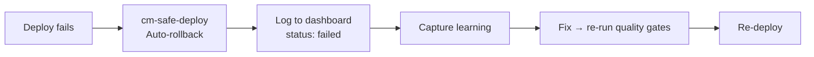

# How CodyMaster Works

> Complete workflow guide with diagrams, use cases, and exception handling.

---

## Core Architecture



---

## The RARV Execution Cycle

The heart of CodyMaster is the enhanced **RARV cycle** — a self-correcting autonomous execution loop:



### PRE-ACT ATTENTION — The Drift Preventer

Before every action, the agent asks itself 3 critical questions:

| # | Question | If NO |
|---|----------|-------|
| Q1 | Does my planned action serve the Active Goal? | Return to REASON |
| Q2 | Am I solving the original problem, not a tangent? | Return to REASON |
| Q3 | Have I seen this error pattern before in learnings? | Apply known prevention |

> **This single check prevents the #1 AI failure mode: goal drift.** Without it, AI agents frequently solve tangential problems instead of the actual task.

---

## The 6-Gate Quality System



**G3 (Blind Review):** Reviewer only sees the diff — no task description, no implementation context. Forces genuine code review.

**G4 (Anti-Sycophancy):** If G3 says "everything is fine," a Devil's Advocate pass actively hunts for hidden issues.

---

## The Judge Agent Protocol



---

## Working Memory System



**Protocol:**
1. **Session Start** → Read CONTINUITY.md + check learnings
2. **During Work** → Update current task, add completed items
3. **On Error** → Capture what failed + why + how to prevent
4. **Session End** → Save state for next session

---

## Progressive Disclosure (Token Savings)



| Approach | Tokens Used | Efficiency |
|----------|-------------|------------|
| Load all 25 skills | 100,000 | 0% saved |
| Progressive Disclosure | 6,300 | **93.7% saved** |

---

## Common Use Cases

### 1. Build a New Feature (Autonomous)

```bash
# Start autonomous execution
cm continuity init
/cm-start "Build user management with list, CRUD form, and role-based access"
```



### 2. Fix a Production Bug (Manual)

```bash
# Step 1: Investigate
@[/cm-debugging]   # Root cause analysis — don't guess, investigate

# Step 2: Fix with TDD
@[/cm-tdd]          # Write test that reproduces bug → fix → verify

# Step 3: Deploy safely
@[/cm-safe-deploy]  # 8-gate pipeline with rollback strategy
```

### 3. Setup New Project

```bash
# Verify identity first, then bootstrap
@[/cm-identity-guard]       # Ensure right GitHub/Cloudflare account
@[/cm-project-bootstrap]    # Full setup: design system, CI, staging, deploy
```

### 4. Mass Translation (i18n)

```bash
# Safe multi-language extraction
@[/cm-safe-i18n]  # Extract hardcoded strings → vi.json + en.json + th.json
```

### 5. CRO & Marketing Setup

```bash
# Full conversion tracking
@[/cm-ads-tracker]    # Meta Pixel + CAPI, TikTok, Google Ads, GTM
@[/cro-methodology]   # Funnel audit + A/B test design
```

---

## Exception Handling

### ❌ What if tests fail continuously?



**Rule:** Max 3 retries per task. After 3 failures → BLOCKED + ESCALATE to user.

### ❌ What if the agent drifts from the goal?

The **PRE-ACT ATTENTION** check catches this:
1. Agent re-reads Active Goal from CONTINUITY.md
2. If planned action doesn't serve the goal → drift logged → return to REASON
3. This happens **before every action**, not just at the start

### ❌ What if working memory is lost?

```bash
# CONTINUITY.md gets corrupted or deleted
cm continuity reset    # Reset CONTINUITY.md, learnings.json preserved
cm continuity init     # Re-create from scratch if needed
```

Learnings survive resets. Architecture decisions survive resets. Only the active session state is cleared.

### ❌ What if deploy fails?



The dashboard tracks all deployments with rollback history. Use `POST /api/deployments/:id/rollback` to rollback via API.

### ❌ What if the wrong agent is assigned?

The **Judge Agent** detects stuck tasks and the **Dynamic Agent Selection** API suggests the best agent:

```bash
curl http://localhost:6969/api/agents/suggest?skill=cm-tdd
# → { "domain": "engineering", "agents": ["claude-code", "cursor", "antigravity"] }
```

### ❌ What if quality gate is too strict?

Gates 1-2 (static analysis + tests) are **mandatory**. Gates 3-6 can be adjusted:
- G3 (Blind Review): Skip only if changes are < 10 lines
- G4 (Anti-Sycophancy): Auto-triggered, cannot skip
- G5 (Security): Skip only for internal tools
- G6 (i18n): Auto-skipped if project has no i18n

---

## API Reference

| Method | Endpoint | Purpose |
|--------|---------|---------|
| GET | `/api/projects` | List projects |
| GET | `/api/tasks` | List tasks |
| POST | `/api/tasks` | Create task |
| PUT | `/api/tasks/:id/move` | Move task (kanban) |
| POST | `/api/tasks/:id/dispatch` | Dispatch to AI agent |
| GET | `/api/judge` | Evaluate all tasks |
| GET | `/api/judge/:taskId` | Evaluate single task |
| GET | `/api/agents/suggest?skill=X` | Suggest best agents |
| GET | `/api/continuity` | All projects' memory |
| POST | `/api/continuity/:id` | Update memory state |
| GET | `/api/learnings/:id` | Learnings list |
| POST | `/api/learnings/:id` | Add learning |
| GET | `/api/decisions/:id` | Decisions list |
| GET | `/api/activities` | Activity history |
| GET | `/api/deployments` | Deploy history |
| POST | `/api/deployments` | Record deployment |
| GET | `/api/changelog` | Version changelog |

---

## Golden Rules

1. 🔒 **Identity First** — `cm-identity-guard` before push/deploy
2. 📐 **Design Before Code** — `cm-planning` always first
3. 🧪 **Test Before Code** — RED → GREEN → REFACTOR
4. 🛡️ **PRE-ACT ATTENTION** — check goal alignment every action
5. 📊 **Evidence Over Claims** — only trust terminal output
6. 🚀 **Deploy via Gates** — all 6 gates must pass
7. 🧠 **Read Memory First** — CONTINUITY.md at session start
8. 📚 **Capture Learnings** — every failure becomes wisdom
