# Cody Master Documentation

> **Quick Reference**
> - **Version**: 3.2.0
> - **Type**: Universal AI Agent Skills Platform
> - **Skills**: 30+ skills in 5 swarms
> - **Platforms**: Cursor, Claude, Gemini/Antigravity, Windsurf, Cline, OpenClaw, and 4+ more

## What is Cody Master?

Cody Master is a **skills framework** that turns AI coding agents into disciplined senior engineers. Instead of letting AI write spaghetti code, Cody Master enforces:

- 🔴 **TDD** — Write tests before code
- 🛡️ **6-Gate Quality System** — Blind review, anti-sycophancy, security scan
- 🧠 **Working Memory** — Context persists across sessions via CONTINUITY.md
- 🤖 **Judge Agent** — Auto-detects stuck tasks, suggests pivots
- 📊 **Kanban Dashboard** — Real-time task management, deploy tracking
- 🌐 **Universal Bootstrap** — One AGENTS.md → configs for 10+ AI platforms

```
Your Idea → Cody Master Skills → Production-Ready Code
```

## Quick Start

::: code-group

```bash [npm]
npm install -g cody-master
cm dashboard start
```

```bash [Clone & Build]
git clone https://github.com/omisocial/cody-master.git
cd cody-master && npm install && npm run build
cm dashboard start
```

:::

## Documentation Structure

| Section | Content | Link |
|---------|---------|------|
| 🏗️ **Architecture** | System design, ADR, tech stack | [View →](./architecture.md) |
| 📊 **Data Flow** | RARV cycle, data flow, skill chain | [View →](./data-flow.md) |
| 🚀 **Deployment** | Installation, configuration, deployment | [View →](./deployment.md) |
| 📋 **Codebase Analysis** | Full source code scan | [View →](./analysis.md) |
| 🧩 **Skills Library** | All 30+ skills — grouped, described, open source | [View →](./skills/) |
| 📖 **User Guides (SOP)** | Step-by-step for every feature | [View →](./sop/) |
| 🔌 **API Reference** | REST API + CLI commands | [View →](./api/) |

## Supported Platforms

| Platform | Status | Skill Invocation |
|----------|--------|-----------------|
| 🟢 Google Antigravity (Gemini) | ✅ | `@[/skill-name]` |
| 🟣 Claude Code / Desktop | ✅ | `/skill-name` |
| 🔵 Cursor | ✅ | `@skill-name` |
| 🟠 Windsurf | ✅ | `@skill-name` |
| 🟤 Cline / RooCode | ✅ | `@skill-name` |
| 🐈 GitHub Copilot | ✅ | `skill-name` |
| 🐾 OpenClaw / MaxClaw | ✅ | `@skill-name` |
| 🦷 OpenFang | ✅ | `@skill-name` |
| 🤖 Manus | ✅ | `@skill-name` |
| 💻 Gemini CLI | ✅ | `@[/skill-name]` |

## Skills Overview — 5 Swarms

```mermaid
graph TB
    CM["🧠 Cody Master"]
    CM --> E["🔧 Engineering"]
    CM --> O["⚙️ Operations"]
    CM --> P["🎨 Product"]
    CM --> G["📈 Growth"]
    CM --> R["🎯 Orchestration"]

    E --> E1["cm-tdd"]
    E --> E2["cm-debugging"]
    E --> E3["cm-quality-gate"]
    E --> E4["cm-test-gate"]
    E --> E5["cm-code-review"]

    O --> O1["cm-safe-deploy"]
    O --> O2["cm-identity-guard"]
    O --> O3["cm-git-worktrees"]
    O --> O4["cm-terminal"]

    P --> P1["cm-planning"]
    P --> P2["cm-brainstorm-idea"]
    P --> P3["cm-ux-master"]
    P --> P4["cm-ui-preview"]
    P --> P5["cm-dockit"]
    P --> P6["cm-readit"]
    P --> P7["cm-project-bootstrap"]

    G --> G1["cm-content-factory"]
    G --> G2["cm-ads-tracker"]

    R --> R1["cm-execution"]
    R --> R2["cm-continuity"]
    R --> R3["cm-skill-chain"]
    R --> R4["cm-skill-mastery"]
    R --> R5["cm-safe-i18n"]
```



*The 5 swarms: Engineering (code quality), Operations (safe deployment), Product (design & documentation), Growth (marketing), and Orchestration (autonomous coordination).*

Browse the full skill library with complete documentation: **[Skills Library →](./skills/)**

## Links

- 🌐 [Main Website](https://codymaster.pages.dev)
- 📦 [GitHub Repository](https://github.com/omisocial/cody-master)
- 📖 [How It Works](./how-it-work.md)
