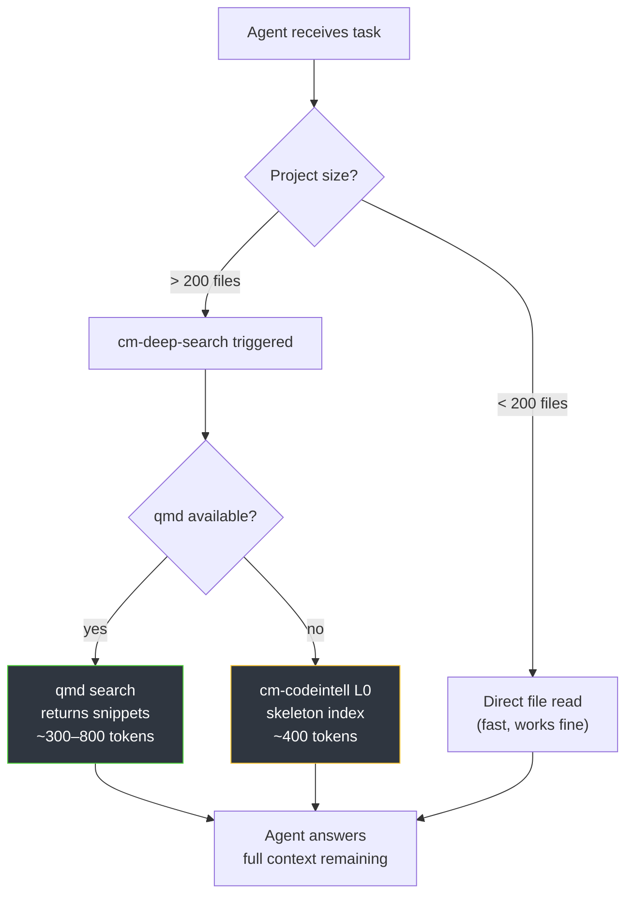

# Semantic Search & Context Overflow Prevention

> [!TIP]
> **Problem:** Your AI reads 40 files to answer one question → context fills up → it forgets the task halfway.
> **Solution:** Use the right search tool for the job. This guide shows which tool to use and when.

---

## Why Context Overflow Happens

When an agent doesn't have a smarter search strategy, it falls back to reading files directly:

```
Agent: "Where is the auth logic?"
↓ (no search index)
Reads src/auth.ts    → +2,000 tokens
Reads src/middleware → +3,000 tokens
Reads src/routes.ts  → +4,000 tokens
...after 15 files → context full, task abandoned
```

CodyMaster solves this with **three layers of search** that return focused answers instead of raw files.

---

## The Three Search Tools

| Tool | Best for | Token cost | Setup |
|------|----------|------------|-------|
| **Skeleton Index** (`cm-codeintell` L0) | "What does this codebase do?" | <500 tokens | Automatic |
| **SQLite FTS5** (`cm-continuity`) | "What did I learn about X?" | <200 tokens | Automatic |
| **qmd** (`cm-deep-search`) | "Find all code related to X" (>200 files) | ~300–800 tokens | One-time setup |

---

## Tool 1: Skeleton Index (Zero Setup)

`cm-codeintell` builds a lightweight structural index of your entire codebase in ~4 seconds. It answers "what exists" without reading file contents.

**Automatic — no action needed.** Run on demand:

```
/cm:start understand this codebase
```

**What it produces:**

```
.cm/skeleton.md          ← L0: directory map + exports + imports (~400 tokens)
.cm/codegraph.json       ← L1: function signatures + class interfaces (~2K tokens)
```

**Use cases:**

| Ask | Without skeleton | With skeleton |
|-----|-----------------|---------------|
| "What does this repo do?" | Reads 20+ files | Reads skeleton.md (1 file) |
| "Where is the payment logic?" | Grep entire repo | L0 map → target 2 files |
| "What does UserService depend on?" | Read 5+ files | L1 codegraph → 1 lookup |

---

## Tool 2: qmd Semantic Search (Setup Required)

For codebases >200 files or doc sets >50 pages, `qmd` provides BM25 + vector search that returns precise snippets instead of full file contents. `cm-deep-search` activates it automatically when your project is large enough.

### Installation

```bash
npm install -g @tobilu/qmd
```

### Index your project

Run once from your project root, then re-run after major changes:

```bash
cd /path/to/your/project

# Add project as a collection
qmd collection add --name myproject --path .

# Generate embeddings (takes 1–3 min first time)
qmd embed --collection myproject
```

### Connect to Claude Desktop / Claude Code

Add to your Claude Desktop config (`~/Library/Application Support/Claude/claude_desktop_config.json`):

```json
{
  "mcpServers": {
    "qmd": {
      "command": "qmd",
      "args": ["serve"]
    }
  }
}
```

For Claude Code, add to `.claude/settings.json`:

```json
{
  "mcpServers": {
    "qmd": {
      "command": "qmd",
      "args": ["serve"]
    }
  }
}
```

Restart the client. The `cm-deep-search` skill auto-detects the MCP server.

### Verify it works

```bash
qmd search --collection myproject "authentication middleware"
```

Expected output: 3–5 ranked snippets, each with source file + line numbers.

---

## How They Work Together

When you start a session in a large project, CodyMaster automatically assembles context from the cheapest sufficient source:



---

## Real-World Use Cases

### Debugging in a large monorepo

```
You: "Why is the checkout flow failing?"
↓
cm-debugging activates
↓
cm-codeintell L0: finds checkout.ts, payment.ts in skeleton
qmd: searches for "checkout error payment" → returns 3 relevant snippets
↓
Agent reads only those 3 snippets (not the whole src/)
Token usage: ~800 tokens instead of ~15,000
```

### Understanding legacy code

```
You: "What does the old auth system do?"
↓
cm-codeintell L1 (CodeGraph): maps AuthService → dependencies
qmd: "auth session token middleware" → returns key functions
↓
Agent explains the system in context
Token usage: ~1,200 tokens instead of ~25,000
```

### Adding a feature to an unfamiliar codebase

```
You: "Add dark mode toggle"
↓
cm-planning activates
qmd: "theme colors CSS variables" → finds theme.ts, variables.css
cm-codeintell L0: shows component tree
↓
Agent proposes changes to only relevant files
Zero hallucinations about file names
```

### Onboarding to a new project

```
You: "Give me a tour of this codebase"
↓
cm-codeintell: generates skeleton.md + Mermaid architecture diagram
cm-deep-search + qmd: cross-references key modules
↓
Full architectural overview in ~2,000 tokens
```

---

## Keeping the Index Fresh

`qmd` doesn't auto-update. Re-embed after significant changes:

```bash
# After adding/removing many files
qmd embed --collection myproject --force

# Check collection status
qmd collection list
```

**Recommended triggers:**
- After merging a large PR
- After adding a new module or domain
- Weekly if the project moves fast

---

## Troubleshooting

### `cm-deep-search` not using qmd

Verify qmd MCP server is running:
```bash
qmd serve  # Should print: Listening on http://localhost:xxxx
```

Check the MCP connection in Claude Desktop: Settings → Developer → MCP Servers.

### Embeddings seem stale

```bash
qmd collection remove myproject
qmd collection add --name myproject --path .
qmd embed --collection myproject
```

### Large project, embeddings take too long

Exclude generated files and dependencies:
```bash
qmd collection add --name myproject --path . \
  --exclude "node_modules,dist,.next,.cache,coverage"
```

---

## Summary

| Situation | Recommended tool | Command |
|-----------|-----------------|---------|
| Any project, any size | Skeleton index | Auto (cm-codeintell) |
| Recall past learnings | SQLite FTS5 | Auto (cm-continuity) |
| Large codebase, code search | qmd | Setup once, auto-activated |
| Understand entire architecture | Skeleton + CodeGraph | `/cm:start understand this` |
| "Find all uses of X" | qmd | `qmd search --collection X` |

---

## See Also

- [Storage and Memory Architecture](/architecture/data-and-memory) — how memory tiers work
- [Codebase Analysis](/operations/codebase-analysis) — cm-codeintell in depth
- [Working Memory](/operations/working-memory) — cm-continuity guide
- [Skills: Orchestration](/skills/orchestration) — cm-deep-search, cm-codeintell reference
