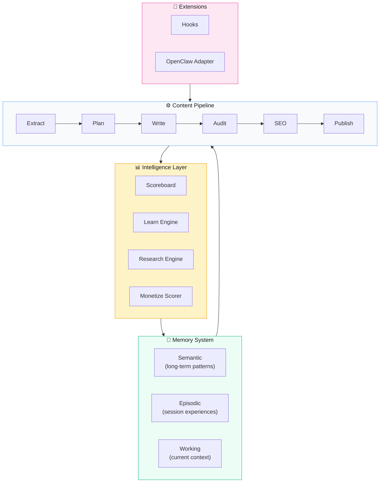

# Kiến trúc Hệ thống

> **Quick Reference**
> - **Type**: AI Content Production Pipeline
> - **Core**: 8 operating modes
> - **Intelligence**: 3-layer memory + scoreboard
> - **Config**: Single JSON file

## Architecture Diagram

## Core Components

| Component | File | Mô tả |
|-----------|------|-------|
| Pipeline Orchestrator | `scripts/pipeline.py` | Master orchestrator cho full auto mode |
| Extractor | `scripts/extract.py` | Trích xuất kiến thức từ documents |
| Planner | `scripts/plan.py` | Lên kế hoạch topics từ knowledge base |
| Writer | `scripts/write.py` | AI content writer với memory context |
| Auditor | `scripts/audit.py` | Kiểm tra chất lượng + auto-fix |
| SEO Optimizer | `scripts/seo.py` | Tối ưu SEO metadata |
| Publisher | `scripts/publish.py` | Build và deploy content |
| Memory Engine | `scripts/memory.py` | 3-layer memory management |
| Scoreboard | `scripts/scoreboard.py` | Reward/penalty tracking |
| Researcher | `scripts/research.py` | Auto-research engine |
| Monetizer | `scripts/monetize.py` | Monetization scoring |

## Architecture Decisions

| # | Decision | Rationale |
|---|----------|-----------|
| 1 | Config-driven | Một file JSON điều khiển toàn bộ — portable, version-controllable |
| 2 | 3-layer memory | Semantic (patterns) + Episodic (experiences) + Working (context) |
| 3 | Reward/penalty scoring | Gamification + data-driven quality improvement |
| 4 | Hook-based extensions | Extensible mà không modify core pipeline |
| 5 | Script-per-mode | Mỗi mode là một script độc lập — composable |

## Security

| Layer | Approach |
|-------|----------|
| Config | `.gitignore` API keys, environment variables |
| Memory | Local storage, no external sync |
| Extensions | Sandboxed hooks, no arbitrary code execution |
