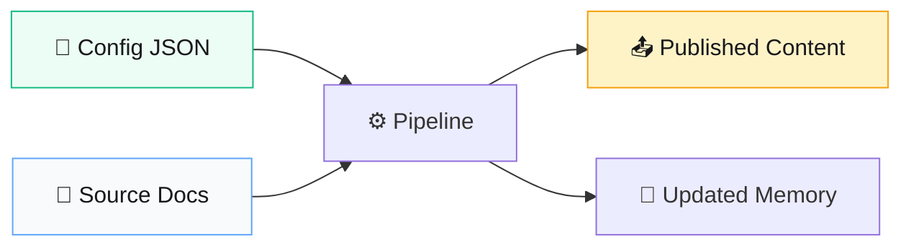

# Data Flow

> **Quick Reference**
> - **Input**: Config + Source documents
> - **Output**: Published content + Updated memory
> - **Pattern**: Config → Extract → Plan → Write → Audit → SEO → Publish → Learn

## End-to-End Data Flow

## Data Stores

| Store | Path | Format | Mô tả |
|-------|------|--------|-------|
| Config | `content-factory.config.json` | JSON | Điều khiển toàn bộ pipeline |
| Knowledge Base | `knowledge-base/` | JSON per category | Kiến thức trích xuất |
| Topic Queue | `topics-queue/` | JSON per batch | Topics chờ viết |
| Content Output | `content/` (configurable) | Markdown | Bài viết generated |
| Semantic Memory | `memory/semantic/` | JSON | Patterns dài hạn |
| Episodic Memory | `memory/episodic/` | JSON | Experiences per session |
| Working Memory | `memory/working/` | JSON | Context hiện tại |
| Scoreboard | `memory/scoreboard.json` | JSON | Points tracking |

## Pipeline Modes Flow

| Step | Mode | Input | Output |
|------|------|-------|--------|
| 1 | Extract | Source docs + Config | Knowledge base JSON |
| 2 | Plan | Knowledge base + Config | Topic queue JSON |
| 3 | Write | Topics + Memory context | Content articles |
| 4 | Audit | Content articles | Pass/Fail + fixes |
| 5 | SEO | Content articles | Optimized metadata |
| 6 | Publish | Approved content | Deployed site |
| 7 | Learn | User feedback (git diff) | Updated memory |
| 8 | Research | New topic keyword | Knowledge JSON |
