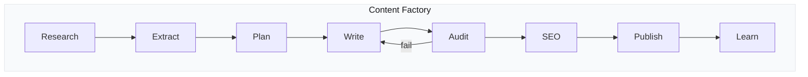

# Process Flows

> **Quick Reference**
> - **Workflows**: 2
> - **Sequences**: 1
> - **Lifecycles**: 1
> - **Journeys**: 1

## System Overview

## Directory

### Workflows

| # | Flow | Persona | Link |
|---|------|---------|------|
| 1 | Content Pipeline | Content Manager Lan | [Xem](./wf-content-pipeline) |
| 2 | Self-Learning Cycle | Hệ thống tự động | [Xem](./wf-learning-cycle) |

### Sequences

| # | Flow | Components | Link |
|---|------|-----------|------|
| 1 | Write Mode Processing | 5 steps | [Xem](./seq-write-mode) |

### Lifecycles

| # | Entity | States | Link |
|---|--------|--------|------|
| 1 | Content Article | 7 states | [Xem](./lc-content-lifecycle) |

### Journeys

| # | Journey | Persona | Link |
|---|---------|---------|------|
| 1 | First Content Batch | Content Writer Tú | [Xem](./uj-first-batch) |
