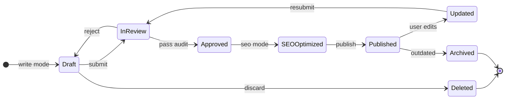

# 🔁 Content Article Lifecycle

> **Quick Reference**
> - **Entity**: Content Article
> - **States**: 7
> - **Terminal**: Archived, Deleted

## State Diagram

## Transition Table

| From | To | Trigger | Score Impact |
|------|----|---------|-------------|
| — | Draft | Write mode creates content | 0 |
| Draft | InReview | Submit for audit | 0 |
| InReview | Draft | Audit fail | -3 |
| InReview | Approved | Audit pass | +3 |
| Approved | SEOOptimized | SEO mode runs | 0 |
| SEOOptimized | Published | Publish mode | 0 |
| Published | Updated | User edits | -5 |
| Published | Archived | Content outdated | 0 |
| Draft | Deleted | User discards | -10 |
