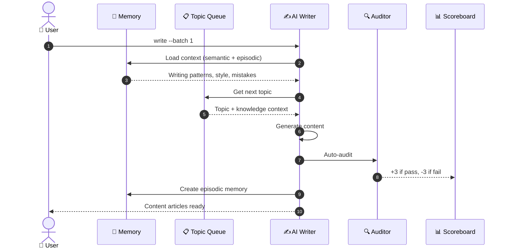

# ⏱️ Write Mode — Sequence

> **Quick Reference**
> - **Trigger**: `scripts/write.py --batch N`
> - **Components**: Memory, Template Engine, AI Writer, Audit, Scoreboard
> - **Steps**: 8

## Sequence Diagram

