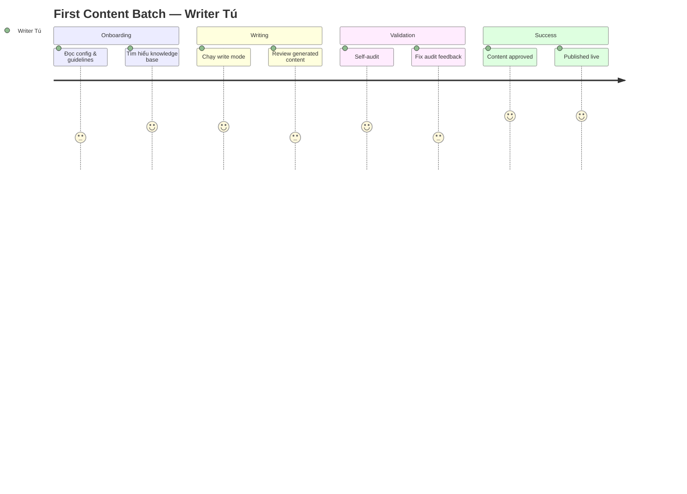

# 🗺️ First Content Batch — User Journey

> **Quick Reference**
> - **Persona**: [Content Writer Tú](../personas/user-writer-tu)
> - **Thời gian**: ~2 giờ
> - **Steps**: 6

## Journey Map

## Journey Details

| Phase | Step | Cảm xúc | Pain Points |
|-------|------|---------|-------------|
| Onboarding | Đọc config | 😐 Neutral | Config options nhiều |
| Writing | Chạy write mode | 😊 Excited | Output quality varies |
| Validation | Self-audit | 😤 Anxious | Fix issues lần đầu |
| Success | Published | 😊 Happy | — |
