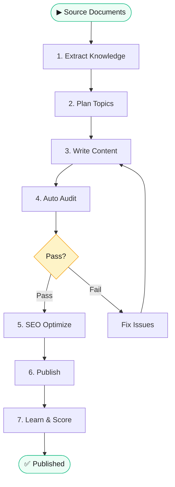

# 🔄 Content Pipeline Workflow

> **Quick Reference**
> - **Persona**: [Content Manager Lan](../personas/user-content-manager-lan)
> - **Trigger**: Có source documents mới hoặc cần batch mới
> - **Outcome**: Published content đạt audit standards

## Process Flow

## Step Details

| Bước | Mode | Command | Output |
|------|------|---------|--------|
| 1 | Extract | `scripts/extract.py` | `knowledge-base/` |
| 2 | Plan | `scripts/plan.py` | `topics-queue/batch-{DATE}.json` |
| 3 | Write | `scripts/write.py --batch N` | Content articles |
| 4 | Audit | `scripts/audit.py` | Pass/Fail report |
| 5 | SEO | `scripts/seo.py extract && apply` | Optimized metadata |
| 6 | Publish | `scripts/publish.py` | Deployed content |
| 7 | Learn | `scripts/memory.py --learn` | Updated memory |
