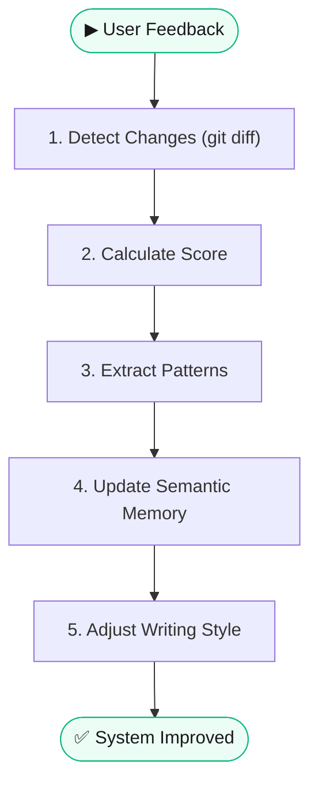

# 🔄 Self-Learning Cycle

> **Quick Reference**
> - **Trigger**: Sau user feedback, edits, hoặc deletes
> - **Outcome**: Memory system cập nhật, writing quality cải thiện

## Process Flow

## Scoring Rules

| Event | Points | Detection |
|-------|--------|-----------|
| User praise | +10 | Keyword detection |
| Engagement | +5 | Analytics hook |
| Audit pass first try | +3 | Auto-detect |
| User edits article | -5 | Git diff |
| User deletes article | -10 | Git diff |
| Audit fail | -3 | Auto-detect |

## Grading Tiers

| Tier | Points | Level |
|------|--------|-------|
| 🏆 S-Tier | 100+ | Master content creator |
| 🥇 A-Tier | 50-99 | Expert |
| 🥈 B-Tier | 20-49 | Skilled |
| 🥉 C-Tier | 0-19 | Learning |
| 📉 D-Tier | < 0 | Needs improvement |
