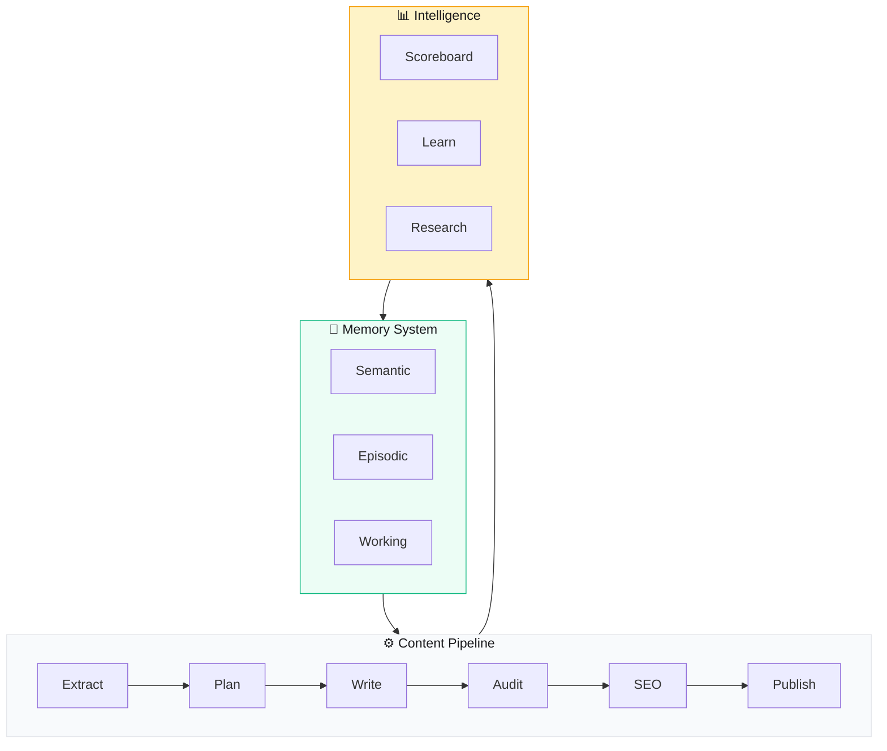

# Content Factory

Self-Learning AI Content Engine — Config-driven, self-improving content factory. Càng dùng càng thông minh.

> **Quick Reference**
> - **Version**: 1.0
> - **Type**: AI Content Production Pipeline
> - **Modes**: 8 operating modes (Extract → Plan → Write → Audit → SEO → Publish → Learn → Research)
> - **Intelligence**: 3-layer memory system + reward/penalty scoreboard

## What is Content Factory?

Content Factory là một self-learning AI content engine. Nó tự động nghiên cứu, tạo nội dung, kiểm tra chất lượng, tối ưu SEO, và xuất bản — tất cả trong một pipeline. Hệ thống học từ mỗi session, tích lũy kinh nghiệm, và tự cải thiện qua thời gian.

## Architecture Overview

## Nội dung

### 📚 Bắt đầu

| Trang | Mô tả |
|-------|-------|
| [Giới thiệu](./getting-started/intro) | Content Factory là gì và tại sao bạn cần nó |
| [Cài đặt](./getting-started/installation) | Setup nhanh trong 5 phút |
| [Cấu hình](./getting-started/configuration) | Config file và các tùy chọn |

### 👥 Personas & JTBD

| Trang | Mô tả |
|-------|-------|
| [Personas](./personas/) | Ai sử dụng Content Factory — 3 User + 2 Buyer Personas |
| [Jobs To Be Done](./jtbd/) | Tại sao họ dùng — 3 Main Jobs, 9 Small Jobs |

### 🔄 Flows & Architecture

| Trang | Mô tả |
|-------|-------|
| [Process Flows](./flows/) | 8 diagrams: Workflow, Sequence, Lifecycle, Journey |
| [Architecture](./architecture) | Kiến trúc hệ thống, ADRs |
| [Data Flow](./data-flow) | Pipeline xử lý, tích hợp |

### 📖 Hướng dẫn SOP

| Trang | Mô tả |
|-------|-------|
| [Content Pipeline](./sop/content-pipeline) | Pipeline tạo nội dung end-to-end |
| [Memory System](./sop/memory-system) | Hệ thống trí nhớ 3 lớp |
| [SEO Optimization](./sop/seo-optimization) | Tối ưu SEO cho content |
| [Troubleshooting](./sop/troubleshooting-guide) | Xử lý vấn đề thường gặp |

## Glossary

| Thuật ngữ | Định nghĩa |
|-----------|-----------|
| **Content Pipeline** | Quy trình tạo nội dung từ Extract đến Publish |
| **Memory System** | Hệ thống trí nhớ 3 lớp: Semantic, Episodic, Working |
| **Scoreboard** | Hệ thống chấm điểm reward/penalty tự động |
| **Knowledge Base** | Kho kiến thức trích xuất từ source documents |
| **Topic Queue** | Hàng đợi topics chờ viết nội dung |
| **Self-Learning** | Khả năng tự cải thiện qua phản hồi và kinh nghiệm |
| **Config-driven** | Mọi thứ điều khiển qua `content-factory.config.json` |
| **Niche-agnostic** | Hoạt động với mọi lĩnh vực, không giới hạn |
