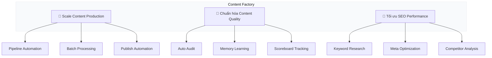

# Jobs To Be Done

> **Quick Reference**
> - **Main Jobs**: 3
> - **Small Jobs**: 9
> - **Framework**: JTBD Canvas

## Job Hierarchy

## Directory

| # | Main Job | Performer | Canvas |
|---|---------|-----------|--------|
| 1 | Scale content production 5x | [Content Manager Lan](../personas/user-content-manager-lan) | [Xem](./scale-content-production) |
| 2 | Chuẩn hóa content quality | [Content Lead Khoa](../personas/buyer-content-lead-khoa) | [Xem](./standardize-quality) |
| 3 | Tối ưu SEO performance | [SEO Specialist Minh](../personas/user-seo-minh) | [Xem](./optimize-seo) |
