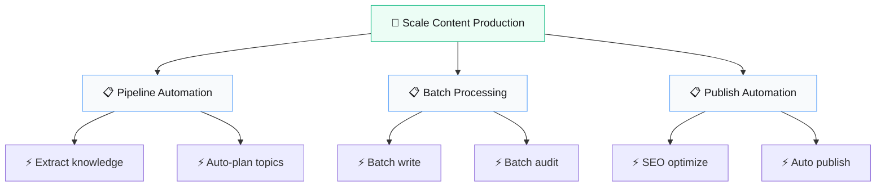

# 🎯 Scale Content Production 5x

> **Quick Reference**
> - **Job Performer**: [Content Manager Lan](../personas/user-content-manager-lan)
> - **Complexity**: 🟡 Moderate
> - **Tần suất**: Hàng ngày

## Job Statement

> **When** content demand tăng nhưng team size giữ nguyên,
> **I want to** tự động hóa content pipeline từ research đến publish,
> **so that** tăng output 5x mà không cần thêm headcount.

## Job Map

## Success Metrics

| Metric | Hiện tại | Mục tiêu |
|--------|---------|---------|
| Articles/week | 10 | 50 |
| Time per article | 4 hours | 30 min |
| Audit pass rate | 60% | 90% |
| Cost per article | $50 | $10 |
