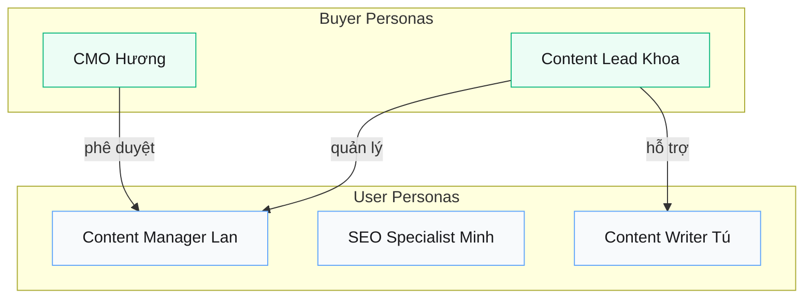

# Personas

> **Quick Reference**
> - **User Personas**: 3
> - **Buyer Personas**: 2

## Hệ sinh thái

## Danh mục

### Buyer Personas

| # | Persona | JTBD | Type |
|---|---------|------|------|
| 1 | [CMO Hương](./buyer-cmo-huong) | Scale content production mà không tăng headcount | Decision Maker |
| 2 | [Content Lead Khoa](./buyer-content-lead-khoa) | Chuẩn hóa content workflow cho team | Champion |

### User Personas

| # | Persona | Vai trò | Tần suất |
|---|---------|---------|---------|
| 1 | [Content Manager Lan](./user-content-manager-lan) | Quản lý pipeline, review content | Hàng ngày |
| 2 | [SEO Specialist Minh](./user-seo-minh) | Tối ưu SEO, phân tích traffic | Hàng tuần |
| 3 | [Content Writer Tú](./user-writer-tu) | Viết và edit nội dung | Hàng ngày |
