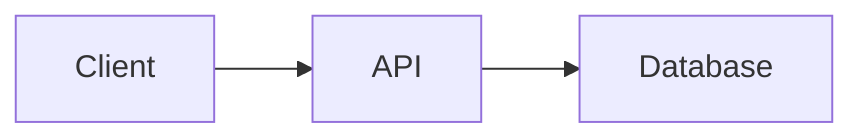

# Content Quality Guidelines — UX Master Edition

Rules for generating documentation content that is readable, scannable, and compatible with VitePress.

## UX Laws for Documentation

### Hick's Law — Reduce Decision Complexity

- **Max 7 items** in any Table of Contents (TOC) top level
- **Max 2 primary CTAs** per page (e.g., "Get Started" + "View API")
- Group related items into categories — never flat-list >10 items
- Use **sidebar categories** instead of one long sidebar

### Miller's Law — Chunk Information

- **Chunk tables** into groups of 5-9 rows with section headers
- **Break long pages** into sub-pages if >500 lines
- Use **visual separators**: `---`, headings, or admonition boxes
- Each section should be independently scannable

### Doherty Threshold — Optimize for Scanning

- **Lead with a summary** — put the most important info first
- **Use tables** instead of long paragraphs for structured data
- **Bold key terms** in definitions and descriptions
- **Code examples** should be runnable as-is (copy-paste friendly)

### Jakob's Law — Follow Familiar Patterns

- Use **standard doc layouts**: sidebar left, content center, TOC right
- Use **conventional heading hierarchy**: H1 (title) → H2 (sections) → H3 (subsections)
- Use **standard admonition types**: tip, info, warning, danger

---

## Filenames

| Rule | ✅ Correct | ❌ Wrong |
|------|-----------| ---------|
| **kebab-case** | `getting-started.md` | `Getting_Started.md` |
| **No underscore prefix** | `analysis.md` | `_analysis.md` |
| **No dots in names** | `deploy-guide.md` | `Deploy.vi.md` |
| **Lowercase only** | `api-reference.md` | `API_Reference.md` |

## Frontmatter (Required)

Every `.md` file MUST include:

```yaml
---
title: "Descriptive Page Title"
description: "Brief 1-line description for SEO"
---
```

> **Note:** VitePress generates sidebar from file structure — no `sidebar_position` needed.

## Links

- Use **relative paths**: `[API](./api-reference.md)` not absolute
- **Anchor links** must match actual heading slugs
- **No `<a>` tags** — use Markdown `[text](url)` syntax

---

## Content Structure Rules

### Quick Reference Card (Required for tech docs)

Every technical document MUST start with a summary box:

```markdown
> **Quick Reference**
> - **What**: Brief description of this system/feature
> - **Stack**: Python 3.10+, PyTorch 2.0, CUDA 12
> - **Key Files**: `src/engine.py`, `src/model.py`
> - **Status**: Production / Beta / Experimental
```

### Admonitions (Custom Containers)

VitePress supports these custom containers natively:

```markdown
:::tip Performance Tip
Use batch processing for >100 items — 3x faster than sequential.
:::

:::info
This feature requires Python 3.10 or later.
:::

:::warning Breaking Change
This API changed in v2.0. See migration guide.
:::

:::danger Security
Never expose API keys in client-side code.
:::

:::details Advanced Configuration Options
| Option | Default | Description |
|--------|---------|-------------|
| `batch_size` | 32 | Processing batch size |
| `num_workers` | 4 | Parallel worker count |
:::
```

### Code Groups (Multi-Platform Examples)

Use VitePress code groups instead of HTML tabs:

```markdown
::: code-group

\```bash [macOS]
brew install myapp
\```

\```bash [Linux]
apt-get install myapp
\```

\```bash [Windows]
winget install myapp
\```

:::
```

### Progressive Disclosure (For Advanced Content)

Hide advanced/optional content behind expandable sections:

```markdown
<details>
<summary>Advanced Configuration Options</summary>

| Option | Default | Description |
|--------|---------|-------------|
| `batch_size` | 32 | Processing batch size |
| `num_workers` | 4 | Parallel worker count |

</details>
```

---

## Mermaid Diagram Rules

### Theme-Neutral Approach (No Hardcoded Colors)

**CRITICAL:** Do NOT use inline `style` directives in Mermaid diagrams.

Hardcoded colors (e.g., `style A fill:#2d333b,color:#e6edf3`) break on light themes.
VitePress has built-in Mermaid support that auto-adapts to light/dark mode —
just enable `markdown: { mermaid: true }` in config.

**❌ DON'T — Hardcoded dark colors:**
```
style A fill:#2d333b,stroke:#6d5dfc,color:#e6edf3
```

**✅ DO — Clean, no-style diagrams:**


> **Note:** Mermaid is built-in to VitePress — no plugin installation needed!
> Just set `markdown: { mermaid: true }` in `.vitepress/config.mts`.

### Minimum Requirements

- **Architecture docs**: ≥ 2 Mermaid diagrams (overview + sequence)
- **Data flow docs**: ≥ 3 Mermaid diagrams
- **SOP guides**: ≥ 1 Mermaid flowchart of the process

---

## Writing Style

| Rule | ✅ Do | ❌ Don't |
|------|------| ---------|
| **Lead with WHY** | "Use streaming for real-time apps" | "The streaming module provides..." |
| **Active voice** | "Install the package" | "The package should be installed" |
| **Concrete examples** | "Set `batch_size=64` for GPUs with ≥8GB VRAM" | "Adjust batch size as needed" |
| **Cite sources** | `(src/engine.py:42)` | "In the engine file" |
| **Tables > paragraphs** | Use tables for comparisons | Write long comparison paragraphs |
