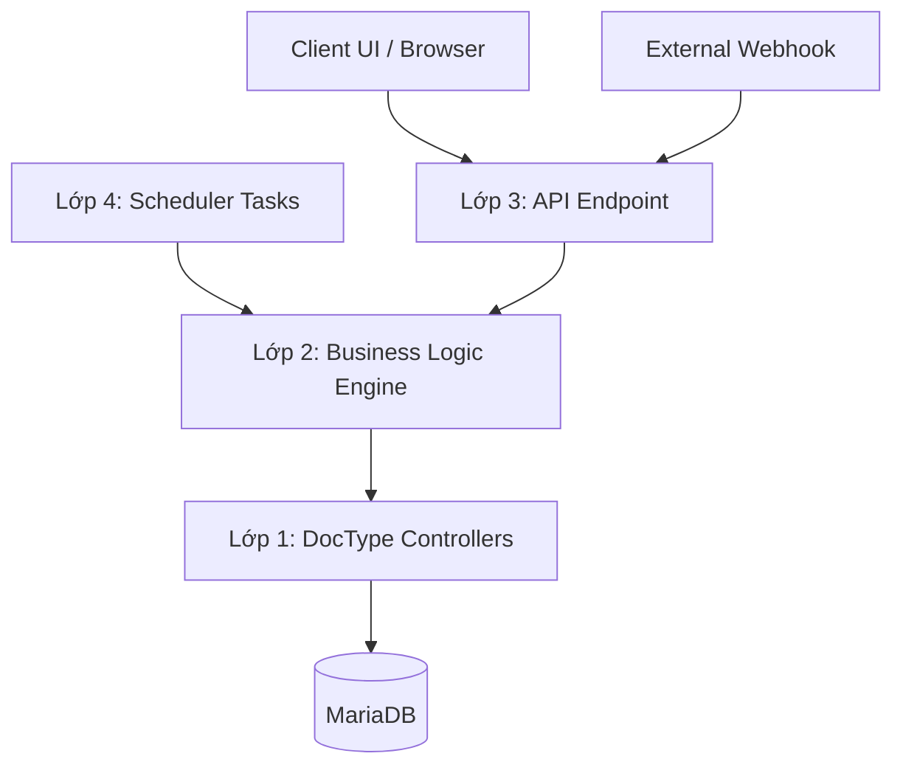
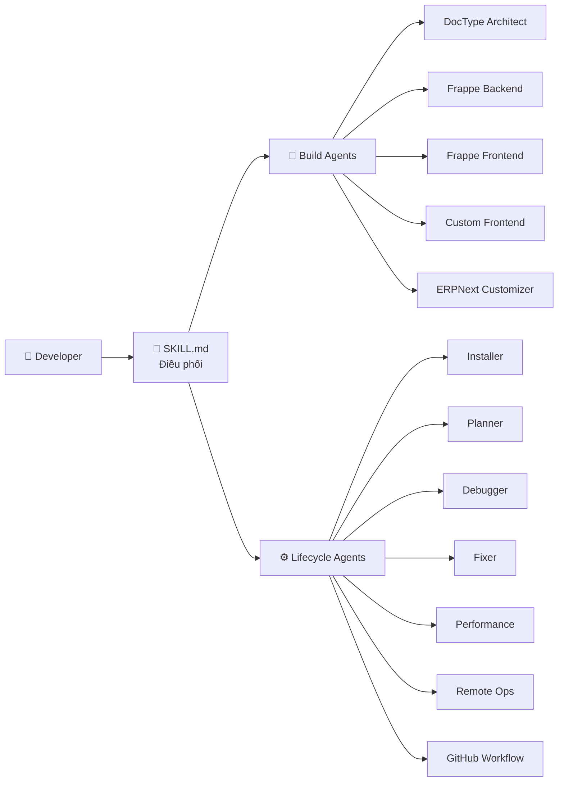

# Kiến trúc Hệ thống

> **Tham chiếu Nhanh:** `frappe-dev-master` xây dựng trên 2 trụ cột: **Kiến trúc App 7-Layer** (tách logic khỏi ORM) và **Hệ thống Điều phối AI Agent** (phân chia công việc rành mạch theo vòng đời).

## 1. Kiến trúc 7 Lớp (7-Layer Architecture)

Mô hình phân lớp nghiêm ngặt đảm bảo code testable, maintainable và scalable.

| Lớp | Tên | Vai trò | Ví dụ |
|-----|-----|---------|-------|
| 1 | **DocType Controllers** | Schema JSON + lifecycle hooks (`validate`, `on_submit`) | `my_app/my_module/doctype/my_dt/my_dt.py` |
| 2 | **Engines** | Pure Python logic — side-effect-free, testable 100% | `my_app/engines/scoring_engine.py` |
| 3 | **APIs** | `@frappe.whitelist` endpoints, idempotent upsert | `my_app/api/permissions.py` |
| 4 | **Tasks** | Scheduler events (daily/weekly) wrapper quanh Engines | `hooks.py` → `scheduler_events` |
| 5 | **Setup Hooks** | Idempotent install/migrate hooks | `after_install`, `after_migrate` |
| 6 | **Tests** | Unit tests pure logic, không cần Frappe Server | `tests/test_scoring_engine.py` |
| 7 | **Client JS** | Shared utility namespaces, form/list scripts | `my_app/public/js/my_app.js` |

### Luồng Dữ liệu (Data Flow)



*Text fallback:* Request từ Client/Webhook → API Endpoint → Engine (Pure Python) → DocType Controller → Database. Scheduler Tasks cũng gọi trực tiếp Engine.

### Quy tắc Vàng

1. **KHÔNG** đặt business logic nặng trong DocType controller
2. **LUÔN** tách thuật toán phức tạp ra `engines/` để test độc lập
3. **LUÔN** dùng `@frappe.whitelist` cho API, KHÔNG trả về raw HTML
4. **LUÔN** dùng `frappe.log_error()`, KHÔNG dùng `frappe.logger`

---

## 2. Hệ thống AI Agent



*Text fallback:* SKILL.md là Orchestrator trung tâm. Nó điều phối 2 nhóm: Build Agents (5 agents cho phát triển) và Lifecycle Agents (7 agents cho vận hành).

### Nhóm Build Agents (Phát triển)

| Agent | File | Chức năng |
|-------|------|-----------|
| DocType Architect | `agents/doctype-architect.md` | Thiết kế schema, relations, workflow states |
| Frappe Backend | `agents/frappe-backend.md` | Python APIs, controllers, background jobs |
| Frappe Frontend | `agents/frappe-frontend.md` | Client scripts, dialogs, custom formatters |
| Custom Frontend | `agents/frappe-custom-frontend.md` | Standalone frontend pages |
| ERPNext Customizer | `agents/erpnext-customizer.md` | Mở rộng ERPNext core an toàn |

### Nhóm Lifecycle Agents (Vận hành)

| Agent | File | Chức năng |
|-------|------|-----------|
| Installer | `agents/frappe-installer.md` | Cài đặt bench, site, production |
| Planner | `agents/frappe-planner.md` | Lập kế hoạch feature, ADR |
| Debugger | `agents/frappe-debugger.md` | Phân tích lỗi, log investigation |
| Fixer | `agents/frappe-fixer.md` | Sửa lỗi có cấu trúc 6-bước |
| Performance | `agents/frappe-performance.md` | Query optimization, profiling, caching |
| Remote Ops | `agents/frappe-remote-ops.md` | REST API operations cho remote sites |
| GitHub Workflow | `agents/github-workflow.md` | Git operations, CI/CD |

---

## 3. Quyết Định Kiến Trúc (ADR)

| Quyết định | Lý do |
|------------|-------|
| **Tách Engine ra khỏi Controller** | DocType controller đòi HTTP Context + DB. Engine thuần Python → test nhanh, CI tự động |
| **Không dùng Raw SQL mặc định** | Bypass cơ chế Role Permission → rủi ro SQL Injection. Ưu tiên `frappe.get_doc`, `frappe.db.get_list` |
| **Luôn dùng `frappe.log_error()`** | `frappe.logger` không ghi vào Error Log DocType → mất trace |
| **Idempotent Upsert cho API** | Tránh duplicate entries khi retry, đảm bảo safe CI/CD |

---

## 4. Cấu trúc Thư mục

```
frappe-dev-master/
├── SKILL.md                  # Bộ não điều phối trung tâm
├── agents/                   # 12 AI Agents chuyên biệt
│   ├── doctype-architect.md
│   ├── frappe-backend.md
│   ├── frappe-frontend.md
│   ├── frappe-installer.md
│   ├── frappe-fixer.md
│   ├── frappe-debugger.md
│   ├── frappe-performance.md
│   ├── frappe-remote-ops.md
│   └── ...
├── commands/                 # 15 CLI Commands
│   ├── frappe-app.md
│   ├── frappe-backend.md
│   ├── frappe-bench.md
│   ├── frappe-install.md
│   ├── frappe-fix.md
│   ├── frappe-remote.md
│   └── ...
├── resources/                # 8+ Tài liệu tham khảo
│   ├── 7-layer-architecture.md
│   ├── bench_commands.md
│   ├── common_pitfalls.md
│   ├── rest-api-patterns.md
│   ├── installation-guide.md
│   └── ...
├── skills/                   # 7 Sub-Skills
│   ├── doctype-patterns/
│   ├── server-scripts/
│   ├── client-scripts/
│   ├── frappe-api/
│   ├── bench-commands/
│   ├── remote-operations/
│   └── web-forms/
└── docs/                     # Tài liệu này
```

---
[← Trang Chủ](README.md) · [Danh mục Agents →](agents-catalog.md)
