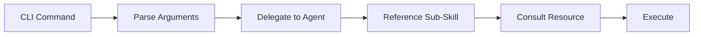

# Danh mục CLI Commands

> **15 Commands** giao tiếp nhanh với hệ thống. Mỗi command map tới một agent chuyên biệt.

---

## Nhóm: Development

| Command | File | Mô tả | Agent |
|---------|------|-------|-------|
| `frappe-app` | `commands/frappe-app.md` | Scaffold app mới, quản lý modules | Backend |
| `frappe-backend` | `commands/frappe-backend.md` | Viết Python logic, API, engine | Backend |
| `frappe-frontend` | `commands/frappe-frontend.md` | Viết Client Script, dialogs | Frontend |
| `frappe-fullstack` | `commands/frappe-fullstack.md` | Feature toàn stack (backend + frontend) | Backend + Frontend |
| `frappe-doctype-create` | `commands/frappe-doctype-create.md` | Thiết kế DocType mới | DocType Architect |
| `frappe-doctype-field` | `commands/frappe-doctype-field.md` | Thêm/sửa fields cho DocType | DocType Architect |
| `frappe-erpnext` | `commands/frappe-erpnext.md` | Customize ERPNext modules | ERPNext Customizer |

## Nhóm: Operations

| Command | File | Mô tả | Agent |
|---------|------|-------|-------|
| `frappe-install` | `commands/frappe-install.md` | Cài đặt bench, site, production | Installer |
| `frappe-bench` | `commands/frappe-bench.md` | Bench commands (migrate, build, clear-cache) | — |
| `frappe-test` | `commands/frappe-test.md` | Chạy test suite | — |
| `frappe-debug` | `commands/frappe-debug.md` | Phân tích lỗi (read-only) | Debugger |
| `frappe-fix` | `commands/frappe-fix.md` | Sửa lỗi theo Fix Loop 6 bước | Fixer |
| `frappe-remote` | `commands/frappe-remote.md` | REST API operations trên remote sites | Remote Ops |
| `frappe-plan` | `commands/frappe-plan.md` | Lên kế hoạch feature | Planner |
| `frappe-github` | `commands/frappe-github.md` | Git/GitHub operations | GitHub Workflow |

---

## Cú pháp Chung

```
frappe <command> <arguments> [--options]
```

### Ví dụ Sử dụng

```bash
# Tạo DocType mới
frappe doctype-create "Employee Score" --module "My App"

# Sửa lỗi
frappe fix "Sales Invoice validate fails with MandatoryError"

# REST API trên remote site
frappe remote list "Sales Invoice" --site https://mysite.com --filters '{"status":"Paid"}'

# Cài đặt fresh bench
frappe install bench --python python3.11

# Chạy tests
frappe test --app my_app --failfast
```

---

## Command → Agent Flow



*Text fallback:* CLI Command → Parse Arguments → Delegate to chuyên Agent → Agent tham chiếu Sub-Skill cú pháp → Consult Resources → Execute.

---
[← Danh mục Agents](agents-catalog.md) · [Tài liệu Tham khảo →](resources-catalog.md)
