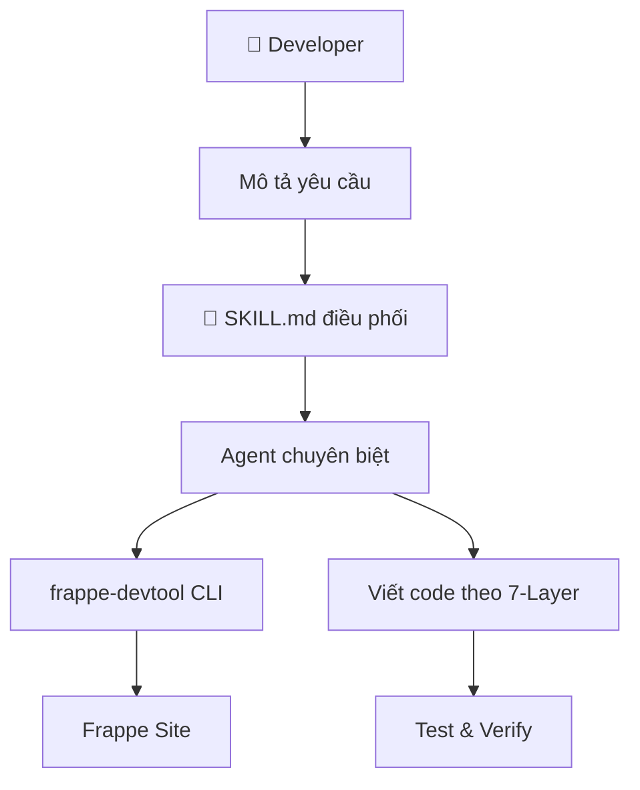

# Hướng dẫn Vibe Coding

> "Vibe Coding" là phong cách lập trình phối hợp cùng AI Agent — bạn mô tả ý tưởng, AI viết code theo chuẩn kiến trúc.

---

## 1. Sử dụng với Interactive AI IDE (Cursor/Claude/Windsurf)

### Cài đặt Skill

Copy `frappe-dev-master/` vào thư mục skills của IDE:

```bash
# Antigravity / Gemini
cp -r frappe-dev-master/ ~/.gemini/antigravity/skills/

# Claude Code
cp -r frappe-dev-master/ .claude/skills/

# Cursor
# Paste SKILL.md content vào Custom Instructions
```

### Cách sử dụng

Chỉ cần mô tả yêu cầu tự nhiên — SKILL.md sẽ tự động điều phối đúng Agent:

```
"Tạo DocType Employee Score với fields: employee (Link), score (Int), month (Data)"
→ DocType Architect xử lý

"Viết API tính tổng điểm theo tháng"
→ Frappe Backend xử lý

"Sửa lỗi Sales Invoice validate fails"
→ Frappe Fixer xử lý (Fix Loop 6 bước)

"Trang Sales Invoice chậm quá"
→ Frappe Performance xử lý
```

---

## 2. Sử dụng với Autonomous Agents (OpenClaw / OpenFang.sh)

### OpenClaw

OpenClaw dùng System Prompt, có giới hạn token. Dùng bản slim SKILL.md.

**Đăng ký CLI tools tự động:**

```bash
# OpenClaw agent chạy lệnh này khi khởi động
frappe tools --format openclaw
```

Output: Array of function-calling JSON schema → Agent tự biết gọi `frappe_get`, `frappe_list`, `frappe_meta` v.v.

### OpenFang.sh

OpenFang hỗ trợ recursive sub-agents. SKILL.md đã có sẵn `Sub-agent Instructions`:

- **Subagent A: DocType Architect** — Schema design
- **Subagent B: Frappe Backend** — Python logic
- **Subagent C: Frappe Frontend** — Client scripts

**Đăng ký CLI tools:**

```bash
frappe tools --format openfang
```

Output: MCP-compatible tool schema với `inputSchema` → OpenFang tự bind CLI commands.

### Context Injection

Inject biến môi trường cho agent:

```
{{ workspace_root }}   → Thư mục dự án hiện tại
{{ current_branch }}   → Git branch đang làm việc
```

---

## 3. CLI `frappe-devtool` Commands cho AI

| Command | Mục đích |
|---------|----------|
| `frappe tools --format json` | Liệt kê tất cả CLI commands (JSON) |
| `frappe tools --format openclaw` | Tool schema cho OpenClaw (function-calling) |
| `frappe tools --format openfang` | Tool schema cho OpenFang (MCP-compatible) |
| `frappe prompt` | In System Prompt cho AI Agent |
| `frappe plan "objective"` | Tạo execution playbook cho AI |
| `frappe meta <DocType>` | Khám phá schema DocType (AI-friendly JSON) |

---

## 4. Workflow Phối hợp AI + CLI



*Text fallback:* Developer mô tả yêu cầu → SKILL.md điều phối đúng Agent → Agent dùng CLI để tương tác Frappe Site + viết code theo 7-Layer → Test & Verify.

---
[← Hướng dẫn SOP](user-guide.md) · [Trang Chủ →](../README.md)
