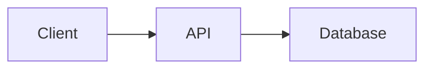

# Content Quality Guidelines — UX Master Edition

Rules for generating documentation content that is readable, scannable, and MDX-safe.

## UX Laws for Documentation

### Hick's Law — Reduce Decision Complexity

- **Max 7 items** in any Table of Contents (TOC) top level
- **Max 2 primary CTAs** per page (e.g., "Get Started" + "View API")
- Group related items into categories — never flat-list >10 items
- Use **sidebar categories** instead of one long sidebar

### Miller's Law — Chunk Information

- **Chunk tables** into groups of 5-9 rows with section headers
- **Break long pages** into sub-pages if >500 lines
- Use **visual separators**: `---`, headings, or admonition boxes
- Each section should be independently scannable

### Doherty Threshold — Optimize for Scanning

- **Lead with a summary** — put the most important info first
- **Use tables** instead of long paragraphs for structured data
- **Bold key terms** in definitions and descriptions
- **Code examples** should be runnable as-is (copy-paste friendly)

### Jakob's Law — Follow Familiar Patterns

- Use **standard doc layouts**: sidebar left, content center, TOC right
- Use **conventional heading hierarchy**: H1 (title) → H2 (sections) → H3 (subsections)
- Use **standard admonition types**: tip, note, warning, danger, info

---

## MDX Safety Rules (Docusaurus Compatibility)

These rules prevent Docusaurus build failures.

### Characters to Escape

| Character | Problem | Solution |
|-----------|---------|----------|
| `<` outside code blocks | Interpreted as JSX tag | Use `\<` or wrap in backticks |
| `>` at line start | May conflict with MDX | Use `\>` or indent |
| `{` and `}` | Interpreted as JSX expression | Use `\{` and `\}` |
| `@` at start of word | May trigger MDX decorator | Use `\@` |

### Filenames

| Rule | ✅ Correct | ❌ Wrong |
|------|-----------|---------|
| **kebab-case** | `getting-started.md` | `Getting_Started.md` |
| **No underscore prefix** | `analysis.md` | `_analysis.md` |
| **No dots in names** | `deploy-guide.md` | `Deploy.vi.md` |
| **Lowercase only** | `api-reference.md` | `API_Reference.md` |

### Frontmatter (Required)

Every `.md` file MUST include:

```yaml
---
title: "Descriptive Page Title"
description: "Brief 1-line description for SEO"
sidebar_position: 1
---
```

### Links

- Use **relative paths**: `[API](./api-reference.md)` not absolute
- **Anchor links** must match actual heading slugs
- **No `<a>` tags** — use Markdown `[text](url)` syntax

---

## Content Structure Rules

### Quick Reference Card (Required for tech docs)

Every technical document MUST start with a summary box:

```markdown
> **Quick Reference**
> - **What**: Brief description of this system/feature
> - **Stack**: Python 3.10+, PyTorch 2.0, CUDA 12
> - **Key Files**: `src/engine.py`, `src/model.py`
> - **Status**: Production / Beta / Experimental
```

### Admonitions (Use Instead of Bold Paragraphs)

```markdown
:::tip Performance Tip
Use batch processing for >100 items — 3x faster than sequential.
:::

:::warning Breaking Change
This API changed in v2.0. See migration guide.
:::

:::danger Security
Never expose API keys in client-side code.
:::

:::info
This feature requires Python 3.10 or later.
:::
```

### Progressive Disclosure (For Advanced Content)

Hide advanced/optional content behind expandable sections:

```markdown
<details>
<summary>Advanced Configuration Options</summary>

| Option | Default | Description |
|--------|---------|-------------|
| `batch_size` | 32 | Processing batch size |
| `num_workers` | 4 | Parallel worker count |

</details>
```

### Tabbed Content (For Multi-Platform)

Use Docusaurus tabs for platform-specific content:

```markdown
import Tabs from '@theme/Tabs';
import TabItem from '@theme/TabItem';

<Tabs>
  <TabItem value="macos" label="macOS" default>
    ```bash
    brew install myapp
    ```
  </TabItem>
  <TabItem value="linux" label="Linux">
    ```bash
    apt-get install myapp
    ```
  </TabItem>
  <TabItem value="windows" label="Windows">
    ```bash
    winget install myapp
    ```
  </TabItem>
</Tabs>
```

---

## Mermaid Diagram Rules

### Theme-Neutral Approach (No Hardcoded Colors)

**CRITICAL:** Do NOT use inline `style` directives in Mermaid diagrams.

Hardcoded colors (e.g., `style A fill:#2d333b,color:#e6edf3`) break on light themes.
Instead, let Mermaid's native theming auto-adapt to the site's light/dark mode.

The rendering platform (Astro Starlight, Docusaurus, etc.) configures the mermaid theme
via `mermaid.initialize({ theme: 'default' | 'dark' })` — diagrams automatically
get correct colors for both light and dark modes.

**❌ DON'T — Hardcoded dark colors:**
```
style A fill:#2d333b,stroke:#6d5dfc,color:#e6edf3
```

**✅ DO — Clean, no-style diagrams:**


### Minimum Requirements

- **Architecture docs**: ≥ 2 Mermaid diagrams (overview + sequence)
- **Data flow docs**: ≥ 3 Mermaid diagrams
- **SOP guides**: ≥ 1 Mermaid flowchart of the process

---

## Writing Style

| Rule | ✅ Do | ❌ Don't |
|------|------|---------|
| **Lead with WHY** | "Use streaming for real-time apps" | "The streaming module provides..." |
| **Active voice** | "Install the package" | "The package should be installed" |
| **Concrete examples** | "Set `batch_size=64` for GPUs with ≥8GB VRAM" | "Adjust batch size as needed" |
| **Cite sources** | `(src/engine.py:42)` | "In the engine file" |
| **Tables > paragraphs** | Use tables for comparisons | Write long comparison paragraphs |

---

## CSS Safety Rules (Docusaurus Mobile)

When customizing `custom.css` for Docusaurus, **NEVER** do these:

| ❌ Don't | Why | Impact |
|----------|-----|--------|
| Set `--ifm-navbar-background-color` to `rgba()` | Docusaurus reuses this var for mobile sidebar background | Sidebar becomes transparent |
| Add `overflow-y: auto` on `.navbar-sidebar__items` | Docusaurus uses horizontal 2-panel slide (width: 200% + translateX) | Clips panel, menu items invisible |
| Override `transform` on `.navbar-sidebar` | Docusaurus controls slide-in/out animation via transform | Sidebar stuck visible or hidden |

The premium template already handles this by overriding the background color variable to be fully opaque on `.navbar-sidebar` while keeping the glassmorphism effect on the desktop navbar.
