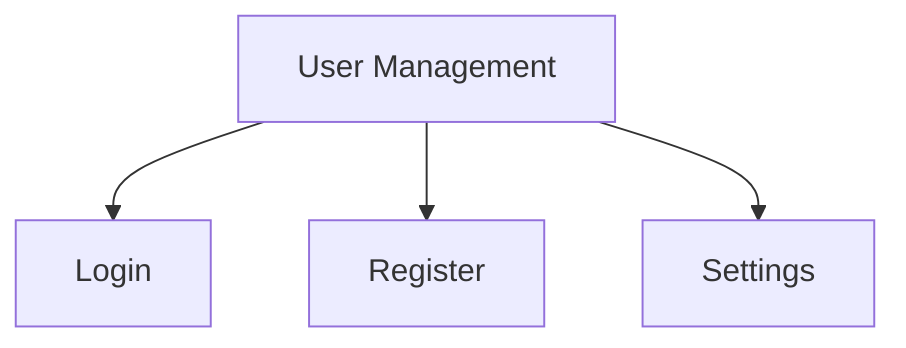

# SOP User Guide Generator — UX Master Edition

Generate professional Standard Operating Procedure (SOP) user guides with progressive disclosure, visual hierarchy, and multi-platform support.

## Input Required

- `docs/_analysis.md` (output from analyze-codebase)
- Access to source code (routes, UI components, views)

## Content Guidelines

**Before generating, read `skills/content-guidelines.md` for:**
- MDX safety rules
- Progressive disclosure patterns
- Writing style rules

## Procedure

### 1. Identify User-Facing Features

Scan the codebase for:
- Frontend routes/pages (Next.js pages, React routes, view templates)
- UI components that represent features
- API endpoints that correspond to user actions
- Role-based access (admin, user, operator)

### 2. Group by Module (Miller's Law: 5-9 items per group)

Organize features into logical modules:
```
Module: User Management (4 features)
├── Login / Register
├── Account Settings
├── Role Assignment
└── Password Reset
```

### 3. Generate SOP per Feature

Output to `docs/sop/[module-name].md`

## SOP Template

Each SOP file MUST follow this structure:

```markdown
---
title: "[Feature Name]"
description: "User guide for [feature name]"
sidebar_position: [number]
---

# [Feature Name]

> **Quick Reference**
> - **Who**: [Role required — Admin / User / Operator]
> - **Where**: [Menu > Submenu > Page]
> - **Time**: ~[estimated minutes] to complete
> - **Prerequisites**: [Brief list]

## Prerequisites

- [ ] Logged in with role **[role]**
- [ ] Have [prerequisites]

## Step-by-Step Guide

### Step 1: [Step Name]

1. Navigate to **[Menu] → [Submenu]**
2. Click the **[Button Name]** button
3. Fill in the information:

   | Field | Required | Description | Example |
   |-------|----------|-------------|---------|
   | Name | ✅ | Full Name | Jane Doe |

4. Click **Save** to complete

<!-- Screenshot: [Description of screenshot to take] -->

:::tip
[Helpful tip for this step — derived from common user behavior]
:::

### Step 2: [Step Name]
[Continue...]

## Expected Results

- ✅ [Result 1]
- ✅ [Result 2]

## Troubleshooting

<details>
<summary>🔴 Error: [Error Message 1]</summary>

**Cause:** [Root cause]

**Solution:**
1. [Step to fix]
2. [Step to fix]

**Source:** `(file_path:line_number)`

</details>

<details>
<summary>🔴 Error: [Error Message 2]</summary>

**Cause:** [Root cause]

**Solution:**
1. [Step to fix]

</details>

## FAQ

<details>
<summary>Q: [Question 1]?</summary>

**A:** [Answer derived from actual code logic]

</details>

<details>
<summary>Q: [Question 2]?</summary>

**A:** [Answer]

</details>

## Related

- [Related SOP](./related-module.md)
- API: `[METHOD] /api/endpoint`
```

## Index File

Generate `docs/sop/index.md`:

```markdown
---
title: "User Guides"
description: "System user guides overview"
sidebar_position: 1
---

# User Guides

> **Quick Reference**
> - **Total Features**: [count]
> - **Roles**: Admin, User, Operator
> - **Last Updated**: [date]

## Feature Map



## Feature List

| No. | Feature | Description | Role | Difficulty |
|-----|---------|-------------|------|------------|
| 1 | [Name] | [Description] | [Role] | 🟢 Easy |
```

## Rules

- **Quick Reference card** at top of every SOP
- **Number every step** — users must be able to follow exactly
- **Include form field tables** with real examples
- **Use `<details>` for Troubleshooting & FAQ** (Progressive Disclosure — Hick's Law)
- **Use `:::tip`** for helpful hints within steps
- **Add `<!-- Screenshot: ... -->` placeholders** where visual guidance helps
- **Link to related SOPs** and API docs
- **Keep language simple and direct** — assume non-technical users
- **Derive FAQ from actual validation rules** and business logic in code
- **Cite source**: `(file_path:line_number)` for technical accuracy
- **MDX-safe content** — escape `<`, `{`, `}` in non-code blocks
- **Estimate time** for each guide in the Quick Reference
